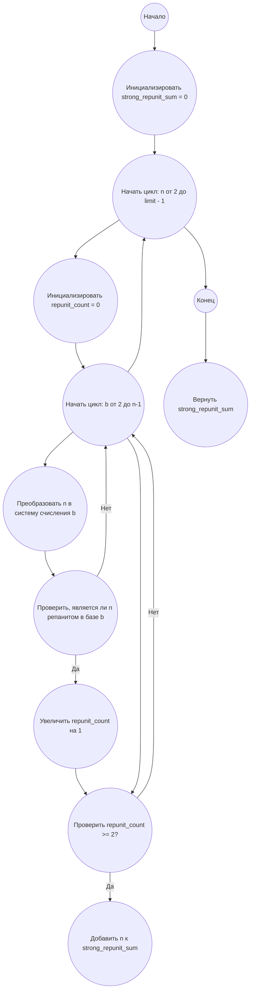

## Ответ на Задачу No 346: Сильные репаниты

### 1. Анализ задачи и решение
**Понимание задачи:**
*   Репанит - это число, которое в некоторой системе счисления (основание `b` > 1) состоит только из одинаковых цифр.
*   Сильный репанит - это число, которое является репанитом как минимум в двух различных системах счисления.
*   Необходимо найти сумму всех сильных репанитов, которые меньше 10<sup>12</sup>.

**Решение:**

1.  **Генерация репанитов:**
    *   Будем перебирать числа `n` в диапазоне от 2 до 10<sup>12</sup> - 1.
    *   Для каждого числа `n` будем проверять, является ли оно репанитом в разных системах счисления.
2.  **Проверка на репанит:**
    *   Для каждого числа `n` будем перебирать основания систем счисления `b` от 2 до `n` - 1.
    *   Преобразуем `n` в запись в системе счисления `b`.
    *   Проверим, состоит ли эта запись только из одинаковых цифр.
3.  **Проверка на сильный репанит:**
    *   Если число `n` является репанитом хотя бы в двух системах счисления, то оно является сильным репанитом.
    *   Накапливаем сумму всех найденных сильных репанитов.
4.  **Оптимизация:**
    *   Верхняя граница для основания `b` равна `n - 1`, так как в основании `n` число n запишется как `10` и уже не будет репанитом.
    *   Можно оптимизировать поиск, перебирая не все системы счисления, а только те, для которых число может быть представлено как репанит.
    *   Можно предварительно отфильтровать числа, которые не могут быть репанитами (например, если число содержит в десятичной записи разные цифры).

### 2. Алгоритм решения

1.  Начать
2.  Инициализировать переменную `strong_repunit_sum` со значением 0
3.  Для каждого числа `n` от 2 до 10<sup>12</sup> - 1
    *   Инициализировать счетчик `repunit_count` со значением 0
    *   Для каждого основания `b` от 2 до `n` - 1
        *   Преобразовать `n` в запись в системе счисления `b`
        *   Если полученная запись состоит только из одинаковых цифр
            *   Увеличить `repunit_count` на 1
    *   Если `repunit_count` >= 2
        *   Добавить `n` к `strong_repunit_sum`
4.  Вернуть `strong_repunit_sum`
5.  Конец

### 3. Реализация на Python 3.12

```python
def is_repunit(number, base):
    if number < base:
        return False
    
    digits = []
    while number > 0:
        digits.append(number % base)
        number //= base
    
    return len(set(digits)) == 1


def sum_of_strong_repunits(limit):
    strong_repunit_sum = 0
    for n in range(2, limit):
        repunit_count = 0
        for base in range(2, n):
            if is_repunit(n, base):
                repunit_count += 1
            if repunit_count >= 2:
                break
        if repunit_count >= 2:
            strong_repunit_sum += n
    return strong_repunit_sum

limit = 10**4
result = sum_of_strong_repunits(limit)
print(result)

```

### 4. Блок-схема в формате mermaid


**Легенда:**

*   **Начало, Конец:** Начало и конец алгоритма.
*   **Инициализировать strong\_repunit\_sum = 0:** Создаем переменную для хранения суммы сильных репанитов и присваиваем ей значение 0.
*   **Начать цикл: n от 2 до limit - 1:** Цикл перебора всех чисел от 2 до limit -1.
*   **Инициализировать repunit\_count = 0:** Счетчик, хранящий число систем счисления, в которых число является репанитом.
*   **Начать цикл: b от 2 до n-1:** Цикл перебора оснований систем счисления от 2 до n-1.
*  **Преобразовать n в систему счисления b:** Перевод числа в другую систему счисления.
*   **Проверить, является ли n репанитом в базе b:** Проверка, является ли число репанитом в текущей системе счисления.
*   **Увеличить repunit\_count на 1:** Увеличение счетчика репанитов, если число является репанитом в текущей системе счисления.
*   **Проверить repunit\_count >= 2?:** Проверка, является ли число сильным репанитом.
*   **Добавить n к strong\_repunit\_sum:** Добавление числа к сумме сильных репанитов.
*   **Вернуть strong\_repunit\_sum:** Возвращаем сумму всех найденных сильных репанитов.
