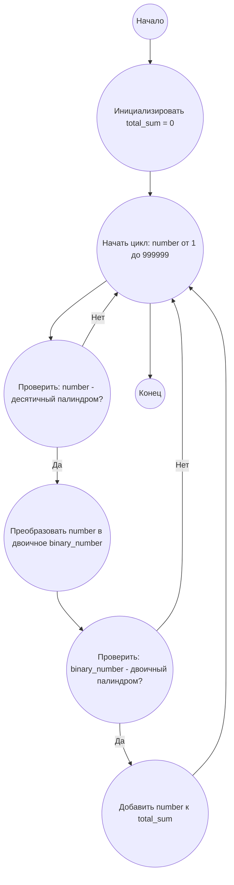

## Ответ на Задачу No 36: Двоичные и десятичные палиндромы

### 1. Анализ задачи и решение
**Понимание задачи:**
* Нам нужно найти все числа меньше миллиона, которые являются палиндромами в десятичной и двоичной системах счисления.
* Палиндром — это число, которое читается одинаково слева направо и справа налево.
* Двоичное представление числа не должно содержать ведущих нулей.

**Решение:**
1. **Перебор:** Проходим по всем числам от 1 до 999 999.
2. **Проверка десятичного палиндрома:** Для каждого числа проверяем, является ли оно палиндромом в десятичной системе счисления.
3. **Преобразование в двоичное:** Если число - десятичный палиндром, преобразуем его в двоичную систему.
4. **Проверка двоичного палиндрома:** Проверяем, является ли двоичное представление палиндромом и не содержит ли оно ведущих нулей.
5. **Накопление суммы:** Если число является палиндромом в обеих системах, добавляем его к общей сумме.
6. **Возврат результата:** Возвращаем общую сумму.

### 2. Алгоритм решения
1. Начать
2. Инициализировать переменную `total_sum` со значением 0
3. Для каждого числа `number` от 1 до 999999
    * Если `number` является десятичным палиндромом:
        * Преобразовать `number` в двоичное представление `binary_number`
        * Если `binary_number` является двоичным палиндромом:
            * Прибавить `number` к `total_sum`
4. Вернуть `total_sum`
5. Конец

### 3. Реализация на Python 3.12
```python
def is_palindrome(s):
    """Checks if a string is a palindrome."""
    return s == s[::-1]

def to_binary(n):
    """Converts a decimal number to its binary representation without leading zeros."""
    return bin(n)[2:]

def sum_of_double_palindromes(limit):
    """Calculates the sum of all numbers less than limit that are palindromes in both decimal and binary representations."""
    total_sum = 0
    for number in range(1, limit):
        if is_palindrome(str(number)):
            binary_number = to_binary(number)
            if is_palindrome(binary_number):
                total_sum += number
    return total_sum

# Пример использования
result = sum_of_double_palindromes(1000000)
print(result)
```

### 4. Блок-схема в формате mermaid


**Легенда:**
* **Начало, Конец:** Начало и конец алгоритма.
* **Инициализировать total_sum:** Создание переменной для хранения результата и присваивание ей начального значения 0.
* **Начать цикл, Конец цикла:** Указывает на начало и конец цикла перебора чисел от 1 до 999999.
* **Проверить: number - десятичный палиндром?**: Проверка, является ли текущее число палиндромом в десятичной системе.
* **Преобразовать number в двоичное binary_number:**  Преобразование десятичного числа в его двоичное представление.
* **Проверить: binary_number - двоичный палиндром?**: Проверка, является ли двоичное представление палиндромом.
* **Добавить number к total_sum:** Если число является палиндромом в обеих системах счисления, то добавляем его к общей сумме.
