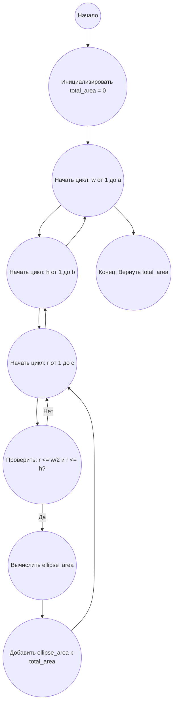

## Ответ на Задачу No 363: Бейсбольные эллипсы

### 1. Анализ задачи и решение

**Понимание задачи:**
*   Нам нужно вычислить площадь бейсбольного эллипса, который состоит из двух полукругов, двух четвертькругов и двух прямоугольных участков. Площадь эллипса зависит от параметров `w`, `h` и `r`.
*   Затем нужно вычислить сумму площадей таких эллипсов для всех допустимых комбинаций `w`, `h`, и `r` в заданных диапазонах и с учётом ограничений:  `0 < w <= a`, `0 < h <= b`, `0 < r <= c`, `r <= w/2` и `r <= h`.

**Решение:**

1.  **Площадь эллипса:**
    *   Площадь двух полукругов равна площади одного круга радиуса `r`: `π * r^2`.
    *   Площадь двух четвертькругов также равна площади одного полукруга радиуса `r`:  `π * r^2 / 2`.
    *   Сумма площадей всех криволинейных частей:  `π * r^2 +  π * r^2 / 2 = 3 * π * r^2 / 2`.
    *   Площадь прямоугольника между двумя прямыми линиями и прямыми, соединяющими дуги окружностей: `(w - 2r) * h`.
    *   Общая площадь эллипса: `E(w, h, r) = (w - 2r) * h + 3 * π * r^2 / 2`.

2.  **Суммирование площадей:**
    *   Перебираем все допустимые значения `w`, `h`, и `r` с учетом ограничений.
    *   Для каждой комбинации вычисляем площадь эллипса `E(w, h, r)`.
    *   Суммируем все вычисленные площади в общую сумму `S(a, b, c)`.

### 2. Алгоритм решения

1.  Начать
2.  Инициализировать переменную `total_area` со значением 0
3.  Для каждого `w` от 1 до `a`
    1. Для каждого `h` от 1 до `b`
        1. Для каждого `r` от 1 до `c`
            1. Если `r <= w/2` и `r <= h`
                1.  Вычислить площадь эллипса `ellipse_area = (w - 2*r) * h + 1.5 * pi * r**2`
                2.  Прибавить `ellipse_area` к `total_area`
4.  Вернуть `total_area`
5.  Конец

### 3. Реализация на Python 3.12
```python
import math

def calculate_ellipse_area(w, h, r):
    """Calculates the area of a baseball ellipse.
    Args:
        w: width of the ellipse
        h: height of the ellipse
        r: radius of the circles
    Returns:
        The area of the ellipse
    """
    return (w - 2 * r) * h + 1.5 * math.pi * r**2

def sum_of_ellipse_areas(a, b, c):
    """Calculates the sum of areas of baseball ellipses for given ranges of w, h, r.
    Args:
        a: Maximum width
        b: Maximum height
        c: Maximum radius
    Returns:
        The sum of the areas of the ellipses
    """
    total_area = 0
    for w in range(1, a + 1):
        for h in range(1, b + 1):
            for r in range(1, c + 1):
                if r <= w / 2 and r <= h:
                    total_area += calculate_ellipse_area(w, h, r)
    return total_area


# Example usage:
result = sum_of_ellipse_areas(10000, 5000, 2000)
print(f"{result:.10f}")

```

### 4. Блок-схема в формате mermaid


**Легенда:**
*   **Начало, Конец:** Начало и конец алгоритма.
*   **Инициализировать `total_area`:** Создаем переменную для хранения общей суммы площадей и присваиваем ей значение 0.
*   **Начать цикл: w от 1 до a:** Начало цикла перебора значений `w`.
*  **Начать цикл: h от 1 до b:** Начало цикла перебора значений `h`.
*  **Начать цикл: r от 1 до c:** Начало цикла перебора значений `r`.
*   **Проверить: r <= w/2 и r <= h?**: Проверяем, выполняются ли условия для `r`.
*   **Вычислить `ellipse_area`**: Вычисляем площадь эллипса для текущих значений `w`, `h` и `r`.
*   **Добавить `ellipse_area` к `total_area`:**  Добавляем вычисленную площадь к общей сумме.
* **Конец: Вернуть total_area:** Возвращаем общую сумму площадей эллипсов.
