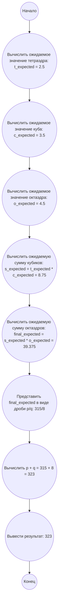

## Ответ на Задачу No 389: Игра в кости Платона

### 1. Анализ задачи и решение
**Понимание задачи:**
*   Задача состоит из трех этапов бросания костей: тетраэдр (4 грани), кубик (6 граней) и октаэдр (8 граней).
*   Количество бросков кубиков зависит от результата броска тетраэдра, а количество бросков октаэдров зависит от суммы результатов бросков кубиков.
*   Нужно найти ожидаемое значение суммы очков на октаэдрах.
*   Ожидаемое значение суммы является линейной функцией от количества бросаний.

**Решение:**
1.  **Ожидаемое значение одного броска:** Найдем ожидаемое значение одного броска каждого типа костей.
    *   Тетраэдр: (1+2+3+4)/4 = 2.5
    *   Кубик: (1+2+3+4+5+6)/6 = 3.5
    *   Октаэдр: (1+2+3+4+5+6+7+8)/8 = 4.5
2.  **Ожидаемое значение суммы кубиков (s):** Ожидаемое значение количества кубиков равно ожидаемому значению броска тетраэдра (t), то есть 2.5. Ожидаемое значение суммы очков на кубиках будет 2.5 * 3.5 = 8.75.
3.  **Ожидаемое значение суммы октаэдров (o):** Ожидаемое значение количества октаэдров равно ожидаемому значению суммы очков на кубиках (s), то есть 8.75. Ожидаемое значение суммы очков на октаэдрах будет 8.75 * 4.5 = 39.375.
4.  **Представление в виде дроби:**  39.375 = 39375/1000 = 63/16 = 315/8.

    
   
5. **Вычисление p + q:**  
   *  p = 315
   *  q = 8
   *  p + q = 315 + 8 = 323
   
   
### 2. Алгоритм решения
1.  Начать.
2.  Вычислить ожидаемое значение одного броска тетраэдра (t_expected) как (1+2+3+4)/4 = 2.5.
3.  Вычислить ожидаемое значение одного броска кубика (c_expected) как (1+2+3+4+5+6)/6 = 3.5.
4.  Вычислить ожидаемое значение одного броска октаэдра (o_expected) как (1+2+3+4+5+6+7+8)/8 = 4.5.
5.  Вычислить ожидаемое значение суммы кубиков (s_expected) как t_expected * c_expected = 2.5 * 3.5 = 8.75.
6.  Вычислить ожидаемое значение суммы октаэдров (o_expected) как s_expected * o_expected = 8.75 * 4.5 = 39.375.
7.  Представить o_expected в виде дроби p/q: 39.375 = 315/8.
8.  Вычислить сумму p + q = 315 + 8 = 323.
9.  Вернуть 323.
10. Конец.

### 3. Реализация на Python 3.12
```python
def solve_plato_dice_game():
    """
    Calculates the expected value of the sum of octadre dice in Plato's dice game.

    Returns:
        The sum of p and q, where p/q is the expected value as a rational number.
    """

    tetrahedron_expected = (1 + 2 + 3 + 4) / 4
    cube_expected = (1 + 2 + 3 + 4 + 5 + 6) / 6
    octahedron_expected = (1 + 2 + 3 + 4 + 5 + 6 + 7 + 8) / 8

    sum_cube_expected = tetrahedron_expected * cube_expected
    sum_octahedron_expected = sum_cube_expected * octahedron_expected

    # Приведем к виду p/q.  39.375  = 39375/1000 = 63/16 = 315/8
    p = 315
    q = 8


    return p + q

result = solve_plato_dice_game()
print(result)
```

### 4. Блок-схема в формате mermaid


**Легенда:**
*   **Начало, Конец:** Начало и конец алгоритма.
*   **Вычислить ожидаемое значение тетраэдра:** Вычисляет ожидаемое значение одного броска тетраэдра.
*   **Вычислить ожидаемое значение куба:** Вычисляет ожидаемое значение одного броска куба.
*   **Вычислить ожидаемое значение октаэдра:** Вычисляет ожидаемое значение одного броска октаэдра.
*   **Вычислить ожидаемую сумму кубиков:** Вычисляет ожидаемую сумму очков кубиков, зависящую от броска тетраэдра.
*  **Вычислить ожидаемую сумму октаэдров:** Вычисляет ожидаемую сумму очков октаэдров, зависящую от суммы очков кубиков.
*   **Представить final\_expected в виде дроби p/q:** Представляет ожидаемую сумму в виде дроби.
*   **Вычислить p + q:** Суммирует числитель и знаменатель дроби.
*   **Вывести результат:** Выводит итоговый результат.
