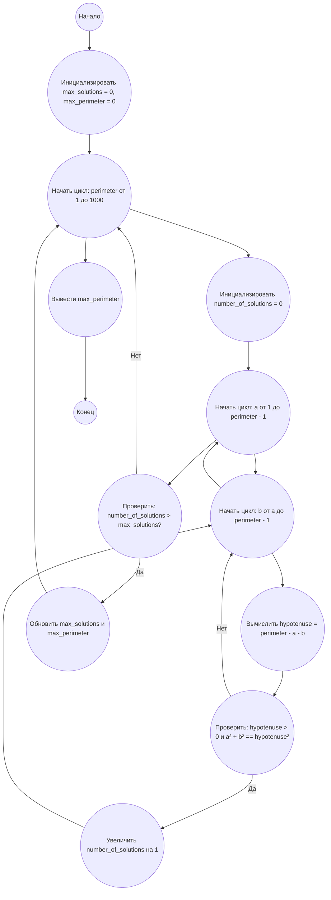

## Ответ на Задачу No 39: Целочисленные прямоугольные треугольники

### 1. Анализ задачи и решение
**Понимание задачи:**
* Нам нужно найти такое значение периметра `p` (не более 1000), для которого количество целочисленных прямоугольных треугольников с этим периметром максимально.
* Прямоугольный треугольник удовлетворяет теореме Пифагора: a² + b² = c², где a и b - катеты, c - гипотенуза.
* Периметр: p = a + b + c
* Все a, b, c - целые числа.
* Необходимо найти количество решений (a, b, c) для каждого значения `p`.

**Решение:**
1. **Перебор периметров:** Перебираем все значения `p` от 1 до 1000.
2. **Перебор катетов:** Для каждого `p` перебираем значения `a` и `b` (причем `a < p`, а `b < p`)
3. **Вычисление гипотенузы:**  Вычисляем `c = p - a - b`
4. **Проверка условия:** Проверяем, является ли треугольник прямоугольным (a² + b² == c²) и что все стороны положительны.
5. **Подсчет решений:** Увеличиваем счетчик решений для данного `p`.
6. **Поиск максимума:**  Сравниваем количество решений для текущего `p` с максимальным количеством решений, найденным ранее, и обновляем максимальное количество и соответствующий периметр.

### 2. Алгоритм решения
1. Начать.
2. Инициализировать переменные `max_solutions = 0` и `max_perimeter = 0`.
3. Для каждого периметра `perimeter` от 1 до 1000:
   * Инициализировать `number_of_solutions = 0`
   * Для каждого катета `a` от 1 до `perimeter - 1`:
     * Для каждого катета `b` от `a` до `perimeter - 1`:
        * Вычислить `hypotenuse = perimeter - a - b`
        * Если `hypotenuse > 0` и `a*a + b*b == hypotenuse*hypotenuse`:
           * Увеличить `number_of_solutions` на 1
    *  Если `number_of_solutions > max_solutions`:
       * `max_solutions = number_of_solutions`
       * `max_perimeter = perimeter`
4. Вернуть `max_perimeter`
5. Конец

### 3. Реализация на Python 3.12
```python
def find_perimeter_with_max_solutions(limit):
    """
    Finds the perimeter p <= limit with the maximum number of integer
    right triangle solutions.
    """
    max_solutions = 0
    max_perimeter = 0
    for perimeter in range(1, limit + 1):
        number_of_solutions = 0
        for a in range(1, perimeter):
            for b in range(a, perimeter):
                c = perimeter - a - b
                if c > 0 and a * a + b * b == c * c:
                    number_of_solutions += 1
        if number_of_solutions > max_solutions:
            max_solutions = number_of_solutions
            max_perimeter = perimeter
    return max_perimeter

# Пример использования:
limit = 1000
result = find_perimeter_with_max_solutions(limit)
print(result)
```

### 4. Блок-схема в формате mermaid


**Легенда:**

* **Начало, Конец:** Начало и конец алгоритма.
* **Инициализировать max\_solutions = 0, max\_perimeter = 0:**  Инициализация переменных для хранения максимального количества решений и соответствующего периметра.
* **Начать цикл: perimeter от 1 до 1000:** Начало цикла перебора значений периметра.
* **Инициализировать number\_of\_solutions = 0:**  Сброс счетчика решений для текущего периметра.
* **Начать цикл: a от 1 до perimeter - 1:** Начало цикла перебора катета `a`.
* **Начать цикл: b от a до perimeter - 1:** Начало цикла перебора катета `b`.
* **Вычислить hypotenuse = perimeter - a - b:** Вычисление гипотенузы.
* **Проверить: hypotenuse > 0 и a² + b² == hypotenuse²:** Проверка, является ли треугольник прямоугольным и что гипотенуза положительна.
* **Увеличить number\_of\_solutions на 1:** Если условия выполняются, увеличить счетчик решений.
* **Проверить: number\_of\_solutions > max\_solutions?:** Сравнение текущего количества решений с максимальным.
* **Обновить max\_solutions и max\_perimeter:** Обновление максимального количества решений и соответствующего периметра.
* **Вывести max\_perimeter:** Вывод значения периметра с максимальным количеством решений.
