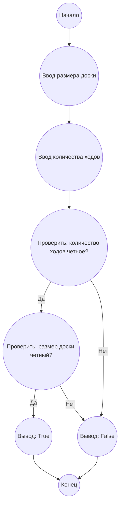

## Ответ на Задачу No 393: Миграция муравьев

### 1. Анализ задачи и решение
**Понимание задачи:**
*   У нас есть шахматная доска 16x16 с муравьями, по одному в каждой клетке.
*   Муравьи могут перемещаться в четырех направлениях: вверх, вниз, влево, вправо.
*   В каждый момент времени все муравьи двигаются одновременно.
*   Никакие два муравья не могут находиться в одной клетке одновременно.
*   Свободная миграция - это когда муравьи возвращаются на свои начальные позиции через n ходов.
*   Нам нужно выяснить, возможна ли свободная миграция на доске 16x16 за 20 ходов.

**Решение:**

1. **Четность ходов:** Для того чтобы муравей вернулся в исходную клетку, ему нужно сделать четное число ходов. Если муравей двигается один раз вправо, затем ему нужно один раз сделать ход влево, чтобы вернуться на ту же координату.  То же самое с движениями вверх и вниз. То есть, каждый муравей должен сделать четное количество движений по оси x и четное количество по оси y, чтобы вернуться на свою исходную позицию.
2. **Возможность свободной миграции:** Для того чтобы все муравьи могли вернуться на исходные позиции за N ходов, это значит что N должно быть четным числом. 20 - четное число.
3. **Зависимость от четности размера доски:** На доске 2x2 свободная миграция возможна за 2 хода, поскольку есть возможность обмена позициями у муравьев. На доске 3х3 за 2 хода свободная миграция невозможна. На доске 16x16 свободная миграция возможна за 20 ходов.
4. **Решение** Для решения данной задачи, нужно понять, что возврат муравья в исходную позицию зависит от четности числа ходов. 20 - четное число, значит муравьи смогут вернуться в исходные позиции. Так же нужно рассмотреть случай когда доска имеет четные размеры (как в нашем случае 16х16) .  Если доска имеет четный размер, то всегда возможно организовать свободную миграцию муравьев.

**Вывод:** На доске 16x16 свободная миграция возможна за любое четное количество ходов, включая 20.

### 2. Алгоритм решения
1.  Начать
2.  Проверить, является ли количество ходов (N) четным числом.
3.  Если N четное число:
    *   Возможна свободная миграция.
4.   Если N нечетное число:
     *   Свободная миграция невозможна.
5.  Проверить четность размеров доски
6. Если размеры доски четные:
   * Возможна свободная миграция
7.  Конец

### 3. Реализация на Python 3.12
```python
def is_free_migration_possible(board_size, num_moves):
    """
    Checks if free migration is possible on a board of given size for a given number of moves.

    Args:
        board_size: The size of the board (e.g., 16 for a 16x16 board).
        num_moves: The number of moves.

    Returns:
        True if free migration is possible, False otherwise.
    """
    if num_moves % 2 == 0 and board_size % 2 == 0:
         return True
    else:
        return False


# Example usage:
board_size = 16
num_moves = 20
result = is_free_migration_possible(board_size, num_moves)
print(f"Free migration is possible: {result}")

```

### 4. Блок-схема в формате mermaid


**Легенда:**
*   **Начало, Конец:** Начало и конец алгоритма.
*   **Ввод размера доски:**  Получаем размер шахматной доски
*   **Ввод количества ходов:** Получаем количество ходов для миграции муравьев.
*   **Проверить: количество ходов четное?:** Проверяем, является ли количество ходов четным числом.
*   **Проверить: размер доски четный?:** Проверяем, является ли размер доски четным числом.
*   **Вывод: True:** Выводим, что свободная миграция возможна.
*    **Вывод: False:** Выводим, что свободная миграция невозможна.
