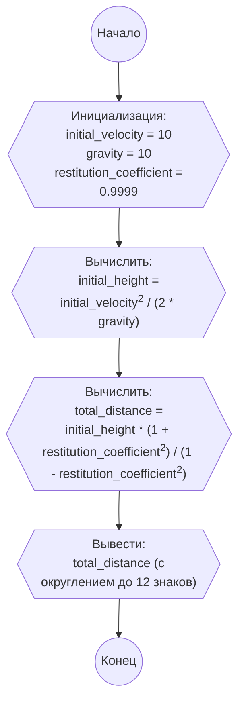

## Ответ на Задачу No 394: Состояние шара

### 1. Анализ задачи и решение

**Понимание задачи:**

*   Мяч бросают вертикально вверх с начальной скоростью 10 м/с.
*   На мяч действует ускорение свободного падения g = 10 м/с².
*   После каждого отскока от земли мяч теряет часть энергии, и его скорость уменьшается в `c` раз.
*   Необходимо рассчитать полное расстояние, которое мяч пролетит до полной остановки.
*   Нужно найти `S(0.9999)`, где `S(c)` - общее расстояние, пройденное мячом при коэффициенте восстановления `c`.

**Решение:**

1.  **Начальный подъем и падение:**
    *   Мяч поднимается вверх, пока его скорость не станет равна нулю. Время подъема равно `v / g`, а высота подъема `h = v^2 / (2*g)`.
    *   Мяч падает с этой высоты и приобретает ту же скорость перед ударом о землю `v`.
2.  **Последующие подскоки:**
    *   После каждого удара скорость мяча становится `c * v`. Соответственно, высота и время каждого нового подскока уменьшаются в `c^2` раз.
    *   Расстояние, пройденное мячом за каждый подскок (вверх и вниз) равно `2 * h`, где `h`  - высота подъема для текущей скорости.
    *   Общее расстояние можно вычислить как сумму бесконечной геометрической прогрессии.
3.  **Общая формула:**
    *   Первоначальная высота подъема `h0 = v^2 / (2 * g)`. Первоначальное расстояние, которое пролетит мяч - `2*h0`.
    *   После первого удара мяч взлетает на `h1 = c^2 * h0`. Соответственно, пролетит расстояние `2*h1`.
    *   Общее расстояние будет равно: `S = 2 * h0 + 2 * c^2 * h0 + 2 * (c^2)^2 * h0 + ...`  
        Это сумма бесконечной геометрической прогрессии со знаменателем `c^2` и первым членом `2*h0`.
    *   Сумма такой прогрессии равна:  `S = 2 * h0 / (1 - c^2)`. Так как, при самом первом броске мяч летит вверх только один раз, то нужно скорректировать формулу.
    *   Итоговая формула для расчета: `S = h0 + 2 * h0 * (c^2 / (1 - c^2))`  или `S = h0 * (1 + c^2) / (1 - c^2)`

### 2. Алгоритм решения

1.  Начать.
2.  Задать начальную скорость `initial_velocity = 10`.
3.  Задать ускорение свободного падения `gravity = 10`.
4.  Задать коэффициент восстановления `restitution_coefficient = 0.9999`.
5.  Вычислить начальную высоту `initial_height = initial_velocity^2 / (2 * gravity)`.
6.  Вычислить общее расстояние `total_distance = initial_height * (1 + restitution_coefficient^2) / (1 - restitution_coefficient^2)`.
7.  Вывести `total_distance`, округленное до 12 знаков после запятой.
8.  Конец.

### 3. Реализация на Python 3.12

```python
def calculate_total_distance(initial_velocity, gravity, restitution_coefficient):
    """
    Calculates the total distance traveled by a bouncing ball until it stops.

    Args:
        initial_velocity: The initial velocity of the ball (m/s).
        gravity: The acceleration due to gravity (m/s^2).
        restitution_coefficient: The coefficient of restitution.

    Returns:
        The total distance traveled by the ball.
    """

    initial_height = initial_velocity**2 / (2 * gravity)
    total_distance = initial_height * (1 + restitution_coefficient**2) / (1 - restitution_coefficient**2)
    return total_distance

# Example usage:
initial_velocity = 10
gravity = 10
restitution_coefficient = 0.9999

total_distance = calculate_total_distance(initial_velocity, gravity, restitution_coefficient)
print(f"{total_distance:.12f}")
```

### 4. Блок-схема в формате mermaid



**Легенда:**
*   **Начало, Конец:** Начало и конец алгоритма.
*   **Инициализация:** Присваивание значений начальным переменным, таким как начальная скорость, ускорение свободного падения и коэффициент восстановления.
*   **Вычислить начальную высоту:** Вычисление начальной высоты подъема мяча с помощью формулы `initial_velocity^2 / (2 * gravity)`.
*   **Вычислить общее расстояние:** Вычисление общего расстояния, пройденного мячом до остановки с помощью формулы, полученной в анализе решения.
*   **Вывести результат:** Вывод на экран общего расстояния, округленного до 12 знаков после запятой.
