## Ответ на Задачу No 398: Разбиения круга

### 1. Анализ задачи и решение

**Понимание задачи:**

*   **D(n):** Количество допустимых способов соединить *n* точек на окружности отрезками так, чтобы отрезки не пересекались.
*   **M(n):** Количество допустимых способов соединить *n* точек, где все точки соединены хотя бы одним отрезком.
*   **S(n):** Сумма *M(k)* для всех делителей *k* числа *n*.
*   Нужно найти *S(10<sup>16</sup>)*.

**Ключевые идеи:**

1.  **Числа Каталана:** Количество способов соединить *n* точек на окружности непересекающимися отрезками (D(n)) связано с числами Каталана. Однако, нас интересует *M(n)*.
2.  **Связь M(n) и D(n):**  Если мы посмотрим на примеры, то заметим, что *M(n)* = 1 для всех *n*, кроме *n=1*. Это так, потому что при *n>1*, если мы соединяем все точки, то есть только 1 вариант (например, соединить точки по порядку 1-2, 2-3, ..., n-1-n и n-1). Если *n=1*, то у нас нет отрезков вообще, и он соответствует условию, что все точки соединены (с самим собой).  Значит, M(n) = 1 для всех n.

3. **Сумма M(k):** Так как  M(n) = 1 для всех n, то S(n) это просто количество делителей числа *n*.

4.  **Задача сводится к нахождению количества делителей 10<sup>16</sup>**: Если n = p<sub>1</sub><sup>a<sub>1</sub></sup> * p<sub>2</sub><sup>a<sub>2</sub></sup> * ... * p<sub>k</sub><sup>a<sub>k</sub></sup>, то количество делителей равно (a<sub>1</sub>+1)(a<sub>2</sub>+1)...(a<sub>k</sub>+1).

5.  **Разложение 10<sup>16</sup> на простые множители**: 10<sup>16</sup> = (2 * 5)<sup>16</sup> = 2<sup>16</sup> * 5<sup>16</sup>
6. **Количество делителей:**  Количество делителей 10<sup>16</sup> равно (16+1)*(16+1) = 17 * 17 = 289

**Решение:**
1.  Разложить 10<sup>16</sup> на простые множители:  2<sup>16</sup> * 5<sup>16</sup>.
2.  Количество делителей будет (16 + 1) * (16 + 1) = 17 * 17 = 289.
3.  S(10<sup>16</sup>) = 289.

### 2. Алгоритм решения
1.  Начать.
2.  Вычислить простые множители числа n = 10^16, это 2^16 * 5^16
3.  Используя формулу для подсчета делителей, найти количество делителей числа n:  (16 + 1) * (16 + 1) = 17 * 17 = 289.
4.  Вернуть результат.
5.  Конец.

### 3. Реализация на Python 3.12
```python
def calculate_s(n):
  """
    Calculates the sum of M(k) for all divisors k of n.

    Args:
      n: The number for which to calculate S(n).

    Returns:
      The sum of M(k) for all divisors k of n.
  """

  if n == 0:
    return 0 # Edge case for 0 if it is included
  
  divisors_count = 1

  power_of_two = 0
  temp_n = n
  while temp_n % 2 == 0:
    power_of_two += 1
    temp_n //= 2
  if power_of_two > 0:
    divisors_count *= (power_of_two+1)
  
  power_of_five = 0
  while temp_n % 5 == 0:
    power_of_five += 1
    temp_n //= 5
  if power_of_five > 0:
    divisors_count *= (power_of_five+1)


  i = 3
  while i*i <= temp_n:
    power = 0
    while temp_n % i == 0:
      power += 1
      temp_n //= i
    if power > 0 :
       divisors_count *= (power+1)
    i += 2
  if temp_n > 1 :
      divisors_count *= 2
  
  return divisors_count


# Example usage for n = 10^16
n = 10**16
result = calculate_s(n)
print(result)

```

### 4. Блок-схема в формате mermaid

```mermaid
flowchart TD
    Start((Начало)) --> InputN((Ввод n = 10^16))
    InputN --> InitializeDivisorsCount((Инициализировать divisors_count = 1))
    InitializeDivisorsCount --> CheckPowerOfTwo((Проверка кратности 2))
    CheckPowerOfTwo --> CalculatePowerOfTwo((Расчет степени двойки))
    CalculatePowerOfTwo --> UpdateDivisorsCountTwo((Обновить divisors_count, если степень 2 > 0))
    UpdateDivisorsCountTwo --> CheckPowerOfFive((Проверка кратности 5))
    CheckPowerOfFive --> CalculatePowerOfFive((Расчет степени пятерки))
    CalculatePowerOfFive --> UpdateDivisorsCountFive((Обновить divisors_count, если степень 5 > 0))
    UpdateDivisorsCountFive --> LoopStart((Начать цикл: i от 3))
    LoopStart --> CheckPrimeDivisor((Проверка кратности i))
    CheckPrimeDivisor --> CalculatePower((Расчет степени i))
    CalculatePower --> UpdateDivisorsCount((Обновить divisors_count, если степень i > 0))
    UpdateDivisorsCount --> LoopNext((Следующий i, i+=2))
    LoopNext --> CheckLoopEnd((Завершить цикл, если i*i > temp_n))
    CheckLoopEnd -- Да --> CheckRemainingFactor((Проверка остатка > 1))
    CheckRemainingFactor -- Да --> UpdateDivisorsCountFinal((Обновить divisors_count))
    UpdateDivisorsCountFinal --> ReturnResult((Вернуть divisors_count))
     CheckRemainingFactor -- Нет -->ReturnResult
     CheckLoopEnd -- Нет --> LoopStart
    ReturnResult --> End((Конец))
    

```


**Легенда:**

*   **Начало, Конец:** Начало и конец алгоритма.
*   **Ввод n:** Ввод числа n, для которого нужно вычислить S(n), в данном случае n=10^16.
*   **Инициализировать divisors\_count:** Инициализируем переменную для подсчета делителей, присваиваем ей значение 1.
* **Проверка кратности 2, Проверка кратности 5:** проверяем деления числа n на 2 и 5.
*   **Расчет степени двойки, Расчет степени пятерки:** Находим степень числа 2 и 5 в факторизации числа n.
*   **Обновить divisors\_count:** Обновляем счетчик делителей, умножая его на (степень + 1).
*   **Начать цикл, Следующий i, Завершить цикл:** цикл для поиска других простых делителей числа n
*  **Проверка кратности i:** Проверяем кратность текущего делителя.
*   **Расчет степени i:** Находим степень текущего делителя.
*   **Обновить divisors\_count, если степень i > 0:** Обновляем счетчик делителей, умножая его на (степень + 1).
*  **Проверка остатка > 1:** Проверка остатка temp\_n на > 1
*   **Вернуть divisors\_count:**  Возвращаем общее количество делителей.
