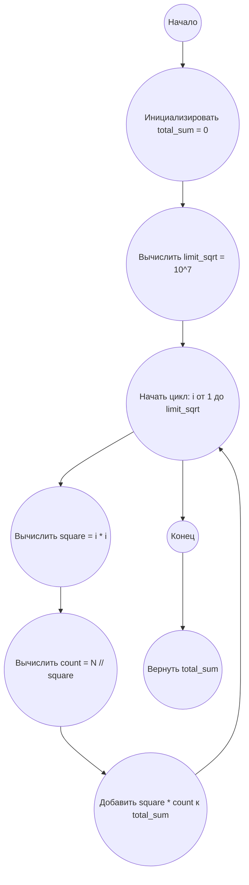

## Ответ на Задачу No 424: Идеальные квадраты и их суммы

### 1. Анализ задачи и решение
**Понимание задачи:**

*   Задача требует вычисления суммы `S(N)`, где `S(N)` является суммой `s(n)` для всех `n` от 1 до `N`.
*   `s(n)` – это сумма всех идеальных квадратов, являющихся делителями числа `n`. Идеальный квадрат - это квадрат целого числа (1, 4, 9, 16...).
*   Необходимо найти `S(10^14)`.

**Решение:**

1.  **Переформулировка s(n):**  Вместо того, чтобы для каждого `n` вычислять делители - идеальные квадраты, посмотрим на задачу с другой стороны. Рассмотрим все идеальные квадраты `q` и для каждого `q` найдем количество `n` в диапазоне от 1 до `N` для которых `q` является делителем.
2.  **Оптимизация:** Для каждого идеального квадрата `q`  в диапазоне `[1, N]`  количество  чисел `n` в диапазоне `[1, N]`, которые делятся на `q`, равно `N // q`.
3.  **Вычисление S(N):**  Таким образом, `S(N)` можно вычислить как сумму `q * (N // q)`  по всем идеальным квадратам `q`, которые не превышают `N`.
4.  **Ограничения:** Нам нужно найти `S(10^14)`. Следовательно максимальный идеальный квадрат должен быть меньше либо равен 10<sup>14</sup>.  Максимальное целое число, квадрат которого меньше 10<sup>14</sup>, равно  10<sup>7</sup>,  так как (10<sup>7</sup>)<sup>2</sup> = 10<sup>14</sup>.

### 2. Алгоритм решения

1.  **Начать.**
2.  Инициализировать переменную `total_sum` со значением 0.
3.  Установить  `limit_sqrt`  равным  10<sup>7</sup>  (корень из N = 10<sup>14</sup>).
4.  Для каждого числа `i` от 1 до `limit_sqrt`
    *   Вычислить идеальный квадрат `square`  =  `i * i`.
    *   Вычислить количество чисел `n`  в диапазоне `[1, N]` которые делятся на `square`:  `count` = `N // square`.
    *   Прибавить `square * count` к `total_sum`.
5.  Вернуть `total_sum`.
6.  **Конец.**

### 3. Реализация на Python 3.12
```python
def sum_of_s_n(limit):
    """
    Calculates the sum of s(n) for all n from 1 to limit.

    Args:
        limit: The upper bound for n.

    Returns:
        The sum S(limit).
    """

    total_sum = 0
    limit_sqrt = int(limit**0.5)  # Оптимизация вычисления корня
    for i in range(1, limit_sqrt + 1):
        square = i * i
        count = limit // square
        total_sum += square * count
    return total_sum

# Пример использования:
N = 10**14
result = sum_of_s_n(N)
print(result)
```

### 4. Блок-схема в формате mermaid

**Legenda:**

*   **Начало, Конец:** Начало и конец алгоритма.
*   **Инициализировать total\_sum:** Создаем переменную для хранения результата и присваиваем ей значение 0.
*   **Вычислить limit\_sqrt:** Вычисляем корень квадратный из предела, для ограничения цикла.
*   **Начать цикл, Конец цикла:** Определяют начало и конец цикла перебора всех чисел от 1 до  `limit_sqrt`.
*   **Вычислить square:** Вычисляем идеальный квадрат текущего числа `i`.
*   **Вычислить count:** Вычисляем количество чисел от 1 до N, которые делятся на `square`.
*  **Добавить square * count к total_sum:** Добавляем `square * count`  к общей сумме.
*  **Вернуть total_sum:** Возвращаем результат.
