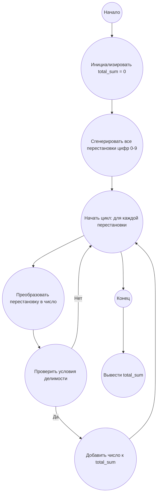

## Ответ на Задачу No 43: Подстроки с делимостью

### 1. Анализ задачи и решение

**Понимание задачи:**
* Нам нужно найти все 10-значные числа, которые состоят из цифр 0-9 (каждая цифра встречается ровно один раз) и удовлетворяют условию делимости, описанному в задаче.
* Условия делимости:
    * *d<sub>2</sub>d<sub>3</sub>d<sub>4</sub>* делится на 2
    * *d<sub>3</sub>d<sub>4</sub>d<sub>5</sub>* делится на 3
    * *d<sub>4</sub>d<sub>5</sub>d<sub>6</sub>* делится на 5
    * *d<sub>5</sub>d<sub>6</sub>d<sub>7</sub>* делится на 7
    * *d<sub>6</sub>d<sub>7</sub>d<sub>8</sub>* делится на 11
    * *d<sub>7</sub>d<sub>8</sub>d<sub>9</sub>* делится на 13
    * *d<sub>8</sub>d<sub>9</sub>d<sub>10</sub>* делится на 17
* Необходимо вычислить сумму всех таких чисел.

**Решение:**
1. **Генерация перестановок:** Используем библиотеку `itertools` для генерации всех перестановок цифр от 0 до 9.
2. **Проверка условия:** Для каждой перестановки (представляющей собой 10-значное число), проверяем условия делимости подстрок.
3. **Суммирование:** Если число удовлетворяет всем условиям, добавляем его к общей сумме.
4. **Возврат результата:** После перебора всех перестановок возвращаем общую сумму.

### 2. Алгоритм решения
1. Начать
2. Инициализировать переменную `total_sum` со значением 0.
3. Получить все перестановки цифр от 0 до 9.
4. Для каждой перестановки `permutation`:
   * Преобразовать перестановку в 10-значное число.
   * Проверить условия делимости для подстрок.
   * Если все условия выполняются, добавить число к `total_sum`.
5. Вернуть `total_sum`.
6. Конец

### 3. Реализация на Python 3.12
```python
import itertools

def check_divisibility(number_str):
    """Проверяет условия делимости для подстрок числа."""
    if int(number_str[1:4]) % 2 != 0:
        return False
    if int(number_str[2:5]) % 3 != 0:
        return False
    if int(number_str[3:6]) % 5 != 0:
        return False
    if int(number_str[4:7]) % 7 != 0:
        return False
    if int(number_str[5:8]) % 11 != 0:
        return False
    if int(number_str[6:9]) % 13 != 0:
        return False
    if int(number_str[7:10]) % 17 != 0:
        return False
    return True

def solve():
    """Находит и суммирует 0-9 палиндромические числа, удовлетворяющие условиям делимости."""
    total_sum = 0
    for permutation in itertools.permutations(range(10)):
      number_str = "".join(map(str, permutation))
      if check_divisibility(number_str):
        total_sum += int(number_str)
    return total_sum
  
result = solve()
print(result)

```

### 4. Блок-схема в формате mermaid


**Легенда:**
* **Начало, Конец:** Начало и конец алгоритма.
* **Инициализировать total_sum:** Создаем переменную для хранения результата и присваиваем ей значение 0.
* **Сгенерировать все перестановки цифр 0-9:** Получаем все возможные перестановки цифр от 0 до 9.
* **Начать цикл, Конец цикла:** Определяют начало и конец цикла перебора всех перестановок.
* **Преобразовать перестановку в число:** Преобразуем текущую перестановку в 10-значное число.
* **Проверить условия делимости:** Проверяем, удовлетворяет ли текущее число всем условиям делимости.
* **Добавить число к total_sum:** Если число удовлетворяет условиям, то добавляем его к общей сумме.
*   **Вывести total_sum:** Выводим общую сумму всех найденных чисел.
