**Prompt**:  
Your task is to help the developer of the code of the project `hypotez` explain to the developer how the code works
### Requirements:  
Analyze the provided code and explain its functionality.

### Response Format:  

```
<input code>
<algorithm>
<explanation>
```

1. **<input code>**:  
   - Provide the given code without any modifications.  

2. **<algorithm>**:  
   - Describe the code's workflow in a step-by-step block diagram format.  
   - For each logical block, provide examples of how it works (if applicable).  
   - Show how data flows between functions, classes, or methods.  

3. **<explanation>**:  
   - Provide a detailed description:  
     - Imports: Explain their purpose and describe their relationship with other packages, especially those starting with `src.` (if applicable).  
     - Classes: Detail their purpose, attributes, and methods, as well as their relationships with other project components.  
     - Functions: Explain their purpose, arguments, return values, and include examples.  
     - Variables: Describe their types and usage.  
   - Build a chain of relationships with other parts of the project (if any).  
   - Highlight potential errors or areas for improvement, if any.  

---

**Example Request**:  

```python
from src.utils.calculator import calculate_sum

def add_numbers(a, b):
    result = calculate_sum(a, b)
    return result
```

**Expected Response**:  

```
<input code>
from src.utils.calculator import calculate_sum

def add_numbers(a, b):
    result = calculate_sum(a, b)
    return result

<algorithm>
1. The function `calculate_sum` is imported from the `src.utils.calculator` module.
2. A function `add_numbers` is defined, taking two arguments, `a` and `b`.
3. The `calculate_sum(a, b)` function is called to compute the sum of `a` and `b`.
4. The result of the function is returned to the caller.

Example:  
- Input: `a = 3`, `b = 5`.  
- Algorithm: `calculate_sum(3, 5)`.  
- Result: `8`.  

<explanation>
**Imports**:  
- `from src.utils.calculator import calculate_sum`: Imports the `calculate_sum` function, which is used to perform the addition. This module is located in the `src.utils` package.

**Function `add_numbers`**:  
- Purpose: Simplifies the addition of two numbers by utilizing the `calculate_sum` function.  
- Arguments:  
  - `a` (number): The first operand.  
  - `b` (number): The second operand.  
- Return Value: The result of adding `a` and `b`.  

**Relationship with Other Packages**:  
- The `src.utils.calculator` module is likely part of a library for mathematical operations.  
- If `calculate_sum` relies on additional modules, this can be clarified in its documentation.

**Possible Improvements**:  
- Add type checks for the `a` and `b` arguments to prevent errors.  
- Localize the `calculate_sum` call within the module if it is not reused elsewhere.


### Instructions for Creating Mermaid Flowchart Diagrams Using HTML in Node Descriptions

1. **Graph Type:**  
   - Use `flowchart` (e.g., `flowchart TD` for a top-to-bottom directed graph).  
   - Other options: `LR` (left-to-right), `BT` (bottom-to-top), `RL` (right-to-left).

2. **Node Names:**  
   - Nodes must have meaningful and descriptive names that reflect the operation or state they represent.  
   - Avoid names like `A`, `B`, `C`. Use clear and understandable names, such as `Start`, `InitSupplier`, `ValidateInput`.

3. **Using HTML:**  
   - Apply HTML tags to style the text in nodes.  
   - Supported tags include text formatting (e.g., `<b>`, `<i>`, `<h1>`, `<h3>`, `<code>`).  
   - Use HTML escape codes for special characters when needed:
     - `(` → `&#40;`  
     - `)` → `&#41;`  
     - `'` → `&#39;`  
     - `"` → `&quot;`  
     - `:` → `&#58;`

4. **Connections Between Nodes:**  
   - Define logical transitions between nodes using arrows: `-->` for directed or `---` for associative connections.  
   - Add text labels to arrows to clarify transition conditions, e.g., `-->|Success|`.

5. **Example:**

```mermaid
flowchart TD
    Start[<html>Start of the process<br><b>Create instance</b></html>] 
        --> InitSupplier[<html>Initialize Supplier<br><code>_payload&#40;params&#41;</code></html>]
    InitSupplier --> Validate[<html>Validate parameters<br><i>is_valid&#40;params&#41;</i></html>]
    Validate -->|Validation passed| Success[<html><b>Success</b><br>Creation completed</html>]
    Validate -->|Error| Error[<html>Error<br><span style="color:red;">Invalid parameters</span></html>]
```



6. **Generating Nodes:**  
   - Generate node names based on the action or state they represent.  
   - Nodes should be concise but informative. Use HTML tags to enhance readability where needed.

7. **Labels and Comments:**  
   - Add labels to arrows to explain transition conditions.  
   - Use comments with `%%` to describe complex connections.

8. **Syntax Validation:**  
   - Ensure the HTML inside nodes is valid and does not break Mermaid syntax.

**Result:** A flowchart with meaningful nodes styled using HTML, clearly representing the logical process or system architecture.


## Response text format: `UTF-8`
This instruction is designed to ensure the model analyzes the code in detail and provides a comprehensive description of each element's functionality.```