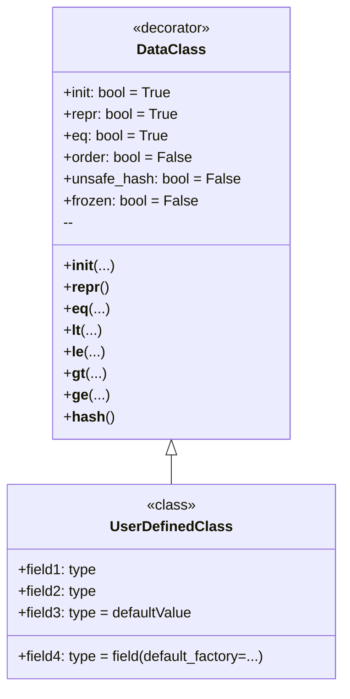

**Что такое `dataclass`?**

`dataclass` — это декоратор, введенный в Python 3.7, который автоматически генерирует специальные методы (такие как `__init__`, `__repr__`, `__eq__` и другие) для классов, которые в основном служат контейнерами для данных. Это избавляет тебя от необходимости писать много шаблонного кода.

**Зачем использовать `dataclass`?**

1.  **Сокращение кода:** Вместо того чтобы вручную определять методы `__init__`, `__repr__`, `__eq__` и т.д., ты просто объявляешь поля данных, и `dataclass` сделает всё остальное.
2.  **Улучшение читаемости:** Классы становятся более лаконичными и понятными, поскольку сосредотачиваются на данных, а не на технической реализации.
3.  **Уменьшение количества ошибок:** Автоматически сгенерированный код обычно более надежный, чем код, написанный вручную.
4.  **Ускорение разработки:** Ты можешь быстрее создавать классы для работы с данными, не тратя время на рутину.

**Как использовать `dataclass`?**

Для начала, тебе нужно импортировать декоратор `dataclass` из модуля `dataclasses`:

```python
from dataclasses import dataclass
```

Затем ты помечаешь класс декоратором `@dataclass`, и определяешь поля данных, как обычные переменные класса с аннотациями типов:

```python
from dataclasses import dataclass

@dataclass
class Point:
    x: int
    y: int
```

В этом примере, `Point` — это `dataclass`, которая имеет два поля: `x` и `y`, оба целого типа. `dataclass` автоматически создаст:
    * Конструктор `__init__`, позволяющий создавать экземпляры класса, например `Point(1, 2)`.
    *  `__repr__`, возвращающий строковое представление объекта, например `Point(x=1, y=2)`.
    * `__eq__`, позволяющий сравнивать объекты, например `Point(1, 2) == Point(1, 2)`.

**Пример простого использования**
```python
from dataclasses import dataclass

@dataclass
class Point:
    x: int
    y: int

# Создание экземпляра класса
point1 = Point(1, 2)
point2 = Point(1, 2)
point3 = Point(3, 4)

# Вывод на экран
print(point1) # Выведет: Point(x=1, y=2)
print(point1 == point2) # Выведет: True
print(point1 == point3) # Выведет: False
```

**Варианты `dataclass`**

`dataclass` предоставляет несколько параметров для настройки поведения:

*   `init`: Если `True` (по умолчанию), генерируется метод `__init__`. Если `False`, метод `__init__` не создается.
*   `repr`: Если `True` (по умолчанию), генерируется метод `__repr__`. Если `False`, метод `__repr__` не создается.
*   `eq`: Если `True` (по умолчанию), генерируется метод `__eq__`. Если `False`, метод `__eq__` не создается.
*   `order`: Если `True`, генерируются методы сравнения (`__lt__`, `__le__`, `__gt__`, `__ge__`). По умолчанию `False`.
*   `unsafe_hash`: Если `False` (по умолчанию), метод `__hash__` не генерируется. Если `True`, метод `__hash__` будет сгенерирован, а  `dataclass` станет хешируемым.
*   `frozen`: Если `True`, экземпляры класса будут неизменяемыми (read-only). По умолчанию `False`.

**Примеры использования параметров**
1. Отключаем метод `__repr__` и делаем класс неизменяемым
```python
from dataclasses import dataclass

@dataclass(repr=False, frozen=True)
class Point:
    x: int
    y: int

# Создание экземпляра класса
point1 = Point(1, 2)
# Вывод на экран
print(point1) # Выведет: <__main__.Point object at 0x000001D8322F6770> (т.к. __repr__ не определен)

# Изменение экземпляра вызовет ошибку
try:
    point1.x = 10
except Exception as e:
    print (e) # Выведет: cannot assign to field 'x'
```
2. Устанавливаем порядок, добавляем метод hash и делаем класс неизменяемым
```python
from dataclasses import dataclass

@dataclass(order=True, unsafe_hash=True, frozen=True)
class Point:
    x: int
    y: int

# Создание экземпляра класса
point1 = Point(1, 2)
point2 = Point(3, 4)
point3 = Point(1, 2)
# Вывод на экран
print(point1 < point2) # Выведет: True
print(point1 == point3) # Выведет: True

# Теперь можно использовать класс как ключ словаря
my_dict = {point1: "first", point2: "second"}
print(my_dict) # Выведет: {Point(x=1, y=2): 'first', Point(x=3, y=4): 'second'}
```

**Значения по умолчанию**

Ты можешь задавать значения по умолчанию для полей:

```python
from dataclasses import dataclass

@dataclass
class Point:
    x: int = 0
    y: int = 0

# Создание экземпляра класса
point1 = Point()
point2 = Point(1, 2)

# Вывод на экран
print(point1) # Выведет: Point(x=0, y=0)
print(point2) # Выведет: Point(x=1, y=2)
```
При создании экземпляра класса, если значения не переданы, будет использовано значение по умолчанию.

**Использование `dataclass` с изменяемыми типами**

Будь осторожен при использовании изменяемых типов данных (списки, словари) в качестве значений по умолчанию. Они будут созданы только один раз и будут использоваться всеми экземплярами класса:

```python
from dataclasses import dataclass
from typing import List

@dataclass
class BadExample:
    items: List[int] = []

bad1 = BadExample()
bad2 = BadExample()

bad1.items.append(1)
print (bad1.items) # Выведет: [1]
print (bad2.items) # Выведет: [1] 
```
В примере выше изменения в `bad1.items` также отображаются в `bad2.items`. Это происходит из-за того, что оба экземпляра класса используют один и тот же список по умолчанию.

Чтобы этого избежать, используй `dataclasses.field` и `default_factory`:
```python
from dataclasses import dataclass, field
from typing import List

@dataclass
class GoodExample:
    items: List[int] = field(default_factory=list)

good1 = GoodExample()
good2 = GoodExample()

good1.items.append(1)
print (good1.items) # Выведет: [1]
print (good2.items) # Выведет: []
```
В этом случае `default_factory=list` создаст новый пустой список для каждого нового экземпляра класса.

**Диаграмма**

Вот диаграмма, показывающая основные концепции `dataclass`:



В этой диаграмме:
*   `DataClass` представляет декоратор `@dataclass` и его параметры.
*   `UserDefinedClass` — это класс, который ты объявляешь, используя декоратор `@dataclass`.
*   Стрелка от `DataClass` к `UserDefinedClass` показывает, что `DataClass` применяется к `UserDefinedClass`


## `dict()`, `__dir__()` и другие особенности `dataclass`.

*   `dict()` напрямую не работает с экземплярами `dataclass`. Для преобразования в словарь нужно использовать ручные способы или сторонние библиотеки.
*   `__dir__()` возвращает список всех атрибутов и методов объекта, включая сгенерированные `dataclass` методы и поля.
*   `__dataclass_fields__` и `__dataclass_params__` предоставляют метаданные о полях и параметрах `dataclass`.

**1. `dict()` в контексте `dataclass`**

   - **Нет автоматической поддержки:** Встроенная функция `dict()` напрямую не работает с экземплярами `dataclass`, как с обычными словарями. Если ты попытаешься вызвать `dict(instance_of_dataclass)`, то получишь ошибку `TypeError: cannot convert dictionary update sequence element #0 to a sequence`. 
   
   - **Преобразование в словарь:** Чтобы преобразовать экземпляр `dataclass` в словарь, нужно сделать это вручную или воспользоваться сторонней библиотекой. Вот как это можно сделать вручную:

     ```python
     from dataclasses import dataclass
     
     @dataclass
     class Person:
         name: str
         age: int
     
     person = Person("Alice", 30)
     
     # Ручное преобразование в словарь
     person_dict = {field.name: getattr(person, field.name) for field in dataclasses.fields(Person)}
     print(person_dict)  # Выведет: {'name': 'Alice', 'age': 30}

     #Альтернативный вариант: 
     person_dict = person.__dict__
     print(person_dict) #Выведет: {'name': 'Alice', 'age': 30}
     ```
   - **Почему так?** `dataclass` в первую очередь предназначен для представления данных в виде классов. Хотя данные и хранятся как атрибуты объекта, `dataclass` не делает их автоматически доступными как словарь. 

**2. `__dir__()` в `dataclass`**

   - **Возвращает атрибуты:** Метод `__dir__()` возвращает список строк, представляющих имена атрибутов и методов объекта. Для `dataclass`, `__dir__()` будет включать:
     - Все определенные поля данных.
     - Автоматически сгенерированные методы (`__init__`, `__repr__`, `__eq__`, и т.д., в зависимости от настроек).
     - Любые другие методы, добавленные вручную.

   - **Пример:**
      ```python
      from dataclasses import dataclass
      
      @dataclass
      class Point:
          x: int
          y: int
          
          def distance(self):
                return (self.x**2 + self.y**2)**0.5
      
      point = Point(1, 2)
      print(dir(point))
      #Выведет:
      #['__class__', '__dataclass_fields__', '__dataclass_params__', '__delattr__', '__dict__', '__dir__', '__doc__', '__eq__', '__format__', '__ge__', '__getattribute__', '__gt__', '__hash__', '__init__', '__init_subclass__', '__le__', '__lt__', '__module__', '__ne__', '__new__', '__reduce__', '__reduce_ex__', '__repr__', '__setattr__', '__sizeof__', '__str__', '__subclasshook__', '__weakref__', 'distance', 'x', 'y']

      ```

   - **Полезность:** `__dir__()` может быть полезным для интроспекции - просмотра доступных атрибутов и методов экземпляра `dataclass`.
   
**3. Другие особенности `dataclass`**

   - **`__dataclass_fields__`:**
      - Это атрибут класса, который содержит словарь, где ключами являются имена полей `dataclass`, а значениями – объекты `dataclasses.Field`.
      - Этот атрибут позволяет получить метаданные о полях `dataclass` (например, тип, значение по умолчанию, и т.д.).

     ```python
     from dataclasses import dataclass, fields
     
     @dataclass
     class Point:
          x: int = 0
          y: int = 0
     
     print(Point.__dataclass_fields__)
     #Выведет:
     #{'x': Field(name='x',type=<class 'int'>,default=0,default_factory=MISSING,init=True,repr=True,hash=None,compare=True,metadata=mappingproxy({}),kw_only=False), 'y': Field(name='y',type=<class 'int'>,default=0,default_factory=MISSING,init=True,repr=True,hash=None,compare=True,metadata=mappingproxy({}),kw_only=False)}
     ```
     ```python
     # Используем fields() для того же результата
     for field in fields(Point):
         print(field.name, field.type, field.default)
     #Выведет:
     #x <class 'int'> 0
     #y <class 'int'> 0
     ```
  
   - **`__dataclass_params__`:**
      - Это атрибут класса, который хранит информацию о параметрах `dataclass` (например, `init`, `repr`, `eq`, `order`, и т.д.).
      - Это позволяет получить доступ к настройкам, с которыми был создан `dataclass`.

      ```python
      from dataclasses import dataclass
      
      @dataclass(order = True, frozen = True)
      class Point:
        x: int
        y: int
      print(Point.__dataclass_params__)
      #Выведет:
      #dataclass_params(init=True,repr=True,eq=True,order=True,unsafe_hash=False,frozen=True)
      ```

   - **Использование с наследованием:** Ты можешь создавать `dataclass`, наследуясь от других `dataclass`.
   - **Использование с `typing.NamedTuple`:** `dataclass` является более гибкой альтернативой `typing.NamedTuple`, поскольку позволяет задавать значения по умолчанию, добавлять свои методы, а также делать класс изменяемым или неизменяемым.
