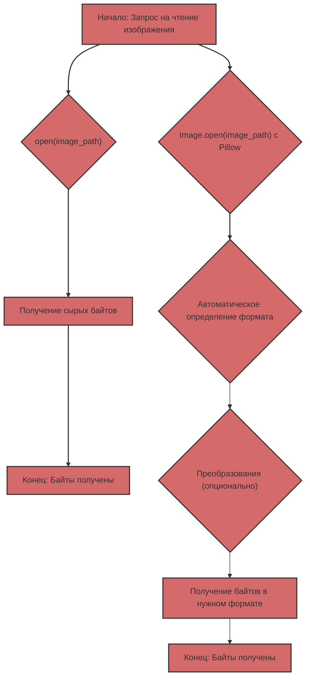

## Чтение изображений: сырые байты против Pillow

Когда дело доходит до работы с изображениями в Python, у тебя есть два основных подхода:

1.  **Чтение сырых байтов:** Использование `open()` для чтения содержимого файла изображения как последовательности байтов.
2.  **Использование Pillow:** Использование библиотеки Pillow для открытия и обработки изображений.

Рассмотрим каждый подход подробно и выясним, в чем их отличия и когда какой подход лучше использовать.

### 1. Чтение сырых байтов с помощью `open()`

#### Что это такое?

Когда ты открываешь файл изображения в бинарном режиме (`"rb"`) с помощью `open()`, ты получаешь доступ к содержимому файла как к последовательности байтов. Это означает, что ты получаешь "сырые" данные, без какой-либо интерпретации или обработки.

#### Как это выглядит в коде?

```python
from pathlib import Path

def read_image_bytes_direct(image_path: Path) -> bytes | None:
    """
    Читает изображение как байты напрямую с помощью open().

    Args:
        image_path: Путь к файлу изображения.

    Returns:
        bytes: Байты изображения.
        None: Если произошла ошибка.
    """
    try:
        with open(image_path, "rb") as image_file:
            image_data = image_file.read()
            return image_data
    except Exception as e:
        print(f"Ошибка чтения файла: {e}")
        return None


if __name__ == '__main__':
    image_path = Path("test.jpg")  # Замените на путь к вашему изображению

    if not image_path.is_file():
        print(f"Файла {image_path} не существует")
    else:
       image_bytes_direct = read_image_bytes_direct(image_path)

       if image_bytes_direct:
           print(f"Изображение прочитано напрямую, размер: {len(image_bytes_direct)} bytes")
           # Можно использовать image_bytes_direct, например, для отправки по сети
       else:
           print("Не удалось прочитать изображение.")
```

#### Когда это полезно?

*   **Передача данных по сети:** Когда тебе нужно просто передать данные изображения по сети, не заботясь о формате.
*   **Сохранение на диск:** Когда тебе нужно сохранить содержимое файла на диск без изменений.
*   **Низкоуровневый доступ:** Когда тебе нужен низкоуровневый доступ к данным файла, и ты сам знаешь, как их интерпретировать.

#### Ограничения

*   **Нет обработки формата:** Ты получаешь только байты, без какой-либо информации о формате изображения (JPEG, PNG, GIF и т.д.).
*   **Нет валидации:** Нет проверки, действительно ли файл является изображением.
*   **Нет метаданных:** Ты не получаешь доступ к метаданным изображения (размер, цветовое пространство и т.д.).
*   **Нет удобных преобразований:** Нельзя менять размер, формат или применять другие преобразования без дополнительной обработки.

### 2. Использование Pillow для чтения изображений

#### Что это такое?

Pillow — это мощная библиотека для работы с изображениями. Она позволяет открывать изображения разных форматов, получать метаданные, изменять размер, конвертировать форматы и многое другое.

#### Как это выглядит в коде?

```python
from pathlib import Path
from PIL import Image
from io import BytesIO

def read_image_pillow(image_path: Path) -> bytes | None:
    """
    Читает изображение с помощью Pillow и возвращает его как байты JPEG.

    Args:
        image_path: Путь к файлу изображения.

    Returns:
         bytes: Байты изображения в формате JPEG.
         None: Если произошла ошибка.
    """
    try:
        img = Image.open(image_path)
        img_byte_arr = BytesIO()
        img.save(img_byte_arr, format="JPEG")
        return img_byte_arr.getvalue()
    except Exception as e:
        print(f"Ошибка чтения изображения с Pillow: {e}")
        return None

if __name__ == '__main__':
    image_path = Path("test.jpg") # Замените на путь к вашему изображению

    if not image_path.is_file():
        print(f"Файла {image_path} не существует")
    else:
        image_bytes_pillow = read_image_pillow(image_path)
        if image_bytes_pillow:
           print(f"Изображение прочитано с Pillow, размер: {len(image_bytes_pillow)} bytes")
           # Можно использовать image_bytes_pillow, например, для отправки в модель Gemini.
        else:
           print("Не удалось прочитать изображение с Pillow.")
```

#### Когда это полезно?

*   **Работа с изображениями:** Когда тебе нужно работать с изображениями, а не просто байтами.
*   **Автоматическое определение формата:** Pillow автоматически определяет формат изображения.
*   **Конвертация форматов:** Можно легко конвертировать изображения между разными форматами (JPEG, PNG, GIF и т.д.).
*   **Изменение размера:** Можно менять размер изображения перед обработкой.
*   **Метаданные:** Можно получить доступ к метаданным изображения (размер, цветовой профиль и т.д.).
*   **Обработка ошибок:** Pillow обрабатывает ошибки при открытии поврежденных файлов.

#### Преимущества

*   **Гибкость:** Pillow предоставляет множество возможностей для работы с изображениями.
*   **Надежность:** Pillow проверяет, является ли файл валидным изображением.
*   **Удобство:** Pillow упрощает процесс обработки изображений.

### Сравнение в таблице

| Характеристика             | `open(image_path, "rb")`                                    | Pillow                                                      |
| :------------------------- | :---------------------------------------------------------- | :---------------------------------------------------------- |
| **Что делает**            | Читает файл как последовательность байтов                     | Открывает и обрабатывает изображение                         |
| **Формат**                | Не распознает формат                                        | Автоматически определяет формат                              |
| **Метаданные**            | Нет доступа к метаданным                                     | Предоставляет доступ к метаданным                             |
| **Обработка**              | Нет возможностей обработки                                 | Изменение размера, конвертация форматов, и т.д.              |
| **Валидация**             | Нет валидации                                                | Проверяет, является ли файл валидным изображением          |
| **Когда использовать**    | Простая передача байтов, низкоуровневый доступ              | Работа с изображениями, преобразования, обработка ошибок |
| **Пример**                | Передача байтов по сети, сохранение на диск                  | Подготовка изображений для Gemini, веб-разработка           |

### В контексте Gemini

Модели Gemini ожидают данные изображений в определенном формате (обычно JPEG или PNG). Использование Pillow гарантирует, что ты предоставляешь изображения в корректном формате, а не просто "сырые" байты. Более того, Pillow позволяет изменять размер изображения, если это необходимо.

### Диаграмма сравнения



Если тебе нужно просто прочитать файл как байты, без какой-либо обработки, `open(image_path, "rb")` подойдет. Однако для обработки изображений, особенно для взаимодействия с API, которые ожидают изображения в определенном формате, использование Pillow является более надежным и гибким решением.
