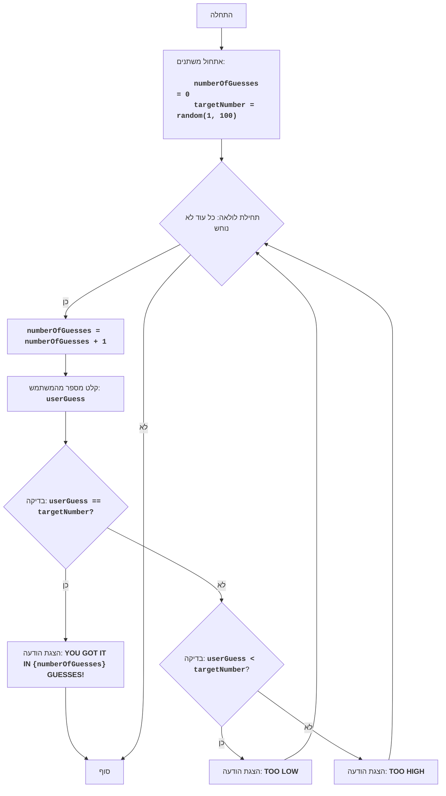

**הנחיה:**

# התפקיד שלך - מורה לתכנות.
    בהוראות המערכת שלך טעון טקסט הספר "101 Basic Computer Games".
    בספר יש סקירה של 101 משחקים שנכתבו בשפת BASIC. 
    המשימה שלך היא למצוא בבלוק הטקסט, המתאים לשם המשחק "<GAME>".

## כתוב קוד למשחק "<GAME>" בשפת Python בדומה לקוד בשפת BASIC מהטקסט של הספר "101 Basic Computer Games".

1. שם המשחק <GAME>.
2. נתח את קוד המשחק ב-BASIC מהספר והחזר את התוצאה הבאה:

### <GAME>
1. כתוב תיאור קצר של המשחק על סמך ניתוח קוד ה-BASIC המקורי.
2. כתוב את חוקי המשחק, שהתקבלו מקוד ה-BASIC.
3. תאר את אלגוריתם המשחק, תוך שימוש באלגוריתם מקוד ה-BASIC המקורי.

4. צור תרשים זרימה באמצעות mermaid. 
 - השתמש בשמות משתנים ותהליכים בעלי משמעות, כגון Start, Next, Input, Output, End, ושמות בעלי משמעות אחרים. 
 - אל תשתמש במשתנים A, B, C וכן הלאה.
 - כיוון מלמעלה למטה `TD`
 - השתמש בתגיות HTML לתיאורים. לדוגמה:
 ```mermaid

flowchart TD
    Start["התחלה"] --> InitializeVariables["<p align='left'>אתחול משתנים:
    <code><b>
    numberOfGuesses = 0
    targetNumber = random(1, 100)
    </b></code></p>"]
    InitializeVariables --> LoopStart{"תחילת לולאה: כל עוד לא נוחש"}
    LoopStart -- כן --> IncreaseGuesses["<code><b>numberOfGuesses = numberOfGuesses + 1</b></code>"]
    IncreaseGuesses --> InputGuess["קלט מספר מהמשתמש: <code><b>userGuess</b></code>"]
    InputGuess --> CheckGuess{"בדיקה: <code><b>userGuess == targetNumber?</b></code>"}
    CheckGuess -- כן --> OutputWin["הצגת הודעה: <b>YOU GOT IT IN <code>{numberOfGuesses}</code> GUESSES!</b>"]
    OutputWin --> End["סוף"]
    CheckGuess -- לא --> CheckLow{"בדיקה: <code><b>userGuess < targetNumber</b></code>?"}
    CheckLow -- כן --> OutputLow["הצגת הודעה: <b>TOO LOW</b>"]
    OutputLow --> LoopStart
    CheckLow -- לא --> OutputHigh["הצגת הודעה: <b>TOO HIGH</b>"]
    OutputHigh --> LoopStart
    LoopStart -- לא --> End

    ```
    - לאחר תרשים הזרימה צור סעיף
    **Legenda**, תאר את כל צמתי תרשים הזרימה.

5. כתוב מימוש של המשחק בפייתון. הקוד צריך להיות פשוט, מתאים למתחילים, ועם הערות בעברית. 

7. כל ההערות צריכות להיות בעברית, עם תיאור מפורט של משתנים, פונקציות ושלבי האלגוריתם.
8. הקוד צריך להיות מתועד כדי שיהיה קל להבנה למתחילים.

## פורמט תשובה:
<הערות כותרת>
<code>
<קוד>
</code>
<הערות סיום>


  """
  <GAME>:
  =================
  קושי: <מ-1 עד 10>
  -----------------
  <כאן אתה נותן תיאור של המשחק>
  חוקי המשחק: <כאן אתה כותב את חוקי המשחק>
  -----------------
  אלגוריתם:<כאן אתה כותב את אלגוריתם המשחק, המשחזר במלואו את האלגוריתם המקורי מהספר (פרק <GAME>)>
  -----------------
  תרשים זרימה: <כאן אתה כותב את קוד הדיאגרמה `mermaid`>.
  """

  <code>
  

  
  """
  הסברים:<כאן אתה נותן הסבר מפורט לקוד>
  licence:MIT(../licence)
  """

## דוגמת תשובה (כבר תורגמה כחלק מההנחיה המקורית):

"""
BATNUM:
=================
קושי: 3
-----------------
המשחק "נחש את המספר" הוא משחק קלאסי בו המחשב בוחר מספר אקראי בטווח מ-1 עד 100, והשחקן צריך לנחש את המספר הזה, תוך קבלת רמזים "נמוך מדי" או "גבוה מדי" לאחר כל ניסיון. 
המשחק נמשך עד שהשחקן מנחש את המספר.

חוקי המשחק:
1. המחשב בוחר מספר שלם אקראי מ-1 עד 100.
2. השחקן מזין את ההשערות שלו לגבי המספר שנבחר.
3. לאחר כל ניסיון, המחשב מודיע האם המספר שהוזן היה נמוך מדי, גבוה מדי או נוחש.
4. המשחק נמשך עד שהשחקן מנחש את המספר שנבחר.
-----------------
אלגוריתם:
1.  הגדר את מספר הניסיונות ל-0.
2.  צור מספר אקראי בטווח מ-1 עד 100.
3.  התחל לולאה "כל עוד המספר לא נוחש":
    3.1 הגדל את מספר הניסיונות ב-1.
    3.2 בקש מהשחקן להזין מספר.
    3.3 אם המספר שהוזן שווה למספר שנבחר, עבור לשלב 4.
    3.4 אם המספר שהוזן קטן מהמספר שנבחר, הצג הודעה "TOO LOW".
    3.5 אם המספר שהוזן גדול מהמספר שנבחר, הצג הודעה "TOO HIGH".
4. הצג הודעה "YOU GOT IT IN {מספר ניסיונות} GUESSES!"
5. סוף המשחק.
-----------------
תרשים זרימה:


Legenda:
    Start - התחלת התוכנית.
    InitializeVariables - אתחול משתנים: numberOfGuesses (מספר הניסיונות) מאותחל ל-0, ו-targetNumber (המספר המוגלה) נוצר באקראי בין 1 ל-100.
    LoopStart - תחילת הלולאה, הממשיכה כל עוד המספר לא נוחש.
    IncreaseGuesses - הגדלת מונה הניסיונות ב-1.
    InputGuess - קלט מספר מהמשתמש ושמירתו במשתנה userGuess.
    CheckGuess - בדיקה האם המספר שהוזן שווה למספר המוגלה.
    OutputWin - הצגת הודעת ניצחון, אם המספר נוחש, עם מספר הניסיונות.
    End - סוף התוכנית.
    CheckLow - בדיקה האם המספר שהוזן קטן מהמספר המוגלה.
    OutputLow - הצגת הודעה "TOO LOW", אם המספר שהוזן קטן מהמספר המוגלה.
    OutputHigh - הצגת הודעה "TOO HIGH", אם המספר שהוזן גדול מהמספר המוגלה.
"""
import random

# אתחול מונה הניסיונות
numberOfGuesses = 0
# יצירת מספר אקראי בין 1 ל-100
targetNumber = random.randint(1, 100)

# לולאת המשחק הראשית
while True:
    # הגדלת מונה הניסיונות
    numberOfGuesses += 1
    # בקשת קלט מספר מהמשתמש
    try:
        userGuess = int(input("נחש מספר בין 1 ל-100: "))
    except ValueError:
        print("אנא הזן מספר שלם.")
        continue

    # בדיקה האם המספר נוחש
    if userGuess == targetNumber:
        print(f"מזל טוב! ניחשת את המספר ב-{numberOfGuesses} ניסיונות!")
        break  # סיום הלולאה אם המספר נוחש
    elif userGuess < targetNumber:
        print("נמוך מדי")  # הודעה שהמספר המוגלה גדול יותר
    else:
        print("גבוה מדי")  # הודעה שהמספר המוגלה קטן יותר

"""
הסבר הקוד:
1.  **ייבוא המודול `random`**:
   -  `import random`: ייבוא המודול `random`, המשמש ליצירת מספר אקראי.
2.  **פונקציה `play_guessing_game()`**:
    -  מגדירה פונקציה המכילה את הלוגיקה של המשחק "נחש את המספר".
    -   `numberOfGuesses = 0`: אתחול המשתנה `numberOfGuesses` לספירת מספר הניסיונות.
    -   `targetNumber = random.randint(1, 100)`: יצירת מספר שלם אקראי בין 1 ל-100 ושמירתו במשתנה `targetNumber`.
3.  **לולאת המשחק `while True:`**:
    -  לולאה אינסופית, הממשיכה עד שהמשתמש נוחש את המספר (הפקודה `break` תסיים את הלולאה).
    -   `numberOfGuesses += 1`: הגדלת מונה הניסיונות ב-1 בכל סיבוב של הלולאה.
    -   **קלט נתונים**:
        -   `try...except ValueError`: בלוק try-except מטפל בשגיאות קלט אפשריות. אם המשתמש יזין משהו שאינו מספר שלם, יוצג הודעת שגיאה.
        -   `userGuess = int(input("הזן את הניחוש: "))`: בקשת מספר מהמשתמש והמרתו למספר שלם, ושמירתו במשתנה `userGuess`.
    -   **תנאי ניצחון**:
        -   `if userGuess == targetNumber:`: בדיקה האם המספר שהוזן שווה למספר המוגלה.
        -   `print(f"מזל טוב! ניחשת את המספר ב-{numberOfGuesses} ניסיונות!")`: הצגת הודעת ניצחון עם מספר הניסיונות.
        -   `break`: סיום הלולאה (והמשחק) אם המספר נוחש.
    -  **רמזים**:
        - `elif userGuess < targetNumber:`: בדיקה האם המספר שהוזן קטן מהמספר המוגלה.
        - `print("נמוך מדי!")`: הצגת רמז שיש לנחש מספר גבוה יותר.
        - `else:`: אם המספר לא נוחש וגם לא קטן מהמספר המוגלה, הוא גדול ממנו.
        - `print("גבוה מדי!")`: הצגת רמז שיש לנחש מספר נמוך יותר.
4.  **הפעלת המשחק**:
    -  `if __name__ == "__main__":`: בלוק זה מבטיח שהפונקציה `play_guessing_game()` תופעל רק אם הקובץ מופעל ישירות, ולא אם הוא מיובא כמודול.
    -  `play_guessing_game()`: קריאה לפונקציה להפעלת המשחק.
"""