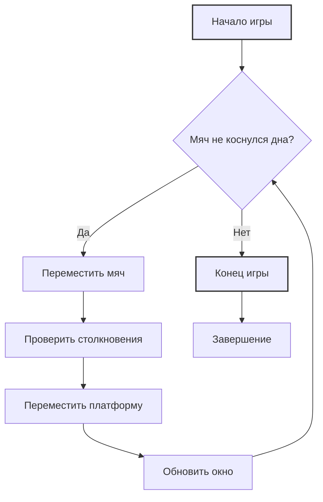

## Игра №1: Арканоид

### Описание

Классическая аркадная игра, где игрок управляет горизонтальной платформой внизу экрана, отбивая мяч, который, в свою очередь, отскакивает от стен и платформы. Цель игры - не дать мячу упасть за нижний край экрана.

### Правила

1.  Мяч движется по экрану, отскакивая от стен и платформы.
2.  Игрок перемещает платформу влево и вправо.
3.  Если мяч касается платформы, он отскакивает обратно.
4.  Если мяч падает за нижний край экрана, игра заканчивается.

### Код

```python
from tkinter import *
import time
import random
import pygame  # Хотя и импортируется, но не используется в коде

class Ball():
    """
    Класс, представляющий мяч в игре.
    """
    def __init__(self, canvas: Canvas, platform: object, color: str) -> None:
        """
        Инициализация мяча.
        
        Args:
            canvas: Холст Tkinter, на котором рисуется мяч.
            platform: Объект платформы для определения столкновений.
            color: Цвет мяча.
        """
        self.canvas = canvas
        self.platform = platform
        self.oval = canvas.create_oval(200, 200, 215, 215, fill=color)
        self.dir = [-3, -2, -1, 1, 2, 3]
        self.x = random.choice(self.dir)
        self.y = -1
        self.touch_bottom = False

    def touch_platform(self, ball_pos: tuple) -> bool:
        """
        Проверяет столкновение мяча с платформой.
        
        Args:
             ball_pos: Координаты мяча (x1, y1, x2, y2).
        Returns:
            True, если мяч столкнулся с платформой, иначе False.
        """
        platform_pos = self.canvas.coords(self.platform.rect)
        if ball_pos[2] >= platform_pos[0] and ball_pos[0] <= platform_pos[2]:
            if ball_pos[3] >= platform_pos[1] and ball_pos[3] <= platform_pos[3]:
                return True
        return False

    def draw(self) -> None:
         """
        Перемещает мяч на холсте и обрабатывает столкновения со стенами и платформой.
        """
        self.canvas.move(self.oval, self.x, self.y)
        pos = self.canvas.coords(self.oval)
        if pos[1] <= 0:
            self.y = 3
        if pos[3] >= 400:
            self.touch_bottom = True
        if self.touch_platform(pos):
            self.y = -3
        if pos[0] <= 0:
            self.x = 3
        if pos[2] >= 500:
            self.x = -3

class Platform():
    """
    Класс, представляющий платформу в игре.
    """
    def __init__(self, canvas: Canvas, color: str) -> None:
        """
        Инициализация платформы.
        
        Args:
             canvas: Холст Tkinter, на котором рисуется платформа.
             color: Цвет платформы.
        """
        self.canvas = canvas
        self.rect = canvas.create_rectangle(230, 300, 330, 310, fill=color)
        self.x = 0
        self.canvas.bind_all('<KeyPress-Left>', self.left)
        self.canvas.bind_all('<KeyPress-Right>', self.right)

    def left(self, event: object) -> None:
         """
        Обработчик нажатия клавиши "влево".
        
        Args:
            event: Событие нажатия клавиши.
        """
        self.x = -2

    def right(self, event: object) -> None:
        """
         Обработчик нажатия клавиши "вправо".
         
        Args:
            event: Событие нажатия клавиши.
        """
        self.x = 2

    def draw(self) -> None:
        """
        Перемещает платформу на холсте и обрабатывает столкновения со стенами.
        """
        self.canvas.move(self.rect, self.x, 0)
        pos = self.canvas.coords(self.rect)
        if pos[0] <= 0:
            self.x = 0
        if pos[2] >= 500:
            self.x = 0

# Инициализация окна
window = Tk()
window.title("Аркада")
window.resizable(0, 0)
window.wm_attributes("-topmost", 1)

canvas = Canvas(window, width=500, height=400)
canvas.pack()

platform = Platform(canvas, 'green')
ball = Ball(canvas, platform, 'red')

while True:
    if not ball.touch_bottom:
        ball.draw()
        platform.draw()
    else:
        break

    window.update()
    time.sleep(0.01)

window.mainloop()
```

### Разбор кода

*   **Класс `Ball`:**
    *   Инициализируется с холстом, платформой и цветом.
    *   `draw()`: Перемещает мяч, проверяет столкновения со стенами и платформой, меняет направление движения.
    *    `touch_platform()`: Определяет, коснулся ли мяч платформы.
*   **Класс `Platform`:**
    *   Инициализируется с холстом и цветом.
    *   `left()`/`right()`: Устанавливает скорость движения платформы.
    *   `draw()`: Перемещает платформу и обрабатывает столкновения со стенами.
*   **Основной цикл игры:**
    *   Создаёт окно, холст, платформу и мяч.
    *   В бесконечном цикле двигает мяч и платформу, проверяет конец игры и обновляет окно.

### Блок-схема




## Игра №3: Танки (текстовая игра)

### Описание

Простая текстовая игра, в которой два танка обмениваются выстрелами, пока один из них не будет уничтожен.

### Правила

1.  Два танка имеют характеристики: здоровье, урон и броня.
2.  Танки стреляют друг в друга по очереди.
3.  Урон наносится случайным образом в заданном диапазоне.
4.  Супер-танк имеет повышенное здоровье и броню.
5.  Игра заканчивается, когда у одного из танков здоровье становится 0.

### Код

```python
import random

class Tank:
    """
    Базовый класс для танков.
    """
    def __init__(self, model: str, armor: int, min_damage: int, max_damage: int, health: int) -> None:
         """
        Инициализация танка.
         
         Args:
            model: Модель танка.
            armor: Броня танка.
            min_damage: Минимальный урон танка.
            max_damage: Максимальный урон танка.
            health: Здоровье танка.
        """
        self.model = model
        self.armor = armor
        self.damage = random.randint(min_damage, max_damage)
        self.health = health

    def print_info(self) -> None:
        """
        Выводит информацию о танке.
        """
        print(f"{self.model} имеет лобовую броню {self.armor}мм при {self.health}ед. здоровья и урон в {self.damage} единиц")

    def health_down(self, enemy_damage: int) -> None:
        """
        Уменьшает здоровье танка.
        
        Args:
             enemy_damage: Урон, нанесенный противником.
        """
        self.health -= enemy_damage
        print(f"\n{self.model}:")
        print(f"Командир, по экипажу {self.model} попали, у нас осталось {self.health} очков здоровья")

    def shot(self, enemy: object) -> None:
        """
        Танк стреляет по противнику.
        
        Args:
            enemy: Танк-противник.
        """
        if enemy.health <= 0 or self.damage >= self.health:
            self.health = 0
            print(f"Экипаж танка {enemy.model} уничтожен")
        else:
            enemy.health_down(self.damage)
            print(f"\n{self.model}:")
            print(f"Точно в цель, у противника {enemy.model} осталось {enemy.health} единиц здоровья")

class SuperTank(Tank):
    """
    Класс для супертанка, наследуется от Tank.
    """
    def __init__(self, model: str, armor: int, min_damage: int, max_damage: int, health: int) -> None:
         """
        Инициализация супертанка.
        
        Args:
            model: Модель танка.
            armor: Броня танка.
            min_damage: Минимальный урон танка.
            max_damage: Максимальный урон танка.
            health: Здоровье танка.
        """
        super().__init__(model, armor, min_damage, max_damage, health)
        self.forceArmor = True

    def health_down(self, enemy_damage: int) -> None:
         """
        Уменьшает здоровье супертанка с учетом повышенной брони.
        
        Args:
            enemy_damage: Урон, нанесенный противником.
        """
        super().health