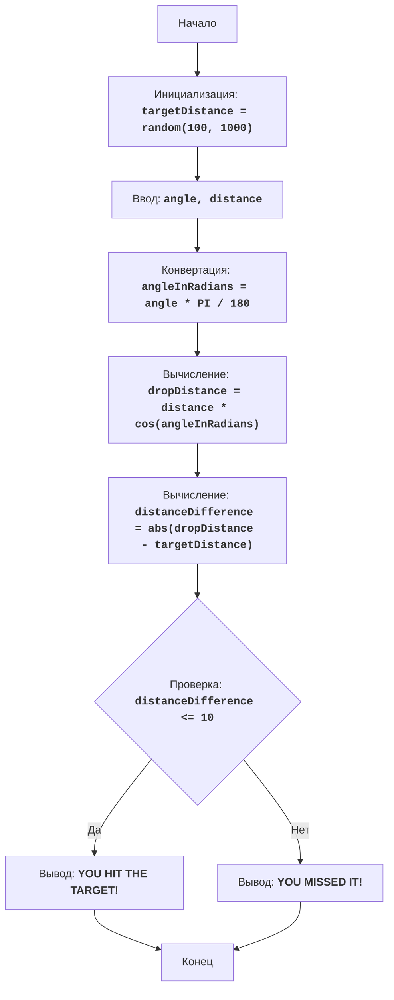

BOMBER:
=================
Сложность: 5
-----------------
Игра "Бомбер" - это игра-головоломка, в которой игрок пытается сбросить бомбу на цель, расположенную на случайно сгенерированном расстоянии. Игрок вводит угол сброса и расстояние, а компьютер вычисляет траекторию бомбы. Цель игры - как можно точнее попасть в цель.

Правила игры:
1. Компьютер генерирует случайное расстояние до цели в диапазоне от 100 до 1000.
2. Игрок вводит угол сброса бомбы и расстояние сброса бомбы.
3. Компьютер вычисляет расстояние, на которое упадет бомба.
4. Если расстояние падения бомбы находится в пределах 10 единиц от расстояния до цели, игрок побеждает.
5. Если расстояние падения бомбы не попадает в диапазон, то игрок проигрывает.
-----------------
Алгоритм:
1. Сгенерировать случайное расстояние до цели в диапазоне от 100 до 1000 и присвоить переменной `targetDistance`.
2. Запросить у игрока угол сброса бомбы в градусах (угол) и расстояние сброса (расстояние).
3. Преобразовать угол из градусов в радианы `angleInRadians = angle * 3.14159 / 180`.
4. Вычислить расстояние падения бомбы по формуле: `dropDistance = distance * cos(angleInRadians)`.
5. Вычислить разницу между расстоянием падения бомбы и расстоянием до цели: `distanceDifference = abs(dropDistance - targetDistance)`.
6. Если разница между расстояниями меньше или равна 10, то вывести сообщение о выигрыше.
7. Иначе вывести сообщение о проигрыше.
8. Конец игры.
-----------------
Блок-схема:

Legenda:
    Start - Начало программы.
    InitializeTargetDistance - Инициализация: генерируется случайное расстояние до цели (targetDistance) от 100 до 1000.
    InputAngleDistance - Запрос у пользователя угла сброса (angle) и расстояния сброса (distance).
    ConvertAngle - Преобразование угла из градусов в радианы (angleInRadians).
    CalculateDropDistance - Вычисление расстояния падения бомбы (dropDistance) на основе введенных данных.
    CalculateDistanceDifference - Вычисление абсолютной разницы между расстоянием падения бомбы (dropDistance) и расстоянием до цели (targetDistance).
    CheckDistanceDifference - Проверка, находится ли разница между расстояниями в пределах 10 единиц (distanceDifference <= 10).
    OutputWin - Вывод сообщения о выигрыше, если разница в пределах 10 единиц.
    End - Конец программы.
    OutputLose - Вывод сообщения о проигрыше, если разница больше 10 единиц.