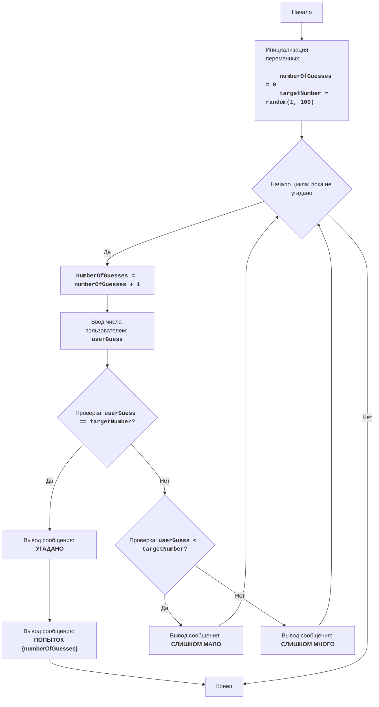

BUZZWD:
=================
Сложность: 4
-----------------
Игра "BUZZWD" представляет собой простую числовую игру, где компьютер генерирует случайное число, а игрок должен угадать его, вводя числа по очереди. После каждого ввода программа сообщает, является ли введенное число "слишком высоким", "слишком низким" или же оно угадано. Игра завершается, когда игрок правильно угадывает число.

Правила игры:
1. Компьютер выбирает случайное целое число от 1 до 100.
2. Игрок вводит свои предположения о загаданном числе.
3. После каждой попытки компьютер сообщает, было ли введенное число слишком низким, слишком высоким или угадано.
4. Игра продолжается до тех пор, пока игрок не угадает загаданное число.
-----------------
Алгоритм:
1.  Установить счетчик попыток в 0.
2.  Сгенерировать случайное число в диапазоне от 1 до 100.
3.  Начать цикл "пока число не угадано":
    3.1 Увеличить счетчик попыток на 1.
    3.2 Запросить у игрока ввод числа.
    3.3 Если введенное число равно загаданному числу, вывести сообщение "УГАДАНО" и перейти к шагу 4.
    3.4 Если введенное число меньше загаданного числа, вывести сообщение "СЛИШКОМ МАЛО".
    3.5 Если введенное число больше загаданного числа, вывести сообщение "СЛИШКОМ МНОГО".
4. Вывести сообщение "ПОПЫТОК {счетчик попыток}"
5. Конец игры.
-----------------
Блок-схема:

Legenda:
    Start - Начало программы.
    InitializeVariables - Инициализация переменных: numberOfGuesses (количество попыток) устанавливается в 0, а targetNumber (загаданное число) генерируется случайным образом от 1 до 100.
    LoopStart - Начало цикла, который продолжается, пока число не угадано.
    IncreaseGuesses - Увеличение счетчика количества попыток на 1.
    InputGuess - Запрос у пользователя ввода числа и сохранение его в переменной userGuess.
    CheckGuess - Проверка, равно ли введенное число userGuess загаданному числу targetNumber.
    OutputWin - Вывод сообщения "УГАДАНО", если числа равны.
    OutputAttempts - Вывод сообщения "ПОПЫТОК {numberOfGuesses}", с указанием количества попыток.
    End - Конец программы.
    CheckLow - Проверка, меньше ли введенное число userGuess загаданного числа targetNumber.
    OutputLow - Вывод сообщения "СЛИШКОМ МАЛО", если введенное число меньше загаданного.
    OutputHigh - Вывод сообщения "СЛИШКОМ МНОГО", если введенное число больше загаданного.   