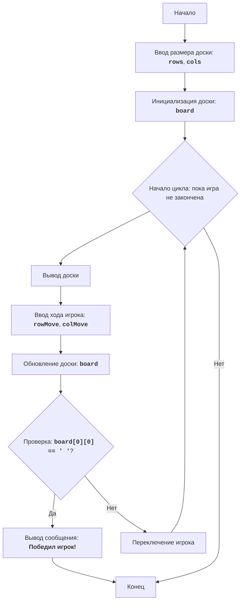

CHOMP:
=================
Сложность: 5
-----------------
Игра "CHOMP" - это игра для двух игроков, в которой используется прямоугольная доска, представляющая собой шоколадную плитку. 
Один из углов (обычно нижний левый) представляет собой ядовитую "дольку". Игроки по очереди отламывают от плитки куски, делая ходы. Цель игры - заставить противника съесть отравленную дольку.
Игрок, который вынужден съесть ядовитую дольку, проигрывает.
Правила игры:
1. Игровое поле представляет собой прямоугольную шоколадную плитку.
2. Один из углов (нижний левый) считается отравленным.
3. Игроки по очереди откусывают часть шоколадной плитки.
4. Игрок выбирает строку и столбец (откусывает кусок шоколада).
5. Все клетки справа и выше выбранной позиции удаляются.
6. Цель - заставить противника съесть отравленную дольку.
7. Игрок, который съедает отравленную дольку, проигрывает.
-----------------
Алгоритм:
1.  Начало игры.
2.  Запросить у пользователя размер шоколадной плитки (количество строк и столбцов).
3.  Инициализировать игровую доску, представляющую шоколадную плитку.
4.  Начать цикл игры, пока игра не закончится:
    4.1.  Вывести текущее состояние доски на экран.
    4.2.  Запросить у текущего игрока координаты откусываемого куска шоколада.
    4.3.  Обновить состояние доски, откусив выбранный кусок.
    4.4.  Проверить, не съел ли текущий игрок ядовитую дольку.
    4.5.  Если съел, объявить о победе противоположного игрока и завершить игру.
    4.6.  Передать ход следующему игроку.
5. Конец игры.
-----------------
Блок-схема:

Legenda:
    Start - Начало игры.
    InputBoardSize - Запрос размера доски (количество строк и столбцов).
    InitializeBoard - Инициализация игровой доски.
    LoopStart - Начало игрового цикла, который продолжается, пока игра не закончена.
    DisplayBoard - Вывод текущего состояния доски на экран.
    InputMove - Запрос у текущего игрока координат откусываемого куска шоколада.
    UpdateBoard - Обновление состояния доски после хода игрока.
    CheckWin - Проверка, съел ли текущий игрок ядовитую дольку.
    OutputWinner - Вывод сообщения о победе другого игрока.
    End - Конец игры.
    SwitchPlayer - Переключение хода на следующего игрока.