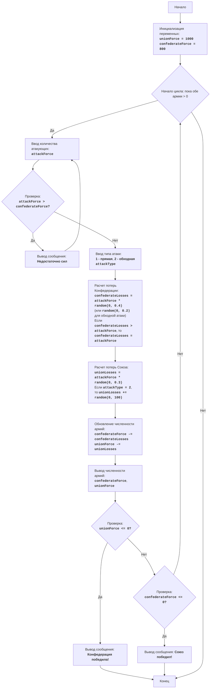

CIVILW:
=================
Сложность: 7
-----------------
Игра "Гражданская война" представляет собой симуляцию сражения между двумя армиями: Конфедерацией и Союзом. Игрок управляет Конфедерацией и принимает решения о численности своих войск и типе атак (прямая атака или обходной маневр). Цель игры - победить армию Союза, минимизируя свои потери. Игра учитывает случайные факторы, влияющие на исход сражения, что делает каждое сражение уникальным.

Правила игры:
1.  Игрок управляет армией Конфедерации и должен победить армию Союза.
2.  Игрок вводит количество солдат для атаки.
3.  Игрок выбирает тип атаки: прямая (1) или обходная (2).
4.  В зависимости от выбора игрока и случайных факторов, производится расчет потерь для обеих сторон.
5.  После каждого сражения, игра выводит текущую численность войск обеих сторон.
6.  Игра завершается победой одной из сторон, когда численность войск противника становится равна или меньше 0.
-----------------
Алгоритм:
1. Установить начальную численность армии Союза (UnionForce) равной 1000 и армии Конфедерации (ConfederateForce) равной 800.
2. Начать цикл "пока обе армии имеют численность больше 0":
    2.1. Запросить у игрока количество солдат, которых он хочет отправить в атаку (AttackForce).
        2.1.1. Если AttackForce больше, чем имеющиеся силы Конфедерации (ConfederateForce), то вывести сообщение "Недостаточно сил" и вернуться к началу шага 2.1
    2.2. Запросить у игрока тип атаки: прямая (1) или обходная (2) (AttackType).
    2.3. Вычислить потери Конфедерации (ConfederateLosses) случайным образом, умножив AttackForce на случайное число от 0 до 0.4 (для прямой атаки) или на случайное число от 0 до 0.2 (для обходного маневра).
        2.3.1. Если ConfederateLosses больше, чем AttackForce, ConfederateLosses установить равным AttackForce.
    2.4. Вычислить потери Союза (UnionLosses) случайным образом, умножив AttackForce на случайное число от 0 до 0.3.
        2.4.1. Если AttackType равно 2, то увеличить UnionLosses на случайное число от 0 до 100.
    2.5. Обновить численность армий:
        ConfederateForce = ConfederateForce - ConfederateLosses
        UnionForce = UnionForce - UnionLosses
    2.6. Вывести текущую численность армий обеих сторон.
    2.7. Проверить условие победы:
        2.7.1. Если UnionForce меньше или равен 0, то вывести сообщение "Конфедерация победила!" и закончить игру.
        2.7.2. Если ConfederateForce меньше или равен 0, то вывести сообщение "Союз победил!" и закончить игру.
3. Конец игры.
-----------------
Блок-схема:

    
Legenda:
    Start - Начало программы.
    InitializeForces - Инициализация начальной численности войск Союза (unionForce = 1000) и Конфедерации (confederateForce = 800).
    LoopStart - Начало цикла, который продолжается, пока обе армии имеют численность больше 0.
    InputAttackForce - Запрос у игрока количества солдат для атаки (attackForce).
    CheckForce - Проверка, достаточно ли у Конфедерации сил для атаки (attackForce > confederateForce).
    OutputInsufficient - Вывод сообщения "Недостаточно сил", если атакующих больше, чем имеющихся сил.
    InputAttackType - Запрос у игрока выбора типа атаки: прямая (1) или обходная (2).
    CalculateConfederateLosses - Расчет потерь Конфедерации (confederateLosses) на основе attackForce и типа атаки, с учетом случайного фактора. Если потери превышают attackForce, потери устанавливаются равными attackForce.
    CalculateUnionLosses - Расчет потерь Союза (unionLosses) на основе attackForce и типа атаки, с учетом случайного фактора. При обходной атаке потери Союза дополнительно увеличиваются случайным числом.
    UpdateForces - Обновление численности войск обеих армий после сражения.
    OutputForces - Вывод текущей численности армий Конфедерации и Союза.
    CheckUnionWin - Проверка, победила ли Конфедерация (численность армии Союза <= 0).
    OutputConfederateWin - Вывод сообщения о победе Конфедерации.
    CheckConfederateWin - Проверка, победил ли Союз (численность армии Конфедерации <= 0).
    OutputUnionWin - Вывод сообщения о победе Союза.
    End - Конец программы.