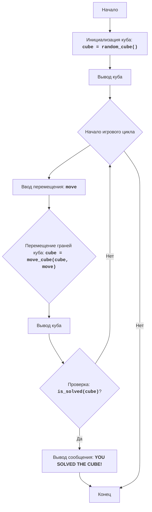

CUBE
=================

Сложность: 5
-----------------
Игра "Куб" - это игра-головоломка, где игрок должен собрать куб, перемещая его грани. Куб представлен в виде матрицы 3x3, где каждая ячейка представляет собой грань куба. Игрок может перемещать грани куба вверх, вниз, влево и вправо. Цель игры - собрать куб, расположив грани в правильном порядке.
Правила игры:
1. Куб представлен в виде матрицы 3x3.
2. Игрок может перемещать грани куба, вводя команды: U (вверх), D (вниз), L (влево), R (вправо).
3. Цель игры - собрать куб, расположив грани в правильном порядке.
4. Начальная позиция куба генерируется случайным образом.
5. Игра заканчивается, когда куб собран, то есть когда все грани расположены в правильном порядке.
-----------------
Алгоритм:
1. Инициализировать куб случайными значениями от 1 до 9 в виде матрицы 3x3.
2. Вывести куб на экран.
3. Начать игровой цикл:
    3.1. Запросить у игрока ввод команды для перемещения грани куба (U, D, L, R).
    3.2. Выполнить перемещение грани в соответствии с командой:
       - Если команда "U", то сдвинуть все ряды вверх.
       - Если команда "D", то сдвинуть все ряды вниз.
       - Если команда "L", то сдвинуть все столбцы влево.
       - Если команда "R", то сдвинуть все столбцы вправо.
    3.3. Вывести куб на экран.
    3.4. Проверить, собран ли куб.
    3.5. Если куб собран, вывести сообщение о победе и закончить игру.
    3.6. Если куб не собран, вернуться к шагу 3.1.
-----------------
Блок-схема:

Legenda:
    Start - Начало программы.
    InitializeCube - Инициализация куба, создание матрицы 3x3 со случайными значениями от 1 до 9.
    DisplayCube - Вывод текущего состояния куба на экран.
    GameLoopStart - Начало игрового цикла, который продолжается до тех пор, пока куб не будет собран.
    InputMove - Запрос у пользователя ввода команды для перемещения граней куба (U, D, L, R).
    MoveCube - Перемещение граней куба в соответствии с введенной командой.
    DisplayCubeAgain - Вывод куба после сделанного перемещения.
    CheckSolved - Проверка, собран ли куб.
    OutputWin - Вывод сообщения о победе, если куб собран.
    End - Конец программы.