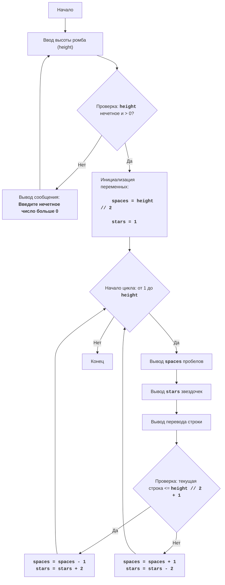

DIAMND:
=================
Сложность: 7
-----------------
Игра DIAMND представляет собой текстовую игру, где игрок пытается нарисовать ромб из звездочек, задавая его высоту.
Игра сначала запрашивает у пользователя нечетную высоту ромба. Затем, если введенное число является нечетным, игра строит ромб из звездочек, используя пробелы для формирования правильной геометрии фигуры. Если введенное число является четным или меньше 1, выводится сообщение об ошибке.
Правила игры:
1. Игрок вводит нечетное число, которое определяет высоту ромба.
2. Если введено четное число или число меньше 1, игра выводит сообщение об ошибке.
3. Если введено корректное (нечетное и больше 0) число, игра выводит на экран ромб из звездочек заданной высоты.
-----------------
Алгоритм:
1. Запросить у пользователя ввод высоты ромба (H).
2. Проверить, является ли H четным или меньше 1. Если да, то вывести сообщение об ошибке и перейти к шагу 1.
3. Если H нечетное и больше 0, то:
   3.1. Установить переменную `space` в H // 2 (целочисленное деление).
   3.2. Установить переменную `stars` в 1.
   3.3. Начать цикл от 1 до H включительно:
      3.3.1. Вывести `space` пробелов.
      3.3.2. Вывести `stars` звездочек.
      3.3.3. Вывести перевод строки.
      3.3.4. Если текущий номер строки меньше H // 2 + 1:
          3.3.4.1. Уменьшить `space` на 1.
          3.3.4.2. Увеличить `stars` на 2.
       3.3.5. Иначе:
          3.3.5.1. Увеличить `space` на 1.
          3.3.5.2. Уменьшить `stars` на 2.
4. Конец игры.
-----------------
Блок-схема:

Legenda:
    Start - Начало программы.
    InputHeight - Запрос у пользователя ввода высоты ромба и сохранение значения в переменной `height`.
    CheckHeight - Проверка, является ли введенная высота нечетным числом больше 0.
    OutputError - Вывод сообщения об ошибке, если высота не соответствует условию.
    InitializeVars - Инициализация переменных: `spaces` (количество пробелов) устанавливается равным `height // 2`, а `stars` (количество звездочек) устанавливается в 1.
    LoopStart - Начало цикла, который повторяется `height` раз.
    OutputSpaces - Вывод `spaces` пробелов.
    OutputStars - Вывод `stars` звездочек.
    OutputNewline - Вывод символа новой строки.
    CheckRow - Проверка, меньше или равна ли текущая строка середине ромба (`height // 2 + 1`).
    DecreaseSpaceIncreaseStars - Уменьшение количества пробелов `spaces` на 1 и увеличение количества звездочек `stars` на 2.
    IncreaseSpaceDecreaseStars - Увеличение количества пробелов `spaces` на 1 и уменьшение количества звездочек `stars` на 2.
    End - Конец программы.