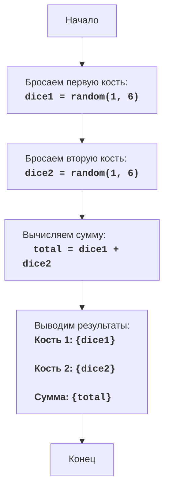

DICE:
=================
Сложность: 2
-----------------
Игра "Кости" - это простая игра, в которой игрок бросает две игральные кости, и компьютер показывает сумму выпавших значений.

Правила игры:
1.  Компьютер имитирует бросание двух шестигранных игральных костей.
2.  Компьютер выводит на экран значения каждой кости и их сумму.
-----------------
Алгоритм:
1.  Сгенерировать случайное число от 1 до 6 для первой кости.
2.  Сгенерировать случайное число от 1 до 6 для второй кости.
3.  Вычислить сумму значений обеих костей.
4.  Вывести на экран значение первой кости, значение второй кости и их сумму.
-----------------
Блок-схема:

Legenda:
    Start - Начало программы.
    RollDice1 -  Генерируется случайное число от 1 до 6, представляющее результат броска первой кости, и сохраняется в переменной dice1.
    RollDice2 - Генерируется случайное число от 1 до 6, представляющее результат броска второй кости, и сохраняется в переменной dice2.
    CalculateSum -  Вычисляется сумма значений dice1 и dice2, результат сохраняется в переменной total.
    OutputResults - Выводятся значения dice1, dice2 и их сумма total на экран.
    End - Конец программы.