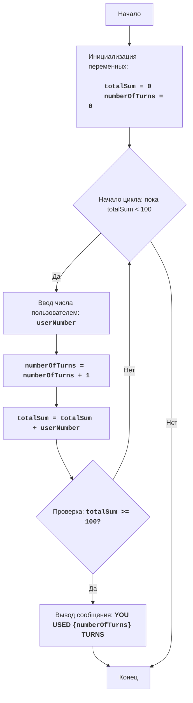

FIPFOP:
=================
Сложность: 5
-----------------
Игра FIPFOP - это игра-головоломка, где игрок должен, поочерёдно, вводить числа. 
Цель игры - добиться того, чтобы все числа введенные пользователем, в сумме, дали число 100. 
Игра заканчивается, когда сумма всех введенных чисел достигнет 100.

Правила игры:
1. Игрок вводит целые числа, по одному за раз.
2. Каждое введенное число добавляется к общей сумме.
3. Игра заканчивается, когда общая сумма достигает 100.
4. После завершения игры, выводится общее количество введенных чисел (ходы).
-----------------
Алгоритм:
1. Установить сумму в 0.
2. Установить счетчик ходов в 0.
3. Начать цикл "пока сумма меньше 100":
    3.1 Запросить у игрока ввод числа.
    3.2 Увеличить счетчик ходов на 1.
    3.3 Прибавить введенное число к общей сумме.
4. Вывести сообщение "ТЫ ИСПОЛЬЗОВАЛ {количество ходов} ХОДОВ"
5. Конец игры.
-----------------
Блок-схема:


**Legenda:**
    Start - Начало программы.
    InitializeVariables - Инициализация переменных: totalSum (сумма введенных чисел) устанавливается в 0, а numberOfTurns (количество ходов) устанавливается в 0.
    LoopStart - Начало цикла, который продолжается, пока totalSum меньше 100.
    InputNumber - Запрос у пользователя ввода числа и сохранение его в переменной userNumber.
    IncreaseTurns - Увеличение счетчика количества ходов на 1.
    AddNumber - Прибавление введенного числа userNumber к общей сумме totalSum.
    CheckSum - Проверка, больше или равна ли общая сумма totalSum 100.
    OutputTurns - Вывод сообщения о количестве ходов, использованных пользователем.
    End - Конец программы.
"""


# Инициализация суммы и счетчика ходов
totalSum = 0 # Сумма введенных чисел
numberOfTurns = 0 # Количество ходов

# Основной игровой цикл
while totalSum < 100:
    # Запрашиваем ввод числа у пользователя
    try:
        userNumber = int(input("Введите число: "))
    except ValueError:
         print("Пожалуйста, введите целое число.")
         continue
    
    # Увеличиваем счетчик ходов
    numberOfTurns += 1
    # Добавляем введенное число к общей сумме
    totalSum += userNumber

# Выводим сообщение о количестве ходов
print(f"ТЫ ИСПОЛЬЗОВАЛ {numberOfTurns} ХОДОВ")


"""
Объяснение кода:
1. **Инициализация переменных:**
   - `totalSum = 0`: Инициализирует переменную `totalSum` для хранения суммы введенных чисел, начинаем с 0.
   - `numberOfTurns = 0`: Инициализирует переменную `numberOfTurns` для подсчета количества ходов, также начинаем с 0.
2. **Основной цикл `while totalSum < 100`:**
   -  Цикл продолжается, пока сумма введенных чисел (`totalSum`) меньше 100.
3. **Ввод данных от пользователя:**
    - `try...except ValueError`: Блок try-except обрабатывает возможные ошибки ввода. Если пользователь введет не целое число, то будет выведено сообщение об ошибке.
   - `userNumber = int(input("Введите число: "))`: Запрашивает у пользователя ввод числа и преобразует его в целое число, сохраняя результат в переменной `userNumber`.
4. **Увеличение счетчика ходов:**
   - `numberOfTurns += 1`: Увеличивает счетчик ходов на 1 при каждом витке цикла.
5.  **Добавление числа к сумме:**
   -  `totalSum += userNumber`: Прибавляет введенное число (`userNumber`) к общей сумме (`totalSum`).
6.  **Вывод результата:**
    - `print(f"ТЫ ИСПОЛЬЗОВАЛ {numberOfTurns} ХОДОВ")`: Выводит на экран сообщение о том, сколько ходов было сделано, когда сумма чисел достигла 100 или больше.
"""
```