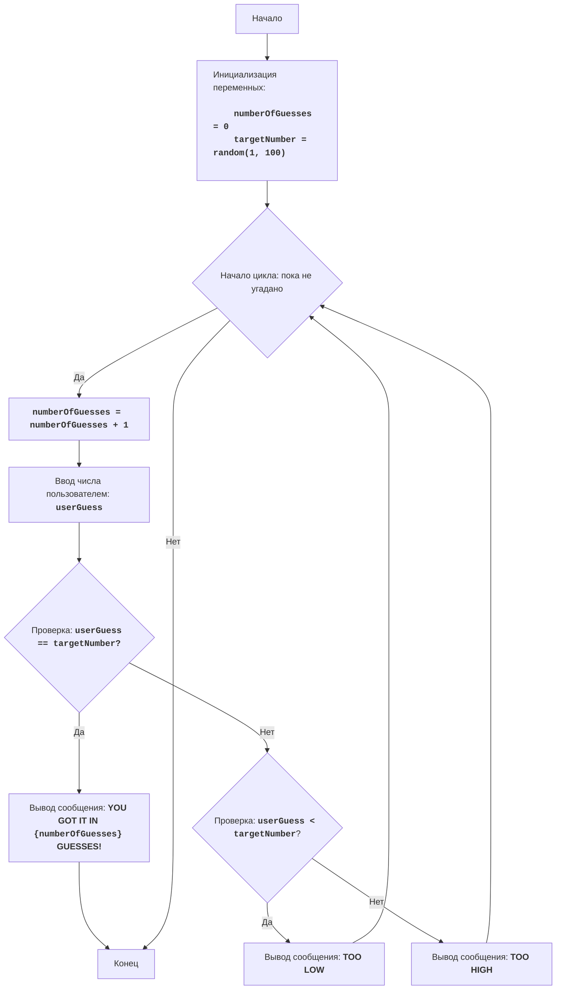

GUESS:
=================
Сложность: 3
-----------------
Игра "Угадай число" - это классическая игра, в которой компьютер выбирает случайное число в диапазоне от 1 до 100, а игрок должен угадать это число, получая подсказки "слишком низко" или "слишком высоко" после каждой попытки. 
Игра продолжается до тех пор, пока игрок не угадает число.

Правила игры:
1. Компьютер выбирает случайное целое число от 1 до 100.
2. Игрок вводит свои предположения о загаданном числе.
3. После каждой попытки компьютер сообщает, было ли введенное число слишком низким, слишком высоким или угадано.
4. Игра продолжается до тех пор, пока игрок не угадает загаданное число.
-----------------
Алгоритм:
1. Установить число попыток в 0.
2. Сгенерировать случайное число в диапазоне от 1 до 100.
3. Начать цикл "пока число не угадано":
    3.1 Увеличить число попыток на 1.
    3.2 Запросить у игрока ввод числа.
    3.3 Если введенное число равно загаданному числу, перейти к шагу 4.
    3.4 Если введенное число меньше загаданного числа, вывести сообщение "TOO LOW".
    3.5 Если введенное число больше загаданного числа, вывести сообщение "TOO HIGH".
4. Вывести сообщение "YOU GOT IT IN {число попыток} GUESSES!"
5. Конец игры.
-----------------
Блок-схема:

Legenda:
    Start - Начало программы.
    InitializeVariables - Инициализация переменных: numberOfGuesses (количество попыток) устанавливается в 0, а targetNumber (загаданное число) генерируется случайным образом от 1 до 100.
    LoopStart - Начало цикла, который продолжается, пока число не угадано.
    IncreaseGuesses - Увеличение счетчика количества попыток на 1.
    InputGuess - Запрос у пользователя ввода числа и сохранение его в переменной userGuess.
    CheckGuess - Проверка, равно ли введенное число userGuess загаданному числу targetNumber.
    OutputWin - Вывод сообщения о победе, если числа равны, с указанием количества попыток.
    End - Конец программы.
    CheckLow - Проверка, меньше ли введенное число userGuess загаданного числа targetNumber.
    OutputLow - Вывод сообщения "TOO LOW", если введенное число меньше загаданного.
    OutputHigh - Вывод сообщения "TOO HIGH", если введенное число больше загаданного.