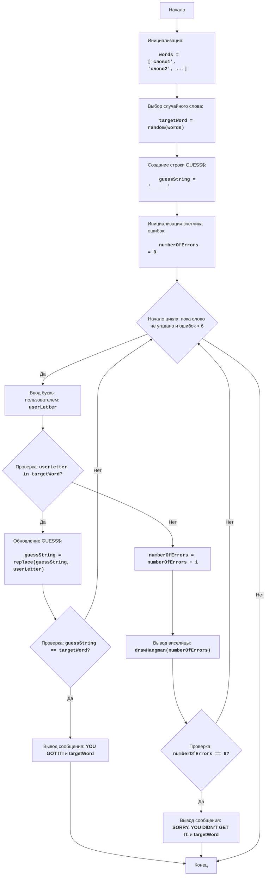

HANG
=================
Сложность: 7
-----------------
Игра "Виселица" - это игра в слова, где один игрок (или компьютер) загадывает слово, а другой игрок пытается его отгадать по буквам.
За каждую неправильную букву игрок получает штраф, обычно в виде части рисунка виселицы. Если рисунок завершен, игрок проигрывает.

Правила игры:
1. Компьютер выбирает случайное слово из заранее определенного списка.
2. Игрок видит слово, представленное прочерками (по одной на каждую букву).
3. Игрок пытается отгадать слово, вводя буквы.
4. Если введенная буква есть в слове, она отображается на своих местах.
5. Если введенной буквы нет в слове, игрок получает штраф.
6. Игра продолжается до тех пор, пока игрок не угадает слово или не исчерпает лимит штрафов.
-----------------
Алгоритм:
1.  Инициализировать массив слов, которые может загадать компьютер.
2.  Выбрать случайное слово из массива.
3.  Создать строку `GUESS$` , состоящую из прочерков, по длине загаданного слова.
4.  Инициализировать число ошибок, равное 0.
5.  Начать цикл "пока слово не отгадано и количество ошибок меньше 6":
  5.1 Запросить ввод буквы от игрока.
  5.2 Если введенная буква есть в загаданном слове:
    5.2.1 Обновить строку `GUESS$` , показав букву на всех ее позициях в слове.
    5.2.2 Если все буквы отгаданы, перейти к шагу 6.
  5.3 Иначе:
    5.3.1 Увеличить число ошибок на 1.
    5.3.2 Показать изображение виселицы, соответствующее текущему количеству ошибок.
  5.4 Если число ошибок равно 6, перейти к шагу 7.
6. Вывести сообщение "YOU GOT IT!", затем загаданное слово, и перейти к шагу 8.
7. Вывести сообщение "SORRY, YOU DIDN'T GET IT.", затем загаданное слово, и перейти к шагу 8.
8. Конец игры.
-----------------
Блок-схема:

-----
**Legenda**: 

  - Start - Начало игры.
  - InitializeWords - Инициализация списка слов для выбора.
  - ChooseWord - Выбор случайного слова из списка.
  - CreateGuessString - Создание строки `guessString` из прочерков, соответствующей длине загаданного слова.
  - InitializeErrors - Инициализация счетчика ошибок `numberOfErrors` в 0.
  - LoopStart - Начало цикла, который продолжается, пока слово не угадано и количество ошибок меньше 6.
  - InputLetter - Запрос у пользователя ввода буквы и сохранение ее в `userLetter`.
  - CheckLetter - Проверка, есть ли введенная буква `userLetter` в загаданном слове `targetWord`.
  - UpdateGuessString - Обновление строки `guessString`, показывая введенную букву на ее местах.
  - CheckWin - Проверка, угадано ли слово (т.е. `guessString` равен `targetWord`).
  - OutputWin - Вывод сообщения о победе "YOU GOT IT!" и загаданного слова.
  - End - Конец игры.
  - IncreaseErrors - Увеличение счетчика ошибок `numberOfErrors` на 1.
  - DrawHangman - Отображение текущего состояния виселицы в зависимости от количества ошибок.
  - CheckLose - Проверка, достигло ли количество ошибок `numberOfErrors` значения 6.
  - OutputLose - Вывод сообщения о проигрыше "SORRY, YOU DIDN'T GET IT." и загаданного слова.
"""