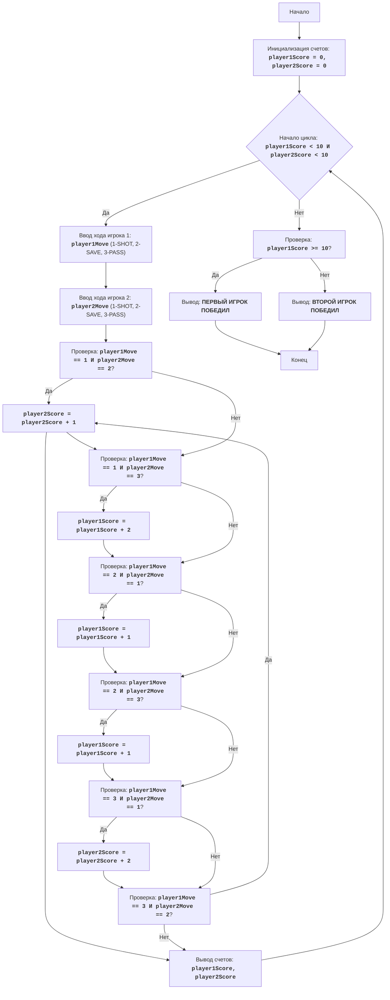

"""
HOCKEY:
=================
Сложность: 5
-----------------
Игра "Хоккей" представляет собой простую симуляцию хоккейного матча между двумя игроками. Игра состоит из нескольких раундов, в каждом из которых игроки по очереди выбирают одно из трех действий: бросок (SHOT), защиту (SAVE) или пас (PASS). Действия каждого игрока сравниваются, и в зависимости от комбинации действий начисляются очки.
Игра продолжается до тех пор, пока один из игроков не наберет 10 очков.

Правила игры:
1. Играют два игрока, каждый из которых вводит свой ход в каждом раунде.
2. Ходы вводятся в виде числовых кодов: 1 - бросок, 2 - защита, 3 - пас.
3. В каждом раунде сравниваются ходы игроков:
   - Если один игрок бросает, а другой защищается, то защищающийся игрок получает 1 очко.
   - Если один игрок бросает, а другой пасует, то бросающий игрок получает 2 очка.
   - Если оба игрока бросают, то очки не начисляются.
   - Если один игрок защищается, а другой пасует, то защищающийся игрок получает 1 очко.
   - Если оба игрока выбирают одинаковый ход, очки не начисляются.
4. Игра продолжается до тех пор, пока один из игроков не наберет 10 очков.
5. Игрок, первым набравший 10 очков, объявляется победителем.
-----------------
Алгоритм:
1. Инициализировать счет каждого игрока нулем.
2. Начать цикл "пока счет первого игрока меньше 10 И счет второго игрока меньше 10":
    2.1 Запросить у первого игрока ввод хода (1 - бросок, 2 - защита, 3 - пас).
    2.2 Запросить у второго игрока ввод хода (1 - бросок, 2 - защита, 3 - пас).
    2.3 Если первый игрок бросает (1), а второй защищается (2), увеличить счет второго игрока на 1.
    2.4 Если первый игрок бросает (1), а второй пасует (3), увеличить счет первого игрока на 2.
    2.5 Если первый игрок защищается (2), а второй бросает (1), увеличить счет первого игрока на 1.
    2.6 Если первый игрок защищается (2), а второй пасует (3), увеличить счет первого игрока на 1.
    2.7 Если первый игрок пасует (3), а второй бросает (1), увеличить счет второго игрока на 2.
    2.8 Если первый игрок пасует (3), а второй защищается (2), увеличить счет второго игрока на 1.
    2.9 Вывести текущий счет.
3. Если счет первого игрока больше или равен 10, вывести сообщение "ПЕРВЫЙ ИГРОК ПОБЕДИЛ".
4. Если счет второго игрока больше или равен 10, вывести сообщение "ВТОРОЙ ИГРОК ПОБЕДИЛ".
-----------------
Блок-схема:

## Legenda:
    Start - Начало программы.
    InitializeScores - Инициализация переменных player1Score и player2Score нулем.
    GameLoopStart - Начало цикла игры, который продолжается пока счет обоих игроков меньше 10.
    Player1Input - Запрос у первого игрока ввода хода (1-бросок, 2-защита, 3-пас) и сохранение его в переменной player1Move.
    Player2Input - Запрос у второго игрока ввода хода (1-бросок, 2-защита, 3-пас) и сохранение его в переменной player2Move.
    CheckMoves1 - Проверка, что первый игрок бросил (1), а второй защищался (2).
    Player2ScoreInc1 - Увеличение счета второго игрока на 1.
    CheckMoves2 - Проверка, что первый игрок бросил (1), а второй пасовал (3).
    Player1ScoreInc2 - Увеличение счета первого игрока на 2.
    CheckMoves3 - Проверка, что первый игрок защищался (2), а второй бросил (1).
    Player1ScoreInc1_1 - Увеличение счета первого игрока на 1.
    CheckMoves4 - Проверка, что первый игрок защищался (2), а второй пасовал (3).
    Player1ScoreInc1_2 - Увеличение счета первого игрока на 1.
    CheckMoves5 - Проверка, что первый игрок пасовал (3), а второй бросил (1).
    Player2ScoreInc2 - Увеличение счета второго игрока на 2.
    CheckMoves6 - Проверка, что первый игрок пасовал (3), а второй защищался (2).
    Player2ScoreInc1 - Увеличение счета второго игрока на 1.
    OutputScores - Вывод текущего счета игроков.
    CheckWinner - Проверка, что счет первого игрока больше или равен 10.
    OutputWinner1 - Вывод сообщения, что первый игрок победил.
    OutputWinner2 - Вывод сообщения, что второй игрок победил.
    End - Конец программы.
"""

# Инициализация счетов игроков
player1Score = 0
player2Score = 0

# Основной игровой цикл
while player1Score < 10 and player2Score < 10:
    # Запрос ввода хода у первого игрока
    try:
        player1Move = int(input("Ход первого игрока (1-бросок, 2-защита, 3-пас): "))
        if player1Move < 1 or player1Move > 3:
          print("Неверный ввод! Введите число от 1 до 3")
          continue
    except ValueError:
      print("Неверный ввод! Введите число от 1 до 3")
      continue

    # Запрос ввода хода у второго игрока
    try:
      player2Move = int(input("Ход второго игрока (1-бросок, 2-защита, 3-пас): "))
      if player2Move < 1 or player2Move > 3:
          print("Неверный ввод! Введите число от 1 до 3")
          continue
    except ValueError:
      print("Неверный ввод! Введите число от 1 до 3")
      continue

    # Проверка и начисление очков в зависимости от ходов
    if player1Move == 1 and player2Move == 2:
        player2Score += 1
    elif player1Move == 1 and player2Move == 3:
        player1Score += 2
    elif player1Move == 2 and player2Move == 1:
        player1Score += 1
    elif player1Move == 2 and player2Move == 3:
        player1Score += 1
    elif player1Move == 3 and player2Move == 1:
        player2Score += 2
    elif player1Move == 3 and player2Move == 2:
        player2Score += 1

    # Вывод текущего счета
    print(f"Счет: Игрок 1 - {player1Score}, Игрок 2 - {player2Score}")

# Определение победителя и вывод сообщения
if player1Score >= 10:
    print("ПЕРВЫЙ ИГРОК ПОБЕДИЛ")
else:
    print("ВТОРОЙ ИГРОК ПОБЕДИЛ")

"""
Объяснение кода:
1. **Инициализация переменных**:
   - `player1Score = 0`: Инициализирует счет первого игрока нулем.
   - `player2Score = 0`: Инициализирует счет второго игрока нулем.
2. **Основной игровой цикл `while player1Score < 10 and player2Score < 10:`**:
   - Цикл продолжается до тех пор, пока счет хотя бы одного из игроков не достигнет 10.
   - **Ввод ходов игроков**:
     - Запрашивает ввод хода у первого игрока (1 - бросок, 2 - защита, 3 - пас) и сохраняет его в `player1Move`.
     - Запрашивает ввод хода у второго игрока (1 - бросок, 2 - защита, 3 - пас) и сохраняет его в `player2Move`.
     - **Обработка исключений**:
     - Блоки `try-except` обрабатывают возможные ошибки ввода. Если пользователь введет не целое число, то будет выведено сообщение об ошибке.
   - **Проверка и начисление очков**:
     - `if player1Move == 1 and player2Move == 2:`: Если первый игрок бросает, а второй защищается, то счет второго игрока увеличивается на 1.
     - `elif player1Move == 1 and player2Move == 3:`: Если первый игрок бросает, а второй пасует, то счет первого игрока увеличивается на 2.
     - `elif player1Move == 2 and player2Move == 1:`: Если первый игрок защищается, а второй бросает, то счет первого игрока увеличивается на 1.
     - `elif player1Move == 2 and player2Move == 3:`: Если первый игрок защищается, а второй пасует, то счет первого игрока увеличивается на 1.
     - `elif player1Move == 3 and player2Move == 1:`: Если первый игрок пасует, а второй бросает, то счет второго игрока увеличивается на 2.
     - `elif player1Move == 3 and player2Move == 2:`: Если первый игрок пасует, а второй защищается, то счет второго игрока увеличивается на 1.
   - **Вывод текущего счета**:
     - `print(f"Счет: Игрок 1 - {player1Score}, Игрок 2 - {player2Score}")`: Выводит текущий счет игроков.
3. **Определение победителя**:
   - `if player1Score >= 10:`: Проверяет, достиг ли счет первого игрока 10 или более.
     - `print("ПЕРВЫЙ ИГРОК ПОБЕДИЛ")`: Выводит сообщение о победе первого игрока.
   - `else:`: Если условие выше не выполнено, значит, победил второй игрок.
     - `print("ВТОРОЙ ИГРОК ПОБЕДИЛ")`: Выводит сообщение о победе второго игрока.
"""
