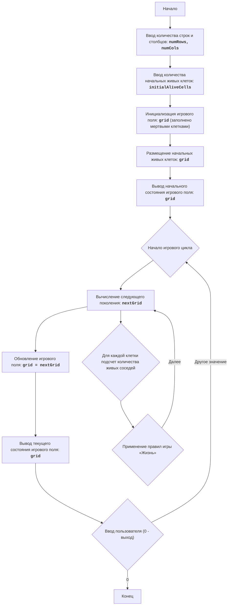

LIFE 2:
=================
Сложность: 5
-----------------
Игра "Жизнь 2" - это симуляция клеточного автомата, разработанная Джоном Конвеем. Она представляет собой поле клеток, каждая из которых может быть либо живой, либо мертвой. Состояние клетки в следующем поколении зависит от количества живых соседей в текущем поколении. Игра демонстрирует, как простые правила могут привести к возникновению сложных и интересных паттернов. Игрок может задавать начальную конфигурацию живых клеток, и наблюдать за эволюцией этой конфигурации с течением времени. 
Правила игры:
1. Игровое поле представлено в виде сетки, где каждая клетка может быть либо живой (обозначена как '*'), либо мертвой (обозначена как пробел ' ').
2. В начале игры игроку предлагается ввести количество строк и столбцов для игрового поля, а также количество живых клеток.
3. После ввода начальных параметров поле заполняется мертвыми клетками, а затем случайным образом размещаются живые клетки, количество которых указал игрок.
4. После инициализации поля программа выводит начальное состояние поля.
5. Итерации продолжаются, пока пользователь не введет "0".
6. Для каждого нового поколения:
     - Каждая живая клетка с 2 или 3 живыми соседями остается живой в следующем поколении.
    - Каждая живая клетка с менее чем 2 живыми соседями умирает в следующем поколении.
    - Каждая живая клетка с более чем 3 живыми соседями умирает в следующем поколении.
    - Каждая мертвая клетка рождается в следующем поколении, если у нее ровно 3 живых соседа.
7. Поле отображается после каждой итерации.
-----------------
Алгоритм:
1. Запросить у пользователя количество строк и столбцов для игрового поля.
2. Запросить у пользователя количество начальных живых клеток.
3. Инициализировать игровое поле как матрицу, заполненную мертвыми клетками (' ').
4. Разместить случайным образом указанное пользователем количество живых клеток ('*') на игровом поле.
5. Вывести начальное состояние игрового поля.
6. Запустить бесконечный цикл:
    6.1 Вычислить следующее поколение клеток:
        6.1.1 Создать новое поле, скопировав текущее поле.
        6.1.2 Для каждой клетки в текущем поле:
           6.1.2.1 Подсчитать количество живых соседей.
           6.1.2.2 Применить правила "Жизни", чтобы определить состояние клетки в новом поле.
        6.1.3 Заменить текущее поле новым полем.
    6.2 Вывести текущее состояние игрового поля.
    6.3 Запросить у пользователя ввод. Если введено "0", завершить игру, иначе продолжить.
-----------------
Блок-схема:

Legenda:
    Start - Начало программы.
    InputRowsCols - Запрос у пользователя количества строк и столбцов для игрового поля.
    InputAliveCells - Запрос у пользователя количества начальных живых клеток.
    InitializeGrid - Инициализация игрового поля в виде матрицы, заполненной мертвыми клетками (пробелами).
    PlaceAliveCells - Размещение заданного количества живых клеток (звездочек) на игровом поле в случайных позициях.
    OutputGrid - Вывод начального состояния игрового поля на экран.
    GameLoopStart - Начало основного игрового цикла.
    ComputeNextGeneration - Вычисление следующего поколения клеток на основе текущего состояния поля и правил игры "Жизнь".
     CalculateNeighbors - Для каждой клетки подсчет количества живых соседей.
     ApplyRules - Применение правил игры «Жизнь» для определения состояния клетки в следующем поколении.
    UpdateGrid - Обновление текущего игрового поля, заменяя его новым поколением.
    OutputCurrentGrid - Вывод текущего состояния игрового поля на экран.
    InputUserContinue - Запрос у пользователя на продолжение игры (любое значение, кроме "0") или выход из игры ("0").
    End - Конец программы.