LIFE:
=================
Сложность: 7
-----------------
Игра "Жизнь" - это симуляция клеточного автомата, разработанная Джоном Конвеем. Игровое поле представляет собой сетку из клеток, каждая из которых может находиться в одном из двух состояний: "живая" или "мертвая". Состояние каждой клетки в следующем поколении зависит от состояния ее соседей в текущем поколении. Цель игры - наблюдать за эволюцией начальной конфигурации клеток и исследовать интересные паттерны, возникающие в процессе симуляции.

Правила игры:
1.  Игровое поле состоит из клеток, каждая из которых может быть "живой" (обозначено символом "*") или "мертвой" (обозначено пробелом).
2.  Изначально поле заполняется случайным образом или задается определенная конфигурация клеток.
3.  Переход к следующему поколению осуществляется по следующим правилам:
    -  Живая клетка с менее чем двумя живыми соседями умирает от одиночества.
    -  Живая клетка с двумя или тремя живыми соседями выживает в следующем поколении.
    -  Живая клетка с более чем тремя живыми соседями умирает от перенаселения.
    -  Мертвая клетка с ровно тремя живыми соседями оживает.
4.  Игра продолжается заданное количество поколений.

-----------------
Алгоритм:
1. Запросить у пользователя размеры поля (количество строк и столбцов).
2. Запросить у пользователя количество поколений для симуляции.
3. Создать начальное поколение: 
    - если пользователь ввел начальные данные, то использовать их.
    - если нет, то заполнить поле случайным образом живыми и мертвыми клетками.
4. Для каждого поколения от 1 до заданного количества поколений:
    4.1 Вывести на экран текущее поколение (состояние поля).
    4.2 Создать новое поле (следующее поколение), применив правила игры:
        - Для каждой клетки в текущем поле:
            - Подсчитать количество живых соседей.
            - В зависимости от состояния клетки и количества соседей в текущем поколении, определить ее состояние в новом поле согласно правилам игры.
    4.3 Обновить текущее поле новым полем.
5. По завершению симуляции вывести на экран заключительное состояние поля.

-----------------
Блок-схема:

```mermaid
flowchart TD
    Start["Начало"] --> InputGridSize["Ввод размеров сетки: <code><b>rows, cols</b></code>"]
    InputGridSize --> InputGenerations["Ввод количества поколений: <code><b>generations</b></code>"]
    InputGenerations --> InputInitialConfig{"Ввод начальной конфигурации: <code><b>initial_config</b></code>"}
    InputInitialConfig --> CreateInitialGrid{"Создание начальной сетки: <code><b>grid</b></code>"}
    CreateInitialGrid --> LoopStart{"Начало цикла поколений: <code><b>for generation in range(generations)</b></code>"}
    LoopStart -- Да --> OutputCurrentGrid["Вывод текущей сетки: <code><b>grid</b></code>"]
    OutputCurrentGrid --> CreateNextGenerationGrid["Создание новой сетки: <code><b>next_grid</b></code>"]
    CreateNextGenerationGrid --> LoopCellsStart{"Начало цикла по клеткам: <code><b>for row in range(rows): for col in range(cols)</b></code>"}
    LoopCellsStart --> CountLiveNeighbours["Подсчет живых соседей: <code><b>live_neighbours</b></code>"]
    CountLiveNeighbours --> ApplyRules["Применение правил игры для определения состояния клетки в <code><b>next_grid</b></code>"]
    ApplyRules --> LoopCellsEnd{"Конец цикла по клеткам"}
    LoopCellsEnd --> UpdateCurrentGrid{"Обновление текущей сетки: <code><b>grid = next_grid</b></code>"}
    UpdateCurrentGrid --> LoopEnd{"Конец цикла поколений"}
     LoopEnd -- Да --> LoopStart
    LoopEnd -- Нет --> OutputFinalGrid["Вывод финальной сетки: <code><b>grid</b></code>"]
    OutputFinalGrid --> End["Конец"]

```

Legenda:
    Start - Начало программы.
    InputGridSize - Ввод размеров сетки (количество строк и столбцов) от пользователя.
    InputGenerations - Ввод количества поколений для симуляции от пользователя.
    InputInitialConfig - Ввод начальной конфигурации клеток от пользователя.
    CreateInitialGrid - Создание начальной сетки (grid) на основе введенных размеров и начальной конфигурации. Если начальная конфигурация не предоставлена, поле заполняется случайным образом.
    LoopStart - Начало цикла, который выполняется заданное количество раз (количество поколений).
    OutputCurrentGrid - Вывод на экран текущего состояния сетки (grid).
    CreateNextGenerationGrid - Создание новой сетки (next_grid), которая будет представлять следующее поколение.
    LoopCellsStart - Начало цикла для каждой клетки в сетке.
    CountLiveNeighbours - Подсчет количества живых соседей для текущей клетки.
    ApplyRules - Применение правил игры (Conway's Game of Life) для определения состояния клетки в следующем поколении (next_grid) на основе количества живых соседей и текущего состояния клетки.
    LoopCellsEnd - Конец цикла для каждой клетки в сетке.
    UpdateCurrentGrid - Обновление текущей сетки (grid) новой сеткой (next_grid).
    LoopEnd - Конец цикла поколений. Если есть еще поколения, цикл повторяется.
    OutputFinalGrid - Вывод на экран финального состояния сетки (grid) после завершения всех поколений.
    End - Конец программы.