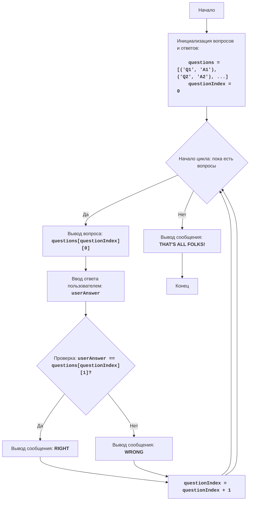

<LIT QZ>:
=================
Сложность: 4
-----------------
Игра "LIT QZ" представляет собой викторину, где компьютер задает вопросы, а игрок должен на них ответить. В оригинальной версии игры вопросы и ответы закодированы в виде данных, но мы можем сделать викторину более интерактивной и расширяемой, позволяя легко добавлять новые вопросы и ответы. Игра проверяет знания игрока, позволяя пройти через серию вопросов. 

Правила игры:
1. Компьютер выводит вопрос.
2. Игрок вводит свой ответ.
3. Компьютер проверяет ответ и сообщает, был ли ответ верным.
4. Игра продолжается до тех пор, пока не закончатся вопросы.
5. В конце игры выводится сообщение о ее завершении.
-----------------
Алгоритм:
1. Инициализировать список вопросов и ответов.
2. Установить счетчик вопросов в 0.
3. Начать цикл "пока не кончатся вопросы":
   3.1. Вывести текущий вопрос.
   3.2. Запросить у игрока ввод ответа.
   3.3. Сравнить введенный ответ с правильным ответом.
   3.4. Если ответ верный, вывести сообщение "RIGHT".
   3.5. Если ответ неверный, вывести сообщение "WRONG".
   3.6. Увеличить счетчик вопросов на 1.
4. Вывести сообщение "THAT'S ALL FOLKS!"
5. Конец игры.
-----------------
Блок-схема:

Legenda:
    Start - Начало программы.
    InitializeQuestions - Инициализация списка вопросов и ответов, а также установка начального индекса вопроса в 0.
    LoopStart - Начало цикла, который продолжается, пока есть вопросы в списке.
    DisplayQuestion - Вывод текущего вопроса на экран.
    InputAnswer - Запрос у пользователя ввода ответа и сохранение его в переменной userAnswer.
    CheckAnswer - Проверка, равен ли введенный ответ userAnswer правильному ответу из списка вопросов.
    OutputRight - Вывод сообщения "RIGHT", если ответ верен.
    IncreaseIndex - Увеличение индекса текущего вопроса на 1.
    OutputWrong - Вывод сообщения "WRONG", если ответ неверен.
    OutputEnd - Вывод сообщения "THAT'S ALL FOLKS!" после завершения всех вопросов.
    End - Конец программы.