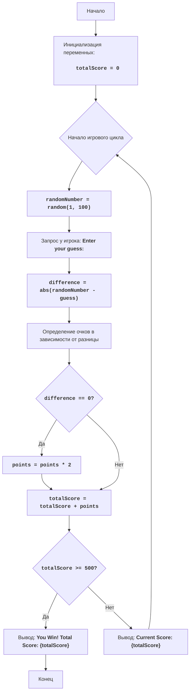

"""
NUMBER RANDOM NUMBER GAME:
=================
Сложность: 6
-----------------
Игра "NUMBER RANDOM NUMBER GAME" представляет собой игру, в которой игрок пытается угадать случайное число, сгенерированное компьютером. В отличие от других игр, где дается несколько попыток, здесь у игрока есть только одна попытка за игру. Очки начисляются или вычитаются в зависимости от того, насколько близко предположение игрока к загаданному числу. Также, есть шанс получить джекпот, который удваивает количество очков. Цель игры - набрать 500 очков.

Правила игры:
1. Компьютер генерирует случайное число в диапазоне от 1 до 100.
2. Игрок делает одно предположение.
3. Очки начисляются или вычитаются в зависимости от того, насколько близко предположение игрока к загаданному числу:
    - Разница в 0: +100 очков (Джекпот, очки удваиваются)
    - Разница от 1 до 5: +50 очков
    - Разница от 6 до 10: +25 очков
    - Разница от 11 до 20: -25 очков
    - Разница более 20: -50 очков
4. Игрок выигрывает, если набирает 500 очков.

-----------------
Алгоритм:
1. Установить начальное количество очков в 0.
2. Начать цикл игры:
    2.1 Сгенерировать случайное число от 1 до 100.
    2.2 Запросить у игрока предположение числа.
    2.3 Вычислить разницу между загаданным числом и предположением игрока.
    2.4 Определить количество очков, которое получит игрок в соответствии с разницей.
    2.5 Если игрок угадал число, удвоить количество очков.
    2.6 Добавить/вычесть очки из общего количества очков.
    2.7 Если общее количество очков 500 или больше, вывести сообщение о победе и завершить игру.
    2.8 Вывести текущее количество очков.
3. Перейти к шагу 2.
4. Если игра завершилась, то выйти из цикла.
-----------------
Блок-схема:

    
**Legenda**:
  Start - Начало игры.
  InitializeScore - Инициализация переменной totalScore (общее количество очков) в 0.
  GameLoopStart - Начало игрового цикла.
  GenerateRandomNumber - Генерация случайного числа от 1 до 100.
  GetGuess - Запрос у игрока предположения числа.
  CalculateDifference - Вычисление разницы между загаданным числом и предположением игрока.
  CalculatePoints - Определение количества очков в зависимости от разницы.
  CheckJackpot - Проверка, является ли разница 0 (джекпот).
  DoublePoints - Удвоение количества очков при джекпоте.
  UpdateScore - Обновление общего количества очков.
  CheckWin - Проверка, набрал ли игрок 500 очков.
  OutputWin - Вывод сообщения о победе и общего количества очков.
  End - Конец игры.
  OutputCurrentScore - Вывод текущего количества очков.
"""
import random

# Инициализация общего счета
totalScore = 0

# Игровой цикл
while True:
    # Генерируем случайное число от 1 до 100
    randomNumber = random.randint(1, 100)
    
    # Запрашиваем у игрока предположение числа
    try:
        guess = int(input("Enter your guess: "))
    except ValueError:
        print("Invalid input. Please enter a valid integer.")
        continue
    
    # Вычисляем разницу между загаданным числом и предположением игрока
    difference = abs(randomNumber - guess)
    
    # Определяем количество очков в зависимости от разницы
    if difference == 0:
        points = 100
    elif difference <= 5:
        points = 50
    elif difference <= 10:
        points = 25
    elif difference <= 20:
        points = -25
    else:
        points = -50
    
    # Если игрок угадал число, удваиваем количество очков
    if difference == 0:
        points *= 2

    # Добавляем/вычитаем очки из общего количества очков
    totalScore += points
    
    # Проверяем, выиграл ли игрок
    if totalScore >= 500:
        print(f"You Win! Total Score: {totalScore}")
        break
        
    # Выводим текущее количество очков
    print(f"Current Score: {totalScore}")
"""
Объяснение кода:
1.  **Импорт модуля `random`**:
    -   `import random`: Импортирует модуль `random`, который используется для генерации случайных чисел.
2.  **Инициализация переменной `totalScore`**:
    -   `totalScore = 0`: Инициализирует переменную `totalScore` для хранения общего количества очков игрока, начиная с 0.
3.  **Основной цикл `while True`**:
    -   `while True:`: Создает бесконечный цикл, который продолжается, пока не будет явно прерван.
4.  **Генерация случайного числа**:
    -  `randomNumber = random.randint(1, 100)`: Генерирует случайное целое число в диапазоне от 1 до 100.
5.  **Запрос ввода от пользователя**:
    -  `try... except ValueError`:
        -  `guess = int(input("Enter your guess: "))`: Запрашивает у игрока предположение числа и пытается преобразовать его в целое число.
        -  `print("Invalid input. Please enter a valid integer.")`: Если введено не целое число, печатает сообщение об ошибке.
        - `continue`:  возвращает к началу цикла.
6. **Вычисление разницы**:
    -   `difference = abs(randomNumber - guess)`: Вычисляет абсолютное значение разницы между загаданным числом и предположением игрока.
7.  **Определение количества очков**:
    -   Блок `if-elif-else` определяет количество очков, которое игрок получает или теряет в зависимости от разницы:
        -   `if difference == 0:`: Если разница равна 0 (игрок угадал число), начисляется 100 очков.
        -   `elif difference <= 5:`: Если разница от 1 до 5, начисляется 50 очков.
        -   `elif difference <= 10:`: Если разница от 6 до 10, начисляется 25 очков.
        -   `elif difference <= 20:`: Если разница от 11 до 20, вычитается 25 очков.
        -   `else:`: Если разница более 20, вычитается 50 очков.
8.  **Удвоение очков при джекпоте**:
    -   `if difference == 0: points *= 2`: Если игрок угадал число, количество очков удваивается.
9.  **Обновление общего счета**:
    -   `totalScore += points`: Добавляет (или вычитает) начисленные очки из общего счета игрока.
10. **Проверка на выигрыш**:
    - `if totalScore >= 500:`: Если общее количество очков 500 или больше:
        -  `print(f"You Win! Total Score: {totalScore}")`: Выводит сообщение о победе и общее количество очков.
        -  `break`: Выходит из цикла, завершая игру.
11. **Вывод текущего счета**:
    -   `print(f"Current Score: {totalScore}")`: Выводит текущий счет игрока после каждой попытки.
"""
