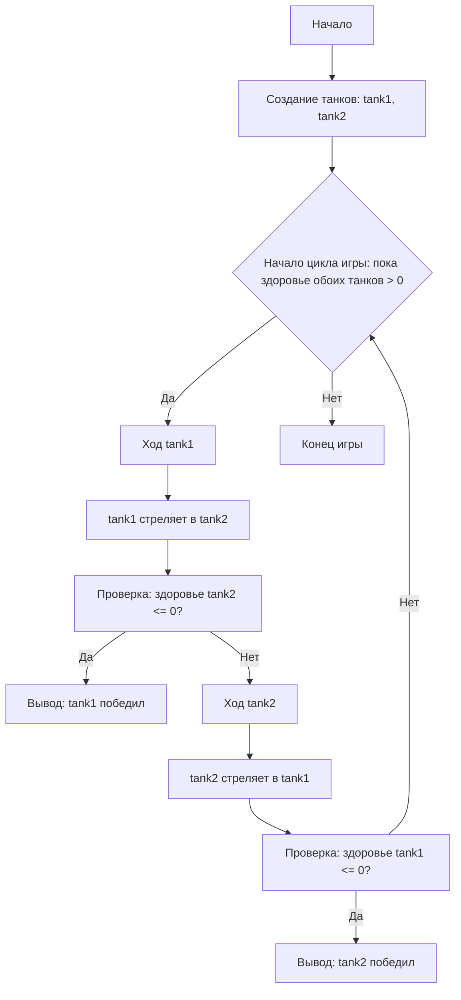

```markdown
# Танки (текстовая игра)
=================
Сложность: 3
-----------------
Простая текстовая игра, в которой два танка обмениваются выстрелами, пока один из них не будет уничтожен.

## Правила

1.  Два танка имеют характеристики: здоровье, урон и броня.
2.  Танки стреляют друг в друга по очереди.
3.  Урон наносится случайным образом в заданном диапазоне.
4.  Супер-танк имеет повышенное здоровье и броню.
5.  Игра заканчивается, когда у одного из танков здоровье становится 0.
-----------------
## Алгоритм:

1. Создать классы для `Tank` и `SuperTank`, которые имеют характеристики `model`, `armor`, `min_damage`, `max_damage`, и `health`.
2. Реализовать метод `health_down` для уменьшения здоровья танка.
3. Реализовать метод `shot` для нанесения урона противнику.
4. Создать метод `calculate_damage` для расчета случайного урона.
5. В основной части программы создать экземпляры танков.
6. Организовать цикл, в котором танки будут по очереди стрелять друг в друга, пока один из танков не будет уничтожен (здоровье 0).
7. Вывести сообщение о победе, когда один из танков будет уничтожен.
-----------------
## Блок-схема:


**Legenda**:
  Start - Начало игры.
  CreateTanks - Создание экземпляров танков (tank1 и tank2).
  GameLoopStart - Начало игрового цикла (пока здоровье обоих танков > 0).
  Tank1Turn - Ход танка tank1.
  Tank1Shot - tank1 стреляет в tank2.
  CheckTank2Health - Проверка: здоровье tank2 <= 0?
   OutputTank1Win - Вывод сообщения о победе tank1.
  Tank2Turn - Ход танка tank2.
  Tank2Shot - tank2 стреляет в tank1.
  CheckTank1Health - Проверка: здоровье tank1 <= 0?
   OutputTank2Win - Вывод сообщения о победе tank2.
  End - Конец игры.
"""
## Пример работы программы
```
Начинается танковый бой!
Т-34 имеет лобовую броню 50мм при 100ед. здоровья и урон в диапазоне от 20 до 30 единиц
Тигр имеет лобовую броню 80мм при 150ед. здоровья и урон в диапазоне от 25 до 35 единиц
    
Т-34:
Точно в цель, у противника Тигр осталось 120 единиц здоровья
    
Тигр:
Командир, по экипажу Т-34 попали, у нас осталось 77 очков здоровья
    
Т-34:
Точно в цель, у противника Тигр осталось 87 единиц здоровья
   
Тигр:
Командир, по экипажу Т-34 попали, у нас осталось 49 очков здоровья
    
Т-34:
Экипаж танка Тигр уничтожен
    
Победил Т-34!
```
## Возможные ограничения
- Текстовый интерфейс.
- Ограниченное взаимодействие с пользователем (только просмотр результатов).
```
