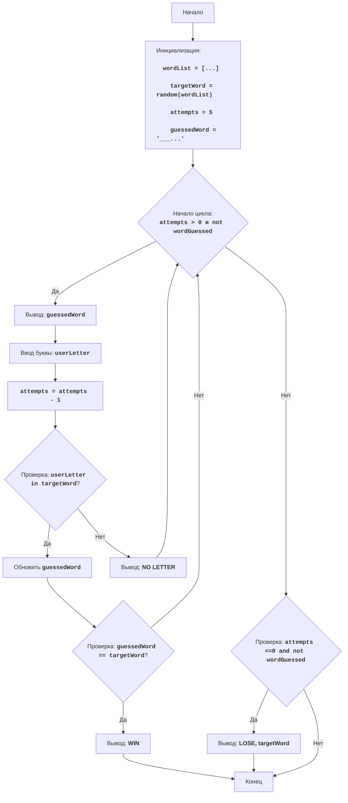

WORD:
=================
Сложность: 5
-----------------
Игра "WORD" - это игра в угадывание слова. Компьютер выбирает случайное слово из заранее определенного списка, а игрок должен угадать его, вводя буквы. После каждой попытки компьютер сообщает, есть ли введенная буква в слове и на какой позиции. Игрок должен угадать слово до того, как исчерпает все свои попытки.

Правила игры:
1. Компьютер выбирает случайное слово из списка.
2. Игроку дается определенное количество попыток (по умолчанию 5).
3. Игрок вводит букву.
4. Компьютер сообщает, есть ли буква в слове, и если есть, то на каких позициях.
5. Игрок пытается угадать слово по буквам.
6. Если игрок угадывает слово, игра заканчивается с победой.
7. Если игрок исчерпывает все попытки, игра заканчивается поражением.
-----------------
Алгоритм:
1. Инициализация: 
    1.1. Задать список слов.
    1.2. Выбрать случайное слово из списка.
    1.3. Задать количество попыток (по умолчанию 5).
    1.4. Создать строку для отображения угаданных букв (изначально все позиции "_").
2. Начать цикл "пока число попыток больше 0 и слово не угадано":
    2.1. Вывести строку с угаданными буквами.
    2.2. Запросить у игрока ввод буквы.
    2.3. Уменьшить количество попыток на 1.
    2.4. Если введенная буква есть в загаданном слове:
        2.4.1.  Заменить "_" на букву на соответствующих позициях в строке с угаданными буквами.
        2.4.2. Если строка угаданных букв равна загаданному слову, то вывести сообщение о победе и выйти из цикла.
    2.5. Если введенной буквы нет в загаданном слове, то вывести сообщение о том, что такой буквы нет.
3. Если после цикла слово не угадано (остались попытки и слово не угадано), то вывести сообщение о поражении и загаданное слово.
4. Конец игры.
-----------------
Блок-схема:

Legenda:
    Start - Начало программы.
    InitializeVariables - Инициализация переменных: wordList (список слов), targetWord (загаданное слово выбирается случайным образом), attempts (количество попыток) устанавливается в 5, guessedWord (строка с угаданными буквами) инициализируется символами "_".
    LoopStart - Начало цикла, который продолжается пока есть попытки и слово не угадано.
    OutputGuessedWord - Вывод текущего состояния угаданных букв.
    InputLetter - Запрос ввода буквы у пользователя.
    DecreaseAttempts - Уменьшение количества оставшихся попыток.
    CheckLetter - Проверка, есть ли введенная буква в загаданном слове.
    UpdateGuessedWord - Обновление строки угаданных букв.
    CheckWin - Проверка, угадано ли слово.
    OutputWin - Вывод сообщения о победе.
    OutputNoLetter - Вывод сообщения о том, что введенной буквы нет в слове.
    CheckLose - Проверка, закончились ли попытки и слово не угадано.
    OutputLose - Вывод сообщения о проигрыше и загаданного слова.
    End - Конец программы.
"""
```python
import random

# 1. Инициализация
# 1.1 Список слов для игры
wordList = ["python", "java", "kotlin", "swift", "javascript", "go", "ruby"]
# 1.2 Выбор случайного слова
targetWord = random.choice(wordList)
# 1.3 Количество попыток
attempts = 5
# 1.4 Создаем строку для хранения угаданных букв (например, "_ _ _ _ _ _" для "python")
guessedWord = "_" * len(targetWord)

# 2. Игровой цикл
while attempts > 0 and guessedWord != targetWord:
    # 2.1 Вывод текущего состояния угаданных букв
    print("Слово:", guessedWord)
    # 2.2 Запрос ввода буквы
    userLetter = input("Введите букву: ").lower()
    # 2.3 Уменьшение количества попыток
    attempts -= 1

    # 2.4 Проверка, есть ли буква в загаданном слове
    if userLetter in targetWord:
        # 2.4.1 Обновляем строку с угаданными буквами
        for i in range(len(targetWord)):
            if targetWord[i] == userLetter:
                guessedWord = guessedWord[:i] + userLetter + guessedWord[i+1:]

        # 2.4.2 Проверяем, угадано ли слово
        if guessedWord == targetWord:
            print("ПОЗДРАВЛЯЮ! Вы угадали слово:", targetWord)
            break
    else:
        # 2.5 Сообщаем, что буквы нет
        print("Такой буквы нет в слове.")

# 3. Проверка на проигрыш
if guessedWord != targetWord:
    print("Вы проиграли. Загаданное слово было:", targetWord)

```
**Объяснение кода**:
1.  **Импорт модуля `random`**:
    -   `import random`: Импортирует модуль random для выбора случайного слова.

2.  **Инициализация**:
    -   `wordList = ["python", "java", "kotlin", "swift", "javascript", "go", "ruby"]`: Создает список слов, из которого будет выбираться загаданное слово.
    -   `targetWord = random.choice(wordList)`: Выбирает случайное слово из списка `wordList` и сохраняет его в `targetWord`. Это слово, которое игрок должен угадать.
    -   `attempts = 5`: Устанавливает количество попыток, доступных игроку.
    -   `guessedWord = "_" * len(targetWord)`: Создает строку `guessedWord`, которая изначально состоит из символов "_". Количество "_" соответствует длине загаданного слова. Эта строка отображает прогресс угадывания слова игроком.

3.  **Игровой цикл `while attempts > 0 and guessedWord != targetWord:`**:
    -   `while attempts > 0 and guessedWord != targetWord:`: Цикл продолжается, пока у игрока есть попытки (`attempts > 0`) и слово еще не угадано (`guessedWord != targetWord`).
    -   `print("Слово:", guessedWord)`: Выводит текущее состояние угаданного слова (например, "_ _ t _ o _").
    -   `userLetter = input("Введите букву: ").lower()`: Запрашивает ввод буквы у игрока и преобразует ее в нижний регистр.
    -   `attempts -= 1`: Уменьшает количество доступных попыток на 1.

4. **Проверка буквы и обновление `guessedWord`**:
   - `if userLetter in targetWord:`: Проверяет, есть ли введенная буква в загаданном слове.
    -  Если буква есть:
       -  `for i in range(len(targetWord)):`: Цикл проходит по всем индексам символов загаданного слова.
          - `if targetWord[i] == userLetter:`: Если буква в загаданном слове совпадает с введенной, то:
              - `guessedWord = guessedWord[:i] + userLetter + guessedWord[i+1:]`: Заменяет символ "_" на угаданную букву в строке `guessedWord` на соответствующей позиции.
       - `if guessedWord == targetWord:`: Проверяет, угадано ли слово полностью.
          - `print("ПОЗДРАВЛЯЮ! Вы угадали слово:", targetWord)`: Выводит поздравление с угадыванием слова.
          - `break`: Завершает игровой цикл.
   -  `else:`: Если введенной буквы нет в загаданном слове.
       -  `print("Такой буквы нет в слове.")`: Выводит сообщение о том, что введенной буквы нет в слове.

5. **Проверка поражения**:
   -  `if guessedWord != targetWord:`: После завершения цикла проверяет, не угадано ли слово.
       -  `print("Вы проиграли. Загаданное слово было:", targetWord)`: Выводит сообщение о проигрыше и показывает загаданное слово.

       ----------
- Файл с кодом [ACEDU](https://github.com/hypo69/hypo/blob/master/src/endpoints/ai_games/101_basic_computer_games/ru/AMAZING/amazing.py)
- Запустить код на Google Colab: [ACEDU](https://colab.research.google.com/drive/1aG11rVe2m7_0pdz1fmLhHGwmUH02eWhs?usp=sharing)
- [К списку игр](https://github.com/hypo69/hypo/blob/master/src/endpoints/ai_games/101_basic_computer_games/ru)
