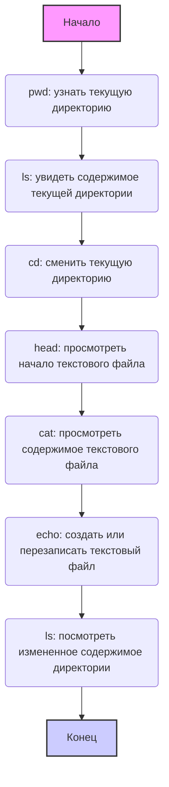

Что такое Google Colab?

Google Colab — это облачная платформа, созданная Google, для работы с интерактивными блокнотами Jupyter Notebook. 
Она предоставляет мощные инструменты для написания и выполнения кода на Python, анализа данных, обучения моделей машинного обучения и совместной работы над проектами. 

Colab предоставляет доступ к мощным вычислительным ресурсам, включая графические процессоры (GPU) и тензорные процессоры (TPU). 
Это позволяет решать сложные задачи, такие как обработка больших данных или обучение нейросетей, без необходимости приобретать дорогое оборудование. Colab построен на основе Jupyter Notebook, предоставляя удобный интерфейс для работы с кодом, текстом и визуализациями. Вы можете выполнять ячейки кода, вставлять поясняющий текст, создавать графики и визуализации прямо в браузере. Использовать Colab можно сразу после открытия. Нет необходимости устанавливать дополнительные программы, библиотеки или драйверы. Всё уже настроено для работы. Вы можете подключить свой Google Диск, что позволяет легко загружать данные, сохранять проекты и обеспечивать доступ к файлам из любого места. Colab поддерживает совместную работу. Вы можете делиться своими проектами с коллегами, редактировать блокноты одновременно и обсуждать изменения в реальном времени.

### Как работает Google Colab?  
- Вы запускаете блокнот Jupyter в браузере, что избавляет от необходимости установки локального окружения.  
- Код выполняется на удаленных серверах Google, а результаты отображаются в вашем блокноте.  
- Данные могут загружаться из локального устройства или из облака, такого как Google Drive.  
- Вы можете использовать Colab для написания Python-кода, работы с библиотеками для машинного обучения (например, TensorFlow, PyTorch), анализа данных с использованием Pandas или создания визуализаций через Matplotlib и Seaborn.  

Как выглядит Google Colab?

Интерфейс Colab состоит из нескольких основных частей:

Строки кода: Это ячейки, в которые ты будешь писать и выполнять свой код на Python.

Текстовые ячейки: Здесь ты можешь добавлять описания, пояснения и заметки к своему коду.

Меню: Сверху есть меню с различными опциями для работы с блокнотом (файл, правка, вид, инструменты и т.д.).

Файловый менеджер: Слева есть панель файлового менеджера, где ты можешь просматривать файлы и папки в своей среде Colab.

В Google Colab, ты работаешь в облачной среде, 
где файловая система организована как на обычном компьютере с папками и файлами. 
Colab предоставляет инструменты для навигации, создания, просмотра и редактирования файлов. 
Ты можешь взаимодействовать с файловой системой с помощью **магических команд** Jupyter (начинаются с `%`) 
и **команд bash** (начинаются с `!`).

**Список основных команд:**

1.  **`%pwd`** (print working directory):
    *   **Описание**: Показывает текущую рабочую директорию (где ты сейчас "находишься" в файловой системе).
    *   **Пример**: `%pwd`
    *   **Результат**: `/content` (или другая текущая директория)

2.  **`%ls`** (list):
    *   **Описание**: Выводит список файлов и папок в текущей директории.
    *   **Пример**: `%ls`
    *   **Результат**: Список файлов и папок, например: `sample_data/  my_file.txt`

3.  **`%cd <путь>`** (change directory):
    *   **Описание**: Переходит в указанную директорию.
    *   **Пример**: `%cd sample_data`
    *   **Результат**: Текущая рабочая директория меняется на `/content/sample_data`

4.  **`!head -<количество строк> <имя файла>`**:
    *   **Описание**: Выводит первые несколько строк указанного текстового файла.
    *   **Пример**: `!head -5 README.md`
    *   **Результат**: Первые 5 строк файла `README.md`.

5.  **`!cat <имя файла>`**:
    *   **Описание**: Выводит содержимое указанного текстового файла.
    *   **Пример**: `!cat sample_file.txt`
    *   **Результат**: Всё содержимое файла `sample_file.txt`.

6.   **`!echo "<текст>" > <имя файла>`**
    *   **Описание:** Создаёт новый файл с указанным именем и записывает в него текст. Если файл уже существует, он будет перезаписан
    *   **Пример:** `!echo "Это мой новый файл!" > new_file.txt`
    *   **Результат:** Создаёт файл `new_file.txt` с содержимым `Это мой новый файл!`.

**Ключевые моменты:**

*   **Магические команды** (`%`) - это специальные команды Jupyter для работы с окружением Colab.
*   **Команды bash** (`!`) - это команды, которые выполняются в командной строке Linux.
*   **Путь к файлу**: Путь к файлу указывает, где именно файл находится в файловой системе (например, `/content/sample_data/my_file.txt`).
*   **Текущая директория**: Твоё положение в файловой системе (изменяется командой `%cd`).

**Диаграмма, иллюстрирующая последовательность команд:**

