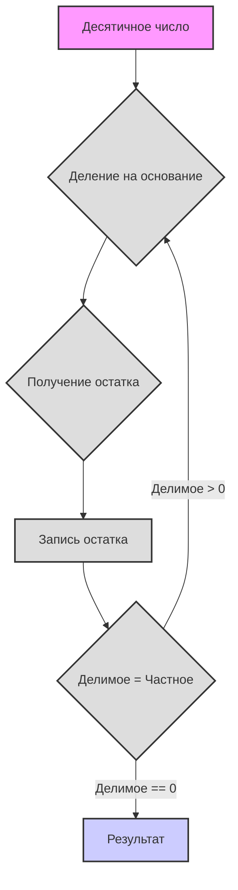

# Системы Счисления

Привет! Начинаем наше погружение в увлекательный мир систем счисления. Готовься, сегодня ты узнаешь много нового и интересного!

# Системы Счисления

**1. Абстрактная система счисления**

Представь, что числа - это как слова, которые можно записывать разными "буквами". Неважно, как именно мы обозначаем числа, главное, чтобы соблюдались определенные правила:

*   **Основание (базис):** Это количество уникальных символов (цифр), которые мы используем. Обозначим основание как `b`. Например, в десятичной системе основание равно 10.
*   **Цифры:** Это символы, которые мы используем для записи чисел. Обычно это арабские цифры (0, 1, 2, 3, ...), но могут быть и другие символы, например, латинские буквы (I, V, X) или даже фрукты (🍎, 🍐, 🍉).
*   **Позиция:** Каждая цифра в записи числа имеет свою позицию, которая влияет на её значение. Это означает, что одна и та же цифра может иметь разное значение в зависимости от того, где она стоит в числе.
*   **Разряды:** Каждая позиция называется разрядом (например, единицы, десятки, сотни и т.д.). В каждой позиции значение цифры умножается на основание в степени, соответствующей номеру разряда.

**Как строится система счисления?**

1.  **Выбор основания:** Выбираем целое число `b`, которое будет основанием нашей системы.
2.  **Выбор цифр:** Нам нужно `b` уникальных цифр. Обычно это 0, 1, 2, ..., `b-1`. Например, для двоичной системы (основание 2) у нас есть цифры 0 и 1.
3.  **Запись числа:** Число записывается как последовательность цифр. Значение каждой цифры умножается на основание, возведенное в степень, равную ее позиции (начиная с 0 справа).

**Формула для расчета значения числа:**

Если у нас есть число, записанное в виде последовательности цифр `dₙ dₙ₋₁ ... d₁ d₀`, то его значение в десятичной системе можно вычислить по формуле:

`значение = dₙ * bⁿ + dₙ₋₁ * bⁿ⁻¹ + ... + d₁ * b¹ + d₀ * b⁰`

Где:

*   `dᵢ` - цифра в i-ом разряде
*   `b` - основание системы счисления
*   `i` - номер разряда (справа налево, начиная с 0)

**Пример:**

Предположим, у нас есть число 123 в десятичной системе (основание 10). По формуле:

`1 * 10² + 2 * 10¹ + 3 * 10⁰ = 100 + 20 + 3 = 123`

**Порядки счисления (разряды):**

Порядки, как мы уже говорили, это позиции цифр в числе, каждая позиция имеет свой вес, который определяется основанием в степени ее порядкового номера.
*   `d₀`: единицы (`b⁰`)
*   `d₁`: `b` (`b¹`)
*   `d₂`: `b²`
*   `d₃`: `b³`
*   и так далее

**Правила:**

1.  **Диапазон цифр:** Используются цифры от 0 до `b-1`.
2.  **Позиционный принцип:** Значение цифры зависит от её позиции.
3.  **Переход к следующему разряду:** Когда в разряде достигается значение `b`, происходит перенос в следующий разряд (аналог того как после 9 в десятичной системе прибавляется 1 к следующему разряду и получается 10)

## Пример: Фруктовая система счисления

Давай рассмотрим пример абстрактной системы счисления с фруктами:

*   🍎 (яблоко)
*   🍐 (груша)
*   🍉 (дыня)
*   🧺 (корзинка)

**Правила:**

1.  3 🍎 = 1 🍐
2.  5 🍐 = 3 🍉
3.  2 🍉 = 1 🧺

**Представление чисел:**

Мы будем представлять количество фруктов в виде строки, где каждый символ юникода соответствует одному фрукту. Например, "🍎🍎🍎" - это 3 яблока, а "🍉🍉" - это 2 дыни.

**Арифметические операции:**

Мы можем выполнять операции сложения и вычитания. Для начала, сделаем сложение.

**Python Code:**

```python
def normalize_fruits(fruits: str) -> str:
    """
    Нормализует строку с фруктами, приводя её к минимальному представлению,
    используя правила обмена фруктов.

    Args:
        fruits: Строка с фруктами (🍎, 🍐, 🍉, 🧺).

    Returns:
        Строка с нормализованным количеством фруктов.
    """
    apples = fruits.count('🍎')
    pears = fruits.count('🍐')
    melons = fruits.count('🍉')
    baskets = fruits.count('🧺')

    # Преобразование яблок в груши
    pears += apples // 3
    apples %= 3

    # Преобразование груш в дыни
    melons += (pears * 3) // 5
    pears %= 5

    # Преобразование дынь в корзины
    baskets += melons // 2
    melons %= 2

    # Собираем строку обратно, сначала корзины, потом дыни, груши, яблоки
    return (
        "🧺" * baskets
        + "🍉" * melons
        + "🍐" * pears
        + "🍎" * apples
    )


def add_fruits(fruits1: str, fruits2: str) -> str:
    """
    Складывает две строки с фруктами.

    Args:
        fruits1: Строка с фруктами.
        fruits2: Строка с фруктами.

    Returns:
        Строка с суммой фруктов.
    """
    return normalize_fruits(fruits1 + fruits2)


def sub_fruits(fruits1: str, fruits2: str) -> str:
    """
    Вычитает вторую строку фруктов из первой, если это возможно.

    Args:
        fruits1: Строка с фруктами, из которой вычитаем.
        fruits2: Строка с фруктами, которую вычитаем.

    Returns:
        Строка с разностью фруктов или "Невозможно вычесть", если результат отрицательный.
    """

    apples1 = fruits1.count('🍎')
    pears1 = fruits1.count('🍐')
    melons1 = fruits1.count('🍉')
    baskets1 = fruits1.count('🧺')

    apples2 = fruits2.count('🍎')
    pears2 = fruits2.count('🍐')
    melons2 = fruits2.count('🍉')
    baskets2 = fruits2.count('🧺')


    # Временное представление в виде общего количества яблок
    total_apples1 = apples1 + pears1 * 3 + melons1 * 15 // 3 + baskets1 * 30
    total_apples2 = apples2 + pears2 * 3 + melons2 * 15 // 3 + baskets2 * 30

    if total_apples1 < total_apples2:
        return "Невозможно вычесть"
    else:
        total_apples = total_apples1 - total_apples2

    # Возвращаем нормализованное представление суммы яблок
    result_fruits = ""
    baskets = total_apples // 30
    result_fruits += "🧺" * baskets
    total_apples %= 30
    melons = (total_apples*3) // 15
    result_fruits += "🍉" * melons
    total_apples %= 15
    pears = total_apples // 3
    result_fruits += "🍐" * pears
    total_apples %= 3
    result_fruits += "🍎" * total_apples

    return normalize_fruits(result_fruits)


# Примеры:
fruits1 = "🍎🍎🍎🍎🍎" # 5 яблок
fruits2 = "🍎🍎🍎" # 3 яблока
print(f"{fruits1} + {fruits2} = {add_fruits(fruits1, fruits2)}")

fruits3 = "🍐🍐"  # 2 груши
fruits4 = "🍎🍎🍎🍎" # 4 яблока
print(f"{fruits3} + {fruits4} = {add_fruits(fruits3, fruits4)}")

fruits5 = "🍉🍉" # 2 дыни
fruits6 = "🍎🍎🍎🍎🍎🍎🍎🍎🍎🍎🍎🍎🍎🍎🍎" # 15 яблок
print(f"{fruits5} + {fruits6} = {add_fruits(fruits5, fruits6)}")

fruits7 = "🧺🧺" # 2 корзины
fruits8 = "🍉🍉🍉" # 3 дыни
print(f"{fruits7} + {fruits8} = {add_fruits(fruits7, fruits8)}")

fruits9 = "🧺🍉🍐🍎" # 1 корзина, 1 дыня, 1 груша, 1 яблоко
fruits10 = "🍉🍐🍎" # 1 дыня, 1 груша, 1 яблоко
print(f"{fruits9} - {fruits10} = {sub_fruits(fruits9, fruits10)}")

fruits11 = "🧺🍉" # 1 корзина, 1 дыня
fruits12 = "🧺🍉🍎🍎🍎" # 1 корзина, 1 дыня, 3 яблока
print(f"{fruits11} - {fruits12} = {sub_fruits(fruits11, fruits12)}")

fruits13 = "🍉🍉🍉" # 3 дыни
fruits14 = "🍎🍎🍎🍎" # 4 яблока
print(f"{fruits13} - {fruits14} = {sub_fruits(fruits13, fruits14)}")

fruits15 = "🍐🍐🍐🍐🍐" # 5 груш
fruits16 = "🍉" # 1 дыня
print(f"{fruits15} - {fruits16} = {sub_fruits(fruits15, fruits16)}")
```

**Разъяснение кода:**

1.  **`normalize_fruits(fruits)`:** Эта функция преобразует строку с фруктами к минимальному виду. Она сначала считает количество каждого фрукта, а затем, используя правила обмена, преобразует их к более крупным единицам (яблоки в груши, груши в дыни, дыни в корзины), после преобразования склеивает обратно в строку с минимальным набором фруктов.
2.  **`add_fruits(fruits1, fruits2)`:** Эта функция выполняет сложение двух строк с фруктами. Она просто конкатенирует две строки и затем нормализует результат.
3.  **`sub_fruits(fruits1, fruits2)`:** Это функция для вычитания одной строки фруктов из другой. Она преобразует всё в "количество яблок" и затем выполняет вычитание, а потом обратно переводит яблоки в нормализованный вид, при этом проверяет возможность вычитания.
4.  **Примеры:** В конце кода приведены примеры сложения и вычитания с различными комбинациями фруктов и выводом результатов.

**Задания:**

1.  Попробуй добавить в код функцию для умножения фруктов на целое число (например, `multiply_fruits(fruits, n)`).
2.  Реализуй функцию `compare_fruits(fruits1, fruits2)`, которая сравнивает две строки с фруктами и возвращает "больше", "меньше" или "равно".
3.  Придумай свои собственные правила обмена фруктов и модифицируй код под них.
4.  Добавьте проверку на корректность входных данных (чтобы строка состояла только из разрешенных символов юникода)
5.  Реализуйте более продвинутое вычитание, например, не выдавать ошибку "Невозможно вычесть", а выводить результат со знаком минус (усложненное задание).

## 2. Конкретные системы счисления

Теперь перейдем к конкретным примерам систем счисления, которые часто используются в информатике и повседневной жизни.

### 2.1. Двоичная (бинарная) система (основание 2)

*   **Цифры:** 0, 1
*   **Используется в компьютерах:** Все данные в компьютерах представлены в двоичном коде (битах).

**Пример:**

*   Число `1011₂` (читается как "один ноль один один по основанию 2"). Перевод в десятичную систему:
    `1 * 2³ + 0 * 2² + 1 * 2¹ + 1 * 2⁰ = 8 + 0 + 2 + 1 = 11₁₀`

**Python:**

```python
def bin_to_dec(binary: str) -> int:
    """
    Преобразует двоичное число (строку) в десятичное.

    Args:
        binary: Двоичное число в виде строки.

    Returns:
        Десятичное представление числа (целое число).
    """
    decimal = 0  # Инициализируем десятичное значение
    power = 0  # Инициализируем степень двойки (показатель разряда)
    for digit in reversed(binary):  # Итерируемся по цифрам двоичного числа в обратном порядке
        if digit == '1':
            decimal += 2 ** power  # Если цифра '1', добавляем 2 в степени разряда
        power += 1  # Увеличиваем степень для следующего разряда
    return decimal  # Возвращаем десятичное значение

binary_number = "1011"
decimal_number = bin_to_dec(binary_number)
print(f"Двоичное {binary_number} = Десятичное {decimal_number}")


def dec_to_bin(decimal: int) -> str:
    """
    Преобразует десятичное число (целое) в двоичное представление (строку).

    Args:
        decimal: Десятичное число.

    Returns:
        Двоичное представление числа (строка).
    """
    if decimal == 0:  # Если десятичное число равно 0
        return "0"  # Возвращаем строку "0"
    binary = ""  # Инициализируем строку для двоичного числа
    while decimal > 0:  # Пока десятичное число больше 0
        binary = str(decimal % 2) + binary  # Добавляем остаток от деления на 2 в начало двоичной строки
        decimal = decimal // 2  # Целочисленно делим десятичное число на 2
    return binary  # Возвращаем двоичную строку

decimal_number = 11
binary_number = dec_to_bin(decimal_number)
print(f"Десятичное {decimal_number} = Двоичное {binary_number}")
```

### 2.2. Троичная система (основание 3)

*   **Цифры:** 0, 1, 2
*   **Интересна в теории:** Применяется в некоторых областях математики и информатики.

**Пример:**

*   Число `210₃` (читается как "два один ноль по основанию 3"). Перевод в десятичную систему:
    `2 * 3² + 1 * 3¹ + 0 * 3⁰ = 18 + 3 + 0 = 21₁₀`

**Python:**

```python
def ternary_to_dec(ternary: str) -> int:
    """
    Преобразует троичное число (строку) в десятичное.

    Args:
        ternary: Троичное число в виде строки.

    Returns:
        Десятичное представление числа (целое число).
    """
    decimal = 0  # Инициализируем десятичное значение
    power = 0  # Инициализируем степень тройки (показатель разряда)
    for digit in reversed(ternary):  # Итерируемся по цифрам троичного числа в обратном порядке
        decimal += int(digit) * (3 ** power)  # Добавляем цифру * 3 в степени разряда
        power += 1  # Увеличиваем степень для следующего разряда
    return decimal  # Возвращаем десятичное значение


ternary_number = "210"
decimal_number = ternary_to_dec(ternary_number)
print(f"Троичное {ternary_number} = Десятичное {decimal_number}")

def dec_to_ternary(decimal: int) -> str:
    """
    Преобразует десятичное число (целое) в троичное представление (строку).

    Args:
        decimal: Десятичное число.

    Returns:
        Троичное представление числа (строка).
    """
    if decimal == 0:  # Если десятичное число равно 0
        return "0"  # Возвращаем строку "0"
    ternary = ""  # Инициализируем строку для троичного числа
    while decimal > 0:  # Пока десятичное число больше 0
        ternary = str(decimal % 3) + ternary  # Добавляем остаток от деления на 3 в начало троичной строки
        decimal = decimal // 3  # Целочисленно делим десятичное число на 3
    return ternary  # Возвращаем троичную строку

decimal_number = 21
ternary_number = dec_to_ternary(decimal_number)
print(f"Десятичное {decimal_number} = Троичное {ternary_number}")
```

### 2.3. Семеричная система (основание 7)

*   **Цифры:** 0, 1, 2, 3, 4, 5, 6
*   **Менее распространена:** Используется в некоторых узких областях, например, в некоторых системах кодирования. Также имеет практическое применение в днях недели.

**Пример:**

*   Число `345₇` (читается как "три четыре пять по основанию 7"). Перевод в десятичную систему:
    `3 * 7² + 4 * 7¹ + 5 * 7⁰ = 147 + 28 + 5 = 180₁₀`

**Python:**

```python
def septenary_to_dec(septenary: str) -> int:
    """
    Преобразует семеричное число (строку) в десятичное.

    Args:
        septenary: Семеричное число в виде строки.

    Returns:
        Десятичное представление числа (целое число).
    """
    decimal = 0  # Инициализируем десятичное значение
    power = 0  # Инициализируем степень семерки (показатель разряда)
    for digit in reversed(septenary):  # Итерируемся по цифрам семеричного числа в обратном порядке
        decimal += int(digit) * (7 ** power)  # Добавляем цифру * 7 в степени разряда
        power += 1  # Увеличиваем степень для следующего разряда
    return decimal  # Возвращаем десятичное значение


septenary_number = "345"
decimal_number = septenary_to_dec(septenary_number)
print(f"Семеричное {septenary_number} = Десятичное {decimal_number}")

def dec_to_septenary(decimal: int) -> str:
    """
    Преобразует десятичное число (целое) в семеричное представление (строку).

    Args:
        decimal: Десятичное число.

    Returns:
        Семеричное представление числа (строка).
    """
    if decimal == 0: # Если десятичное число равно 0
        return "0" # Возвращаем строку "0"
    septenary = ""  # Инициализируем строку для семеричного числа
    while decimal > 0:  # Пока десятичное число больше 0
        septenary = str(decimal % 7) + septenary  # Добавляем остаток от деления на 7 в начало семеричной строки
        decimal = decimal // 7  # Целочисленно делим десятичное число на 7
    return septenary  # Возвращаем семеричную строку

decimal_number = 180
septenary_number = dec_to_septenary(decimal_number)
print(f"Десятичное {decimal_number} = Семеричное {septenary_number}")
```

### 2.4. Десятичная система (основание 10)

*   **Цифры:** 0, 1, 2, 3, 4, 5, 6, 7, 8, 9
*   **Повседневная:** Самая распространенная система, которую мы используем каждый день.

**Пример:**

*   Число `789₁₀`. Перевод в десятичную систему: (смысла нет, это и есть десятичное)
    `7 * 10² + 8 * 10¹ + 9 * 10⁰ = 700 + 80 + 9 = 789₁₀`

### 2.5. Шестнадцатеричная (гексадецимальная) система (основание 16)

*   **Цифры:** 0, 1, 2, 3, 4, 5, 6, 7, 8, 9, A, B, C, D, E, F
    *   A = 10, B = 11, C = 12, D = 13, E = 14, F = 15
*   **Широко используется в программировании:** Для представления цветов, адресов памяти, машинных кодов и т.д. Часто используется для сокращения записи двоичных чисел.

**Пример:**

*   Число `2AF₁₆` (читается как "два а эф по основанию 16"). Перевод в десятичную систему:
    `2 * 16² + 10 * 16¹ + 15 * 16⁰ = 512 + 160 + 15 = 687₁₀`

**Python:**

```python
def hex_to_dec(hexadecimal: str) -> int:
    """
    Преобразует шестнадцатеричное число (строку) в десятичное.

    Args:
        hexadecimal: Шестнадцатеричное число в виде строки.

    Returns:
        Десятичное представление числа (целое число).
    """
    decimal = 0  # Инициализируем десятичное значение
    power = 0  # Инициализируем степень 16 (показатель разряда)
    for digit in reversed(hexadecimal):  # Итерируемся по цифрам шестнадцатеричного числа в обратном порядке
        if digit.isdigit():  # Если цифра - число
            decimal += int(digit) * (16 ** power)  # Добавляем цифру * 16 в степени разряда
        elif digit.upper() == 'A':  # Если цифра 'A'
            decimal += 10 * (16 ** power)  # Добавляем 10 * 16 в степени разряда
        elif digit.upper() == 'B':  # Если цифра 'B'
            decimal += 11 * (16 ** power)  # Добавляем 11 * 16 в степени разряда
        elif digit.upper() == 'C':  # Если цифра 'C'
            decimal += 12 * (16 ** power)  # Добавляем 12 * 16 в степени разряда
        elif digit.upper() == 'D':  # Если цифра 'D'
            decimal += 13 * (16 ** power)  # Добавляем 13 * 16 в степени разряда
        elif digit.upper() == 'E':  # Если цифра 'E'
            decimal += 14 * (16 ** power)  # Добавляем 14 * 16 в степени разряда
        elif digit.upper() == 'F':  # Если цифра 'F'
            decimal += 15 * (16 ** power)  # Добавляем 15 * 16 в степени разряда
        power += 1  # Увеличиваем степень для следующего разряда
    return decimal  # Возвращаем десятичное значение


hex_number = "2AF"
decimal_number = hex_to_dec(hex_number)
print(f"Шестнадцатеричное {hex_number} = Десятичное {decimal_number}")

def dec_to_hex(decimal: int) -> str:
    """
    Преобразует десятичное число (целое) в шестнадцатеричное представление (строку).

    Args:
        decimal: Десятичное число.

    Returns:
        Шестнадцатеричное представление числа (строка).
    """
    if decimal == 0:  # Если десятичное число равно 0
        return "0"  # Возвращаем строку "0"
    hex_digits = "0123456789ABCDEF"  # Строка для соответствия остатков и шестнадцатеричных цифр
    hexadecimal = ""  # Инициализируем строку для шестнадцатеричного числа
    while decimal > 0:  # Пока десятичное число больше 0
        remainder = decimal % 16  # Получаем остаток от деления на 16
        hexadecimal = hex_digits[remainder] + hexadecimal  # Добавляем соответствующую цифру в начало шестнадцатеричной строки
        decimal = decimal // 16  # Целочисленно делим десятичное число на 16
    return hexadecimal  # Возвращаем шестнадцатеричную строку

decimal_number = 687
hex_number = dec_to_hex(decimal_number)
print(f"Десятичное {decimal_number} = Шестнадцатеричное {hex_number}")
```

### 2.6. Шестидесятиричная система (основание 60)

*   **Цифры:** 0-59 (в практическом применении используются комбинации символов)
*   **Историческая:** Использовалась в Древнем Вавилоне, а сейчас для измерения времени (часы, минуты, секунды) и углов.

**Пример:**

*   Представим число `25:30:15₆₀` (25 градусов, 30 минут, 15 секунд) или
    `25 * 60² + 30 * 60¹ + 15 * 60⁰ = 25 * 3600 + 30 * 60 + 15 * 1 = 90000 + 1800 + 15 = 91815₁₀` (общее число секунд)

## 3. Примеры систем счисления в повседневной жизни

Системы счисления не только абстрактные математические понятия, но и реально используемые способы кодирования информации. Вот несколько примеров:

### 3.1. Римские цифры
Римская система счисления - это непозиционная система, в которой для записи чисел используются латинские буквы. Эта система до сих пор используется, например, для нумерации глав в книгах или для обозначения веков.

**Python Code:**
```python
import sys

def roman_to_int(roman_str: str) -> int:
    """
    Преобразует римское число (строку) в десятичное.

    Args:
        roman_str: Римское число в виде строки.

    Returns:
        Десятичное представление числа (целое число).
    """
    roman_dict = {
        'I': 1,
        'V': 5,
        'X': 10,
        'L': 50,
        'C': 100,
        'D': 500,
        'M': 1000
    }

    number = 0
    roman_str = roman_str.replace("IV","IIII")
    roman_str = roman_str.replace("IX","VIIII")
    roman_str = roman_str.replace("XL","XXXX")
    roman_str = roman_str.replace("XC","LXXXX")
    roman_str = roman_str.replace("CD","CCCC")
    roman_str = roman_str.replace("CM","DCCCC")
    for char in roman_str:
        number += roman_dict[char]

    return number

# Пример использования
if __name__ == '__main__':
    roman_number = sys.argv[1] # Получаем римское число из аргументов командной строки
    decimal_number = roman_to_int(roman_number)
    print(f"Римское {roman_number} = Десятичное {decimal_number}")
```

### 3.2. Азбука Морзе
Азбука Морзе - это система кодирования символов с помощью комбинации коротких и длинных сигналов (точек и тире). Она использовалась для передачи сообщений по телеграфу.

**Python Code:**

```python
import time
import platform

# Morse code dictionary with cyrillic alphabet
morse_code_dict = {
    'A': '.-',    'А': '.-',
    'B': '-...',   'Б': '-...',
    'C': '-.-.',   'В': '.--',
    'D': '-..',    'Г': '--.',
    'E': '.',      'Д': '-..',
    'F': '..-.',   'Е': '.',
    'G': '--.',    'Ж': '...-',
    'H': '....',   'З': '--..',
    'I': '..',     'И': '..',
    'J': '.---',   'Й': '.---',
    'K': '-.-',    'К': '-.-',
    'L': '.-..',   'Л': '.-..',
    'M': '--',     'М': '--',
    'N': '-.',     'Н': '-.',
    'O': '---',    'О': '---',
    'P': '.--.',   'П': '.--.',
    'Q': '--.-',   'Р': '.-.',
    'R': '.-.',    'С': '...',
    'S': '...',    'Т': '-',
    'T': '-',      'У': '..-',
    'U': '..-',    'Ф': '..-.',
    'V': '...-',   'Х': '....-',
    'W': '.--',    'Ц': '-.-.',
    'X': '-..-',   'Ч': '---.',
    'Y': '-.--',   'Ш': '----',
    'Z': '--..',   'Щ': '--.-',
    '0': '-----',   'Ъ': '--.--',
    '1': '.----',  'Ы': '-.--',
    '2': '..---',  'Ь': '-..-',
    '3': '...--',  'Э': '..-..',
    '4': '....-',  'Ю': '..--',
    '5': '.....',  'Я': '.-.-',
    '6': '-....',
    '7': '--...',
    '8': '---..',
    '9': '----.',
    '.': '.-.-.-',
    ',': '--..--',
    '?': '..--..',
    "'": '.----.',
    '!': '-.-.--',
    '/': '-..-.',
    '(': '-.--.',
    ')': '-.--.-',
    '&': '.-...',
    ':': '---...',
    ';': '-.-.-.',
    '=': '-...-',
    '+': '.-.-.',
    '-': '-....-',
    '_': '..--.-',
    '"': '.-..-.',
    '$': '...-..-',
    '@': '.--.-.',
    ' ': '/'
}

def play_sound(duration):
    """
    Производит звуковой сигнал заданной длительности.
    """
    # For Windows
    if platform.system() == 'Windows':
        import winsound
        winsound.Beep(1000, duration)  # Beep at 1000 Hz for 'duration' milliseconds
    # For Linux/macOS
    else:
        import os
        os.system('printf "\a"')  # Produces system beep

def text_to_morse(text):
    """
    Преобразует текст в код Морзе.

    Args:
        text: Строка текста.

    Returns:
        Строка с кодом Морзе.
    """
    morse_code = ''
    for char in text.upper():
        if char in morse_code_dict:
            morse_code += morse_code_dict[char] + ' '
        else:
            morse_code += '/ '  # If character is not found, consider it as a space
    return morse_code

def morse_to_sound(morse_code):
    """
    Воспроизводит код Морзе в виде звуковых сигналов.

    Args:
        morse_code: Строка с кодом Морзе.
    """
    for symbol in morse_code:
        if symbol == '.':
            play_sound(100)  # Dot duration: 100 milliseconds
        elif symbol == '-':
            play_sound(300)  # Dash duration: 300 milliseconds
        elif symbol == ' ':
            time.sleep(0.3)  # Pause between characters: 300 milliseconds
        elif symbol == '/':
            time.sleep(0.7)  # Pause between words: 700 milliseconds

if __name__ == '__main__':
    # Get input from user
    text = input("Enter text to convert to Morse code: ")
    
    # Convert text to Morse code
    morse = text_to_morse(text)
    print("Morse Code:", morse)
    
    # Convert Morse code to sound
    morse_to_sound(morse)
```
## 4. Задания

**Задание 1:**


Переведи следующие числа из одной системы в другую:

*   `11011₂` в десятичную
*   `201₃` в десятичную
*   `563₇` в десятичную
*   `2AF₁₆` в десятичную
*   `45₁₀` в двоичную
*   `34₁₀` в троичную
*   `150₁₀` в семеричную
*   `687₁₀` в шестнадцатеричную

**Задание 2:**

Придумай свою собственную систему счисления с основанием, например, 5 (пятеричная). Запиши несколько чисел в этой системе и переведи их в десятичную.

**Задание 3:**

Реализуй функции для перевода из десятичной системы в двоичную, троичную, семеричную, шестнадцатиричную и обратно (как в примерах выше). Можешь оформить эти функции в один класс, например `NumberConverter`.

**Задание 4:**

Напишите функцию для сложения двух двоичных чисел, представленных в виде строк. (Усложненное).

**Задание 5:**

Попробуйте перевести какое-то время в секунды, представленное в виде "ч:м:с" в десятичную систему и обратно.

**Задание 6:**

Напишите функцию, которая будет принимать в себя два дня недели и промежуток дней (как в примере выше), если промежуток меньше недели то возвращает сколько дней между ними, если больше, то возвращает сколько полных недель и остаток, как дней.

**Задание 7:**

Усовершенствуйте функцию `calculate_day_of_week` чтобы она корректно обрабатывала отрицательное число прошедших дней (т.е. когда мы отсчитываем дни назад).

## 5. Дополнительный материал: Дни недели и семеричная система

Дни недели можно рассматривать как пример использования семеричной системы, где каждый день - это цифра от 0 до 6. Однако, поскольку мы обычно не начинаем отсчёт дней недели с нуля, а скорее с понедельника, то можно сказать, что это сдвинутая семеричная система.

**Простой пример кода, считающего дни недели:**

```python
def calculate_day_of_week(start_day: int, days_passed: float) -> int:
    """
    Рассчитывает день недели после заданного количества дней.

    Args:
        start_day: Начальный день недели (0 - понедельник, 6 - воскресенье).
        days_passed: Количество прошедших дней.

    Returns:
        День недели после заданного количества дней (0 - понедельник, 6 - воскресенье).
    """
    if not isinstance(start_day, int) or not (0 <= start_day <= 6):
        raise ValueError("Начальный день недели должен быть целым числом от 0 до 6 (пн-вс)")
    if not isinstance(days_passed, (int, float)):
        raise ValueError("Количество прошедших дней должно быть числом")
    
    days_passed = int(days_passed)
    new_day = (start_day + days_passed) % 7
    return new_day

def day_number_to_name(day_number: int) -> str:
    """
    Преобразует номер дня недели (0-6) в его название.

    Args:
        day_number: Номер дня недели (0 - понедельник, 6 - воскресенье).

    Returns:
        Название дня недели (строка).
    """
    days = ["понедельник", "вторник", "среда", "четверг", "пятница", "суббота", "воскресенье"]
    return days[day_number]

# Примеры:
start_day = 0  # Понедельник
days = 10.5 #Полторы недели
new_day = calculate_day_of_week(start_day, days)
print(f"{days} дня после {day_number_to_name(start_day)}: {day_number_to_name(new_day)}")
days = 120 # Четыре месяца (приблизительно)
new_day = calculate_day_of_week(start_day, days)
print(f"{days} дня после {day_number_to_name(start_day)}: {day_number_to_name(new_day)}")

# можно начинать отсчет от другого дня
start_day = 4  # Пятница
days = 365 # Год
new_day = calculate_day_of_week(start_day, days)
print(f"{days} дня после {day_number_to_name(start_day)}: {day_number_to_name(new_day)}")
```

**Разъяснения:**

1.  `calculate_day_of_week` функция принимает начальный день недели (0-понедельник, 6-воскресенье) и количество прошедших дней (может быть дробным)
2.  `new_day = (start_day + days_passed) % 7`: Суммируем дни и берем остаток от деления на 7, т.к. в неделе 7 дней. Операция `% 7` как раз и обеспечивает "зацикливание", когда дни переваливают через воскресенье.
3.  `day_number_to_name` вспомогательная функция для удобства восприятия результатов

## 6. Диаграмма

Для наглядности процесса перевода чисел из одной системы счисления в другую, можно использовать диаграмму. Вот пример диаграммы, описывающий процесс перевода из десятичной системы в любую другую (включая двоичную, троичную, семеричную, шестнадцатеричную):



**Legenda:**

1.  **Десятичное число:** Исходное число в десятичной системе.
2.  **Деление на основание:** Мы делим исходное число на основание целевой системы счисления (2, 3, 7, 16 и т.д.)
3.  **Получение остатка:** Мы запоминаем остаток от деления, так как он будет одной из цифр в числе целевой системы счисления.
4.  **Запись остатка:** Остаток добавляется к результату в обратном порядке, т.е. с конца в начало
5.  **Делимое = частное:** После этого мы переходим к новому делимому, которое равно частному от предыдущего деления.
6.  **Проверка на 0:** Если наше делимое не равно 0, то мы повторяем цикл, начиная с пункта 2.
7.  **Результат:** Когда делимое равно 0, то мы получили результат - число в целевой системе счисления.

Эта диаграмма описывает общий принцип перевода чисел из десятичной системы в любую другую. Аналогичную диаграмму можно построить и для перевода из произвольной системы счисления в десятичную (суммирования произведений цифр на основание в степени).


**Советы:**

*   Практикуйся в переводах систем счисления. Чем больше ты тренируешься, тем лучше будешь понимать принципы систем счисления.
*   Попробуй создавать свои собственные системы счисления.
*   Используй Python для проверки своих решений и автоматизации перевода.

