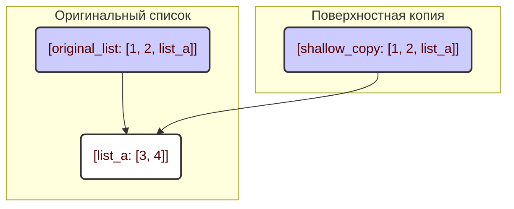
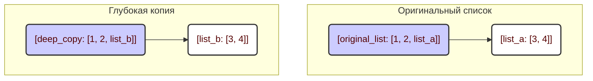

**Зачем нужен `copy`?**

В Python, когда ты присваиваешь одну переменную другой (`list_b = list_a`), ты на самом деле не создаёшь новую копию. Вместо этого обе переменные ссылаются на один и тот же объект в памяти. Это означает, что если ты изменишь `list_a`, то изменения также отразятся на `list_b`. Чтобы этого избежать, нам нужно создавать именно *копии* объектов.

**Два типа копирования**

Модуль `copy` предоставляет две основные функции:

1.  `copy.copy()`: Создаёт *поверхностную* копию.
2.  `copy.deepcopy()`: Создаёт *глубокую* копию.

Разница между ними заключается в том, как обрабатываются вложенные объекты (например, списки внутри списков). Сейчас мы разберём это подробнее.

**Поверхностное копирование (`copy.copy()`)**

Поверхностная копия создаёт новый объект, но при этом копирует только *ссылки* на вложенные объекты. Это значит, что если в твоём исходном объекте есть, например, список, то в копии будет храниться *ссылка* на тот же самый список, а не его копия.

```python
import copy

# Исходный список
original_list = [1, 2, [3, 4]]

# Поверхностная копия
shallow_copy = copy.copy(original_list)

print(f"Исходный список: {original_list}")  # Выведет: Исходный список: [1, 2, [3, 4]]
print(f"Поверхностная копия: {shallow_copy}") # Выведет: Поверхностная копия: [1, 2, [3, 4]]

# Изменяем вложенный список в исходном объекте
original_list[2][0] = 5

print(f"Исходный список после изменения: {original_list}") # Выведет: Исходный список после изменения: [1, 2, [5, 4]]
print(f"Поверхностная копия после изменения: {shallow_copy}")  # Выведет: Поверхностная копия после изменения: [1, 2, [5, 4]]
```

Как ты видишь, при изменении вложенного списка в `original_list`, это изменение также отразилось и в `shallow_copy`. Это потому, что оба списка содержат *ссылку* на один и тот же вложенный список `[3, 4]`.

**Глубокое копирование (`copy.deepcopy()`)**

Глубокая копия, в отличие от поверхностной, рекурсивно создаёт новые копии всех вложенных объектов. Это значит, что если у тебя есть список в списке, то `deepcopy()` создаст полностью независимую копию, включая все вложенные элементы.

```python
import copy

# Исходный список
original_list = [1, 2, [3, 4]]

# Глубокая копия
deep_copy = copy.deepcopy(original_list)

print(f"Исходный список: {original_list}")  # Выведет: Исходный список: [1, 2, [3, 4]]
print(f"Глубокая копия: {deep_copy}")  # Выведет: Глубокая копия: [1, 2, [3, 4]]

# Изменяем вложенный список в исходном объекте
original_list[2][0] = 5

print(f"Исходный список после изменения: {original_list}") # Выведет: Исходный список после изменения: [1, 2, [5, 4]]
print(f"Глубокая копия после изменения: {deep_copy}")  # Выведет: Глубокая копия после изменения: [1, 2, [3, 4]]
```

В этом случае, изменение вложенного списка в `original_list` не повлияло на `deep_copy`. Это потому, что `deep_copy` создала полностью независимую копию вложенного списка.

**Когда какой тип копирования использовать?**

*   **`copy.copy()`** подходит, когда тебе нужно скопировать объект, но не беспокоит, что вложенные изменяемые объекты будут общими. Это может быть быстрее, чем `deepcopy()`, так как не нужно рекурсивно копировать каждый объект.
*   **`copy.deepcopy()`** необходим, когда тебе нужна полная независимость копии от оригинала, особенно если объект содержит вложенные изменяемые объекты, такие как списки или словари.


**Диаграмма для поверхностного копирования:**



**Диаграмма для глубокого копирования:**



В первой диаграмме видно, что и `original_list`, и `shallow_copy` ссылаются на один и тот же вложенный список `list_a`. А во второй диаграмме `deep_copy` имеет свою независимую копию вложенного списка, `list_b`.
