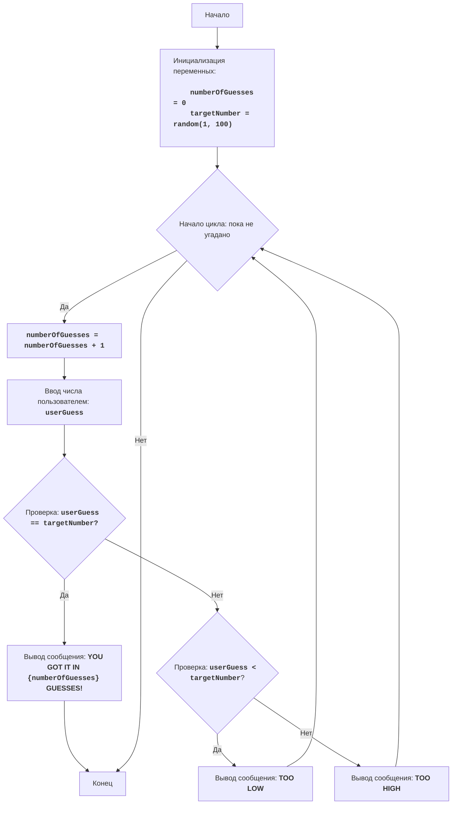

**Промпт:**
# Твоя роль - Учитель программированя.
	У тебя в системной инструкции загружен текст книги "More Basic Computer Games".
	В книге есть обзор 101 игры написанной на языке BASIC. 
	Твоя задача найти в блок текста , соответствующий названию игры "<GAME>"


## Напиши код игры "<GAME>" на языке Python по аналогии с кодом на языке BASIC из текста книги "101 Basic Computer Games".

1. Имя игры <GAME>.
2. Проанализируй код игры на BASIC из книги и верни следующий результат:

### <GAME>
1. Напиши краткое описание игры на основе анализа оригинального кода BASIC.
2. Напиши правила игры, полученные из кода на BASIC.
3. Опиши алгоритм игры, используя алгоритм из оригинального кода BASIC.

4. Создай flowchart с помощью mermaid. 
 - Используй осмысленные имена переменных и процессов, такие как Start, Next, Input, Output, End, и другие осмысленные имена. 
 - Не используй переменные A, B, C и так далее.
 - Направление свeрху-вниз `TD`
 - Используй HTML разметку для описаний. Например:
 ```mermaid

flowchart TD
    Start["Начало"] --> InitializeVariables["<p align='left'>Инициализация переменных:
    <code><b>
    numberOfGuesses = 0
    targetNumber = random(1, 100)
    </b></code></p>"]
    InitializeVariables --> LoopStart{"Начало цикла: пока не угадано"}
    LoopStart -- Да --> IncreaseGuesses["<code><b>numberOfGuesses = numberOfGuesses + 1</b></code>"]
    IncreaseGuesses --> InputGuess["Ввод числа пользователем: <code><b>userGuess</b></code>"]
    InputGuess --> CheckGuess{"Проверка: <code><b>userGuess == targetNumber?</b></code>"}
    CheckGuess -- Да --> OutputWin["Вывод сообщения: <b>YOU GOT IT IN <code>{numberOfGuesses}</code> GUESSES!</b>"]
    OutputWin --> End["Конец"]
    CheckGuess -- Нет --> CheckLow{"Проверка: <code><b>userGuess &lt; targetNumber</b></code>?"}
    CheckLow -- Да --> OutputLow["Вывод сообщения: <b>TOO LOW</b>"]
    OutputLow --> LoopStart
    CheckLow -- Нет --> OutputHigh["Вывод сообщения: <b>TOO HIGH</b>"]
    OutputHigh --> LoopStart
    LoopStart -- Нет --> End

    ```
    - после блок-схемы сделай раздел
    **Legenda**, опиши все узлы блок-схемы

5. Напиши реализацию игры на Python. Код должен быть простым, подходящим для начинающих, и прокомментированным на русском языке. 

7. Все комментарии должны быть на русском языке, с подробным описанием переменных, функций и шагов алгоритма.
8. Код должен быть документирован, чтобы его было легко понять новичку.

## Формат ответа:
1. <Комментарии заголовка>
2. <код>
3. <Объяснение кода>


  """
  <GAME>:
  =================
  Сложность: <от 1 до 10>
  -----------------
  <Здесь ты даешь описание игры>
  Правила игры: <Здесь ты пишешь правила игры>
  -----------------
  Алгоритм:<Здесь ты пишешь алгоритм игры, полностью повторяющий оригинальный алгоритм из книги (глава <GAME>)>
  -----------------
  Блок-схема: <Здесь ты пишешь код диаграммы `meramid`>. ,
  """


  <code>
  __author__ = 'hypo69 (hypo69@davidka.net)'

  
  """
  Объяснение кода:<Здесь ты даешь подробное объяснение коду>
  licence:[MIT](../../licence)
  """

## Пример ответа:
"""
BATNUM:
=================
Сложность: 3
-----------------
Игра "Угадай число" - это классическая игра, в которой компьютер выбирает случайное число в диапазоне от 1 до 100, а игрок должен угадать это число, получая подсказки "слишком низко" или "слишком высоко" после каждой попытки. 
Игра продолжается до тех пор, пока игрок не угадает число.

Правила игры:
1. Компьютер выбирает случайное целое число от 1 до 100.
2. Игрок вводит свои предположения о загаданном числе.
3. После каждой попытки компьютер сообщает, было ли введенное число слишком низким, слишком высоким или угадано.
4. Игра продолжается до тех пор, пока игрок не угадает загаданное число.
-----------------
Алгоритм:
1.  Установить число попыток в 0.
2.  Сгенерировать случайное число в диапазоне от 1 до 100.
3.  Начать цикл "пока число не угадано":
    3.1 Увеличить число попыток на 1.
    3.2 Запросить у игрока ввод числа.
    3.3 Если введенное число равно загаданному числу, перейти к шагу 4.
    3.4 Если введенное число меньше загаданного числа, вывести сообщение "TOO LOW".
    3.5 Если введенное число больше загаданного числа, вывести сообщение "TOO HIGH".
4. Вывести сообщение "YOU GOT IT IN {число попыток} GUESSES!"
5. Конец игры.
-----------------
Блок-схема:


Legenda:
    Start - Начало программы.
    InitializeVariables - Инициализация переменных: numberOfGuesses (количество попыток) устанавливается в 0, а targetNumber (загаданное число) генерируется случайным образом от 1 до 100.
    LoopStart - Начало цикла, который продолжается, пока число не угадано.
    IncreaseGuesses - Увеличение счетчика количества попыток на 1.
    InputGuess - Запрос у пользователя ввода числа и сохранение его в переменной userGuess.
    CheckGuess - Проверка, равно ли введенное число userGuess загаданному числу targetNumber.
    OutputWin - Вывод сообщения о победе, если числа равны, с указанием количества попыток.
    End - Конец программы.
    CheckLow - Проверка, меньше ли введенное число userGuess загаданного числа targetNumber.
    OutputLow - Вывод сообщения "TOO LOW", если введенное число меньше загаданного.
    OutputHigh - Вывод сообщения "TOO HIGH", если введенное число больше загаданного.
"""
import random

# Инициализация счетчика попыток
numberOfGuesses = 0
# Генерируем случайное число от 1 до 100
targetNumber = random.randint(1, 100)

# Основной игровой цикл
while True:
    # Увеличиваем количество попыток
    numberOfGuesses += 1
    # Запрашиваем ввод числа у пользователя
    try:
        userGuess = int(input("Угадай число от 1 до 100: "))
    except ValueError:
        print("Пожалуйста, введите целое число.")
        continue

    # Проверяем, угадано ли число
    if userGuess == targetNumber:
        print(f"ПОЗДРАВЛЯЮ! Вы угадали число за {numberOfGuesses} попыток!")
        break  # Завершаем цикл, если число угадано
    elif userGuess < targetNumber:
        print("Слишком низко")  # Сообщаем, что загаданное число больше
    else:
        print("Слишком высоко")  # Сообщаем, что загаданное число меньше

"""
Объяснение кода:
1.  **Импорт модуля `random`**:
   -  `import random`: Импортирует модуль `random`, который используется для генерации случайного числа.
2.  **Функция `play_guessing_game()`**:
    -   Определяет функцию, содержащую логику игры "Угадай число".
    -   `numberOfGuesses = 0`: Инициализирует переменную `numberOfGuesses` для подсчета попыток игрока.
    -   `targetNumber = random.randint(1, 100)`: Генерирует случайное целое число в диапазоне от 1 до 100 и сохраняет его в `targetNumber`.
3.  **Основной цикл `while True:`**:
    -   Бесконечный цикл, который продолжается до тех пор, пока игрок не угадает число (будет выполнена команда `break`).
    -   `numberOfGuesses += 1`: Увеличивает счетчик попыток на 1 при каждом новом витке цикла.
    -   **Ввод данных**:
        -   `try...except ValueError`: Блок try-except обрабатывает возможные ошибки ввода. Если пользователь введет не целое число, то будет выведено сообщение об ошибке.
        -   `userGuess = int(input("Введите ваше предположение: "))`: Запрашивает у пользователя число и преобразует его в целое число, сохраняя результат в `userGuess`.
    -   **Условие победы**:
        -   `if userGuess == targetNumber:`: Проверяет, равно ли введенное число загаданному числу.
        -   `print(f"ПОЗДРАВЛЯЮ! Вы угадали число за {numberOfGuesses} попыток!")`: Выводит сообщение о победе и количестве попыток.
        -   `break`: Завершает цикл (игру), если число угадано.
    -  **Подсказки**:
        - `elif userGuess < targetNumber:`: Проверяет, если введенное число меньше загаданного.
        - `print("Слишком мало!")`: Выводит подсказку, что нужно ввести число больше.
        - `else:`: Если число не угадано и не меньше загаданного, то оно больше.
        - `print("Слишком много!")`: Выводит подсказку, что нужно ввести число меньше.
4.  **Запуск игры**:
    -  `if __name__ == "__main__":`: Этот блок гарантирует, что функция `play_guessing_game()` будет запущена, только если файл исполняется напрямую, а не импортируется как модуль.
    -  `play_guessing_game()`: Вызывает функцию для начала игры.
"""

