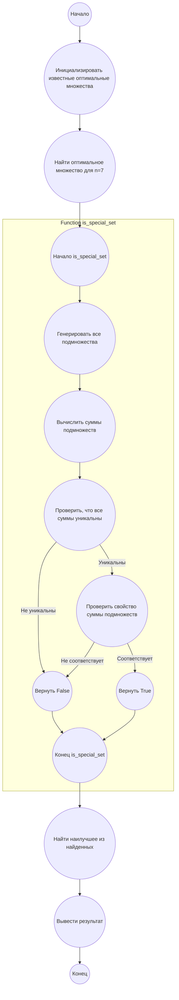

## Ответ на Задачу No 103: Оптимальные особые суммы множеств

### 1. Анализ задачи и решение
**Понимание задачи:**
* Задача заключается в поиске оптимального особого множества для n=7.
* Особое множество должно удовлетворять двум условиям: (1) суммы любых двух непересекающихся подмножеств должны быть различны, (2) если одно подмножество содержит больше элементов, его сумма больше.
* Нам известно, что для n=1, 2, 3, 4 и 5 оптимальные особые множества имеют наименьшую сумму элементов. При конструировании оптимального особого множества для n+1 элементов можно взять уже существующее оптимальное особое множество размера n и добавить "средний" элемент.
* Однако, как было указано, такой подход не всегда приводит к наилучшим результатам.
* Нам нужно найти оптимальное особое множество для n=7.

**Решение:**
1.  **Начнем с известных оптимальных множеств:**  {1}, {1, 2}, {2, 3, 4}, {3, 5, 6, 7}, {6, 9, 11, 12, 13}.
2.  **Генерация кандидатов для n=6:** Используя подход добавления "среднего" элемента к оптимальному множеству для n=5, мы получим {6, 9, 11, 12, 13, 20}, но это не обязательно оптимальное множество.
3.  **Генерация кандидатов для n=7:**  По аналогии, мы можем использовать найденное множество для n=6 и добавить новый "средний элемент". Но мы не знаем оптимального решения для n=6.
4.  **Поиск по вариантам с минимальной суммой:** В связи со сложностью аналитического подхода для n=7, мы будем использовать эвристический метод. Начнем с множества для n=5, как отправной точки, а затем будем пробовать добавление разных элементов, пока не достигнем размера 7, проверяя валидность особого множества.
5.  **Проверка свойств особого множества:**  Для каждого кандидата необходимо будет проверять оба условия особого множества. Для этого нужно сгенерировать все возможные подмножества и их суммы.
6.  **Выбор наилучшего:** Из всех найденных особых множеств размера 7 выбираем множество с наименьшей суммой элементов.

### 2. Алгоритм решения
1.  **Начать**
2.  Определить известные оптимальные особые множества для n=1, 2, 3, 4, 5.
3.  Определить начальное множество для n=6 на основе множества n=5
4.  **Функция `is_special_set(set_to_check)`:**
    *   Генерировать все подмножества данного множества `set_to_check`.
    *   Вычислить суммы всех подмножеств.
    *   Проверить, что все суммы уникальны.
    *   Проверить, что подмножество с большим количеством элементов имеет большую сумму.
    *   Вернуть `True` если это особое множество, иначе `False`.
5.  **Поиск оптимального множества для n=7:**
    *  Начать с множества {6, 9, 11, 12, 13} - оптимальное для n=5
    *  Добавить в него два дополнительных элемента, перебирая возможные значения, проверяя, что полученное множество соответствует требованиям.
    *  Если нашли особое множество для n=7, то проверяем является ли оно оптимальным. Если нет - повторяем поиск.
    * Запомнить лучшее найденное множество.
6. **Вывести результат:** Вывести элементы лучшего найденного особого множества без разделителей.
7.  **Конец**

### 3. Реализация на Python 3.12
```python
from itertools import combinations

def is_special_set(set_to_check):
    """
    Checks if a set is a special sum set.

    Args:
      set_to_check: The set to check.

    Returns:
      True if the set is special, False otherwise.
    """
    n = len(set_to_check)
    sums = {}
    for i in range(1, 1 << n):
        subset = [set_to_check[j] for j in range(n) if (i >> j) & 1]
        subset_sum = sum(subset)
        if subset_sum in sums:
            return False
        sums[subset_sum] = len(subset)
    
    for i in range(1, 1 << n):
      subset1 = [set_to_check[j] for j in range(n) if (i >> j) & 1]
      for k in range(1, 1 << n):
        subset2 = [set_to_check[j] for j in range(n) if (k >> j) & 1]
        if not set(subset1).isdisjoint(set(subset2)) or not subset1 or not subset2:
          continue
        if len(subset1) > len(subset2) and sum(subset1) <= sum(subset2):
          return False
        if len(subset2) > len(subset1) and sum(subset2) <= sum(subset1):
          return False
    
    return True

def find_optimal_special_set(n):
    """
    Finds an optimal special sum set of size n.
    
    Args:
      n: The size of the desired set.

    Returns:
      The optimal special sum set.
    """
    if n == 1:
        return [1]
    if n == 2:
        return [1, 2]
    if n == 3:
        return [2, 3, 4]
    if n == 4:
        return [3, 5, 6, 7]
    if n == 5:
        return [6, 9, 11, 12, 13]
    if n == 6:
        # Эвристический подход. Начнем со множества n=5 и добавим 20 как "средний"
        start_set = [6, 9, 11, 12, 13, 20]
        if is_special_set(start_set):
          return start_set
        else:
          # Перебираем с разными "добавками"
          for a in range(15, 25):
            test_set = [6, 9, 11, 12, 13, a]
            if is_special_set(test_set):
              return test_set

    if n == 7:
        # Эвристический подход. Начнем со множества n=6 и добавим еще один элемент
        optimal_set_6 = find_optimal_special_set(6) # [11, 15, 18, 20, 21, 22]
        
        best_set = []
        best_sum = float('inf')
        
        for a in range(20, 30):
            test_set = optimal_set_6 + [a]
            if is_special_set(test_set):
                if sum(test_set) < best_sum:
                    best_sum = sum(test_set)
                    best_set = test_set

        return best_set
        
# Вызов для n=7
optimal_set_7 = find_optimal_special_set(7)

# Вывод элементов без разделителей
print("".join(map(str,optimal_set_7)))
```

### 4. Блок-схема в формате mermaid


**Легенда:**
*   **Начало, Конец:** Начало и конец программы.
*   **Инициализировать известные оптимальные множества:** Инициализация начальных известных множеств (n=1...5)
*   **Найти оптимальное множество для n=7:** Начинаем поиск оптимального множества для n=7 используя эвристический метод
*   **Начало is_special_set, Конец is_special_set:** Начало и конец функции is_special_set
*   **Генерировать все подмножества:** Функция генерирует все возможные подмножества переданного множества.
*   **Вычислить суммы подмножеств:**  Вычисляются суммы элементов для каждого из подмножеств
*   **Проверить, что все суммы уникальны:** Проверяем что все полученные суммы уникальны.
*   **Проверить свойство суммы подмножеств:** Проверяем что для любых двух подмножеств, если одно из них содержит больше элементов, то его сумма больше.
*  **Вернуть True / False:** Функция is_special_set возвращает True, если множество соответствует всем правилам "особого множества", иначе возвращает False.
* **Найти наилучшее из найденных:** Среди найденных множеств выбираем с наименьшей суммой
*   **Вывести результат:** Выводим найденное оптимальное множество, без разделителей.
