## Ответ на Задачу No 109: Дротики

### 1. Анализ задачи и решение
**Понимание задачи:**
* Нам нужно найти все возможные комбинации из трех бросков дротиков, которые в сумме дают любое положительное число очков меньше 100, при условии, что последний бросок должен быть в двойной сектор.
* Возможные очки за один бросок: одиночные (1-20, 25), двойные (2-40, 50) и тройные (3-60).
* Необходимо перебрать все возможные комбинации бросков и проверить их соответствие условиям задачи.

**Решение:**
1. **Генерация всех возможных бросков:**
   - Создадим списки всех возможных значений для одиночных, двойных и тройных бросков.
2. **Тройной цикл:**
   - Организуем три вложенных цикла, перебирающие все варианты первого, второго и третьего бросков.
   - Условие на последний бросок: третий бросок должен быть из списка двойных.
3. **Проверка суммы:**
   - Проверяем сумму очков всех трех бросков. Она должна быть положительной и меньше 100.
4. **Подсчет комбинаций:**
   - Если сумма соответствует условию, то увеличиваем счетчик найденных комбинаций.
5. **Возврат результата:**
   - Возвращаем общее количество найденных комбинаций.

### 2. Алгоритм решения
1. Начать
2. Инициализировать счетчик комбинаций `combination_count` значением 0
3. Создать списки `singles`, `doubles`, `triples` для возможных значений бросков.
4. Для каждого `first_throw` из `singles + doubles + triples`:
   * Для каждого `second_throw` из `singles + doubles + triples`:
      * Для каждого `third_throw` из `doubles`:
          * Вычислить `total_score` = `first_throw` + `second_throw` + `third_throw`
          * Если `total_score` > 0 и `total_score` < 100:
            * Увеличить `combination_count` на 1
5. Вернуть `combination_count`
6. Конец

### 3. Реализация на Python 3.12
```python
def count_dart_combinations():
    """
    Counts the number of ways to score less than 100 points with 3 darts,
    where the last dart is a double.
    """

    combination_count = 0

    singles = list(range(1, 21)) + [25]
    doubles = list(range(2, 41, 2)) + [50]
    triples = list(range(3, 61, 3))

    for first_throw in singles + doubles + triples:
        for second_throw in singles + doubles + triples:
            for third_throw in doubles:
                total_score = first_throw + second_throw + third_throw
                if 0 < total_score < 100:
                    combination_count += 1

    return combination_count


result = count_dart_combinations()
print(result)
```

### 4. Блок-схема в формате mermaid

```mermaid
flowchart TD
    Start((Начало)) --> InitializeCount((Инициализировать combination_count = 0))
    InitializeCount --> CreateThrowLists((Создать списки singles, doubles, triples))
    CreateThrowLists --> FirstLoopStart((Начать цикл: first_throw))
    FirstLoopStart --> SecondLoopStart((Начать цикл: second_throw))
    SecondLoopStart --> ThirdLoopStart((Начать цикл: third_throw из doubles))
    ThirdLoopStart --> CalculateScore((Вычислить total_score))
    CalculateScore --> CheckScore((Проверить: 0 < total_score < 100?))
    CheckScore -- Да --> IncrementCount((Увеличить combination_count на 1))
    IncrementCount --> ThirdLoopEnd((Конец цикла: third_throw))
    CheckScore -- Нет --> ThirdLoopEnd
    ThirdLoopEnd --> SecondLoopEnd((Конец цикла: second_throw))
    SecondLoopEnd --> FirstLoopEnd((Конец цикла: first_throw))
    FirstLoopEnd --> ReturnCount((Вернуть combination_count))
    ReturnCount --> End((Конец))
```


**Легенда:**
*   **Начало, Конец:** Начало и конец алгоритма.
*   **Инициализировать combination_count:** Создаем переменную для подсчета комбинаций и присваиваем ей значение 0.
*  **Создать списки singles, doubles, triples:** Создание списков всех возможных вариантов броска.
*   **Начать цикл: first_throw, second_throw, third_throw:** Определяют начало вложенных циклов для перебора возможных значений первого, второго и третьего бросков.
*   **Вычислить total_score:** Считаем сумму очков трех бросков.
*   **Проверить: 0 < total_score < 100?:** Проверяем условие по сумме очков.
*   **Увеличить combination_count на 1:** Если условие выполнено, то увеличиваем счетчик комбинаций.
*  **Конец цикла: third_throw, second_throw, first_throw:**  Обозначают конец вложенных циклов перебора значений.
*   **Вернуть combination_count:** Возвращаем общее количество найденных комбинаций.
