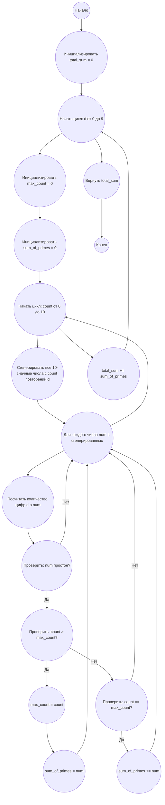

## Ответ на Задачу No 111: Почти простые числа

### 1. Анализ задачи и решение
**Понимание задачи:**
*   Необходимо найти сумму S(10, d) для каждой цифры d (от 0 до 9), где S(n, d) — сумма всех n-значных простых чисел, имеющих наибольшее количество одинаковых цифр, равных d. В нашем случае n=10.
*   Задача состоит из нескольких частей: генерация чисел с заданным количеством одинаковых цифр, проверка этих чисел на простоту, нахождение чисел с максимальным количеством одинаковых цифр и суммирование этих чисел для каждого d.
*   Поскольку n=10, нам нужно генерировать 10-значные числа. Находить максимальное количество одинаковых цифр в 10-значном числе и сумму всех простых чисел с таким максимальным количеством.
*   Из-за того что количество вариантов очень велико, для ускорения процесса можно проверять на простоту, только если  количество одинаковых цифр максимальное для каждого `d`.

**Решение:**
1.  **Генерация чисел:** Для каждой цифры `d` от 0 до 9, сгенерируем все 10-значные числа, содержащие разное количество  цифры `d`.
2.  **Проверка на простоту:** Создадим функцию для проверки, является ли число простым.
3.  **Поиск максимума:**  Для каждой цифры `d` находим максимальное количество повторений  `d` среди 10-значных чисел, и сумму всех простых чисел с таким количеством.
4.  **Суммирование:** Суммируем результаты для всех цифр `d` от 0 до 9.

### 2. Алгоритм решения
1. Начать
2. Инициализировать переменную `total_sum` со значением 0.
3. Для каждой цифры `d` от 0 до 9:
    *   Инициализировать `max_count` = 0.
    *   Инициализировать `sum_of_primes` = 0.
    *   Для каждого количества `count` повторений  `d` от 0 до 10:
        *   Для каждого 10-значного числа `num`, содержащего `count`  цифры `d`:
            *  Если `num` простое:
                * Если `count` > `max_count`:
                  *  `max_count` = `count`.
                  *  `sum_of_primes` = `num`.
                 * Если `count` == `max_count`:
                  * `sum_of_primes` = `sum_of_primes` +  `num`.
    *   `total_sum` = `total_sum` + `sum_of_primes`
4.  Вернуть `total_sum`
5. Конец

### 3. Реализация на Python 3.12
```python
import math

def is_prime(n):
    if n < 2:
        return False
    for i in range(2, int(math.sqrt(n)) + 1):
        if n % i == 0:
            return False
    return True

def generate_numbers(digit, count, length, current_num, index, numbers):
  if index == length:
        numbers.append(current_num)
        return
  
  for i in range(0, 10):
    new_num = current_num * 10 + i
    generate_numbers(digit, count, length, new_num, index + 1, numbers)

def solve():
    total_sum = 0
    for digit in range(10):
        max_count = 0
        sum_of_primes = 0
        for count in range(11):
          numbers = []
          generate_numbers(digit, count, 10, 0, 0, numbers)
          for num in numbers:
              num_str = str(num)
              digit_count = num_str.count(str(digit))
              if digit_count == count and is_prime(num) :
                 if count > max_count:
                    max_count = count
                    sum_of_primes = num
                 elif count == max_count:
                    sum_of_primes += num
                    
        total_sum += sum_of_primes

    return total_sum
    

result = solve()
print(result)
```

### 4. Блок-схема в формате mermaid


**Легенда:**
*   **Начало, Конец:** Начало и конец алгоритма.
*   **Инициализировать total_sum:** Создаем переменную для хранения общей суммы и присваиваем ей значение 0.
*   **Начать цикл: d от 0 до 9, Конец цикла:** Цикл для каждой цифры от 0 до 9.
*  **Инициализировать max_count, Инициализировать sum_of_primes:**  Инициализируем переменные максимального количества  и суммы простых чисел.
*   **Начать цикл: count от 0 до 10:** Цикл для каждого возможного количества повторений цифры `d`.
*   **Сгенерировать все 10-значные числа с count повторений d:** Генерируем все 10-значные числа содержащие count повторений цифры `d`.
*   **Для каждого числа num в сгенерированных:** Цикл для каждого сгенерированного числа.
*  **Посчитать количество цифр d в num:** Считаем сколько раз повторяется цифра `d` в числе `num`.
*   **Проверить: num простое?:** Проверяем, является ли число `num` простым.
*   **Проверить: count > max_count?:** Проверяем, больше ли текущее количество повторений, чем максимальное.
*   **max_count = count, sum_of_primes = num:**  Обновляем переменные.
*   **Проверить: count == max_count?:** Проверяем, равно ли текущее количество повторений, максимальному.
*   **sum_of_primes += num:** Обновляем переменную суммы простых чисел.
*   **total_sum += sum_of_primes:**  Обновляем общую сумму, прибавляя сумму простых чисел для текущей цифры.
*   **Вернуть total_sum:** Возвращаем итоговую сумму.
