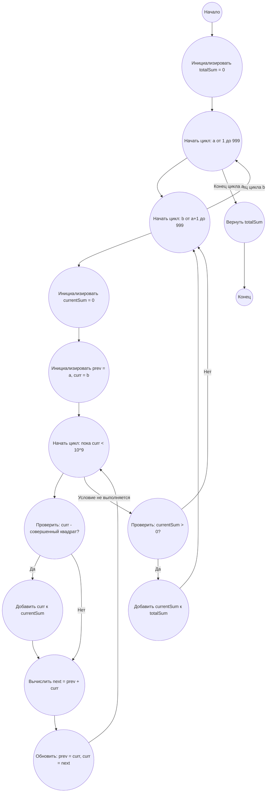

## Ответ на Задачу No 140: Модифицированные числа Фибоначчи

### 1. Анализ задачи и решение
**Понимание задачи:**
*   Нам необходимо для каждой пары чисел `(a, b)` где `0 < a < b < 1000` сгенерировать последовательность, где каждый следующий член равен сумме двух предыдущих.
*   Затем, для каждой последовательности, нужно найти все члены, являющиеся полными квадратами, и посчитать их сумму.
*   В конце, нужно просуммировать все ненулевые суммы полных квадратов для всех пар `(a, b)`.
*   Совершенный квадрат - это целое число, которое является квадратом целого числа (например, 1, 4, 9, 16 и т.д.)

**Решение:**
1. **Генерация последовательности:** Для каждой пары чисел `(a, b)` генерируем последовательность Фибоначчи, пока не достигнем значения большего чем 10^9 (это разумное ограничение, чтобы избежать бесконечных вычислений).
2. **Проверка на совершенный квадрат:** Для каждого числа в последовательности проверяем, является ли оно совершенным квадратом. Для этого берем корень квадратный числа, и проверяем что целая часть корня в квадрате дает исходное число.
3. **Суммирование квадратов:** Если число является совершенным квадратом, добавляем его к сумме для данной пары `(a, b)`.
4. **Общая сумма:** После обработки всех пар, суммируем все ненулевые суммы квадратов.

### 2. Алгоритм решения
1.  Начать
2.  Инициализировать общую сумму `totalSum` со значением 0.
3.  Для каждого числа `a` от 1 до 999
    *   Для каждого числа `b` от `a+1` до 999
        *   Инициализировать `currentSum` со значением 0.
        *   Инициализировать `prev` = `a` и `curr` = `b`.
        *   Пока `curr` < 10<sup>9</sup>
            *   Проверить, является ли `curr` совершенным квадратом
                *   Если да, прибавить `curr` к `currentSum`
            *   Вычислить `next` = `prev` + `curr`
            *   Присвоить `prev` = `curr` и `curr` = `next`
        *   Если `currentSum` > 0, прибавить `currentSum` к `totalSum`
4.  Вернуть `totalSum`
5.  Конец

### 3. Реализация на Python 3.12
```python
import math

def is_perfect_square(number):
    """Checks if a number is a perfect square."""
    if number < 0:
        return False
    root = math.isqrt(number)
    return root * root == number

def calculate_sum_of_squares():
    """Calculates the sum of S(a, b) for all pairs (a, b) where 0 < a < b < 1000 and S(a, b) is not zero."""
    total_sum = 0
    for a in range(1, 1000):
        for b in range(a + 1, 1000):
            current_sum = 0
            prev = a
            curr = b
            while curr < 1_000_000_000:
                if is_perfect_square(curr):
                    current_sum += curr
                next_val = prev + curr
                prev = curr
                curr = next_val
            if current_sum > 0:
                total_sum += current_sum
    return total_sum

# Вызов функции и вывод результата
result = calculate_sum_of_squares()
print(result)
```

### 4. Блок-схема в формате mermaid


**Легенда:**
*   **Начало, Конец:** Начало и конец алгоритма.
*   **Инициализировать totalSum:** Создаем переменную для хранения общей суммы и присваиваем ей значение 0.
*   **Начать цикл: a от 1 до 999:** Начало цикла для перебора всех значений `a`.
*   **Начать цикл: b от a+1 до 999:** Начало цикла для перебора всех значений `b`.
*   **Инициализировать currentSum:** Создаем переменную для хранения суммы совершенных квадратов для текущей пары `(a, b)`.
*   **Инициализировать prev = a, curr = b:** Инициализируем переменные `prev` и `curr` значениями `a` и `b` для генерации последовательности Фибоначчи.
*   **Начать цикл: пока curr < 10^9:** Начало цикла для генерации последовательности Фибоначчи.
*  **Проверить: curr - совершенный квадрат?:** Проверяем является ли текущий элемент `curr` совершенным квадратом.
*   **Добавить curr к currentSum:** Если curr - совершенный квадрат, добавляем его к currentSum
*   **Вычислить next = prev + curr:** Вычисляем следующий член последовательности Фибоначчи.
*   **Обновить: prev = curr, curr = next:** Обновляем переменные `prev` и `curr`.
*   **Проверить: currentSum > 0?:** Проверяем, является ли сумма квадратов для текущей пары `(a, b)` ненулевой.
*   **Добавить currentSum к totalSum:** Если `currentSum` больше нуля, добавляем ее к общей сумме.
*  **Вернуть totalSum:** Возвращаем общую сумму.
