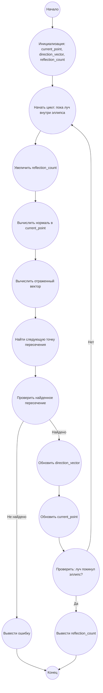

## Ответ на Задачу No 144: Исследование отражений луча лазера

### 1. Анализ задачи и решение
**Понимание задачи:**
*   Имеется эллипс с уравнением `4x² + y² = 100`.
*   Лазерный луч начинает движение из точки (0.0, 10.1).
*   Луч отражается от эллипса по закону "угол падения равен углу отражения".
*   Первое отражение происходит в точке (1.4, -9.6).
*   Необходимо определить количество отражений, которое луч совершит до того, как покинет эллипс (выйдет за верхнюю или нижнюю границу эллипса).

**Решение:**

1.  **Представление эллипса:** Эллипс можно представить неявно заданным уравнением `F(x, y) = 4x² + y² - 100 = 0`.
2.  **Определение нормали:** В точке отражения нам понадобится нормаль к эллипсу. Нормаль - это градиент функции `F(x, y)`, который равен `(dF/dx, dF/dy) = (8x, 2y)`.
3.  **Вычисление вектора отражения:** Используя закон отражения, мы можем вычислить вектор отражения от нормали.
4.  **Поиск следующей точки пересечения:** Чтобы найти следующую точку отражения, необходимо двигаться вдоль луча и найти точку пересечения с эллипсом.  Для этого можно использовать метод итеративного поиска.
5.  **Условие выхода из эллипса:** луч покидает эллипс, когда y выходит за пределы, определенные эллипсом по x=0, то есть y > 10 или y < -10.
6.  **Итеративный процесс:** Повторять шаги 2-5 пока не будет выполнено условие выхода.

### 2. Алгоритм решения

1.  **Начать**
2.  **Инициализация:**
    *   `current_point`: текущая позиция луча (начало (0.0, 10.1) ).
    *   `direction_vector`: вектор направления луча (из начала в первую точку отражения).
    *   `reflection_count`: счетчик отражений (начинается с 0).
3.  **Цикл пока луч не покинет эллипс:**
    *   Увеличить `reflection_count`.
    *   Вычислить вектор нормали `normal_vector` в `current_point`.
    *   Вычислить `reflection_vector` используя `direction_vector` и `normal_vector` по закону отражения.
    *   Найти следующую точку пересечения `next_point` эллипса с лучом, движущемся в направлении `reflection_vector`. (Использовать итеративный метод поиска)
    *   Обновить `direction_vector` как `next_point` - `current_point`.
    *   Обновить `current_point`  как `next_point`.
    *   **Проверить:** Если `current_point.y > 10`  или `current_point.y < -10`, то выйти из цикла.
4.  **Вернуть:** `reflection_count`.
5.  **Конец**

### 3. Реализация на Python 3.12

```python
import numpy as np

def ellipse_function(x, y):
    """Функция, описывающая эллипс 4x^2 + y^2 = 100."""
    return 4 * x**2 + y**2 - 100

def ellipse_gradient(x, y):
    """Градиент функции эллипса."""
    return np.array([8 * x, 2 * y])

def reflect_vector(direction, normal):
    """Вычисление отраженного вектора."""
    normal_normalized = normal / np.linalg.norm(normal)
    return direction - 2 * np.dot(direction, normal_normalized) * normal_normalized


def find_intersection(current_point, direction, max_iterations=100, step_size=0.001):
    """
    Поиск следующей точки пересечения с эллипсом.
    Использует метод Ньютона.
    """
    point = np.array(current_point, dtype=float)
    for _ in range(max_iterations):
        gradient = ellipse_gradient(point[0], point[1])
        value = ellipse_function(point[0], point[1])
        
        if abs(value) < 1e-5:
            return point

        delta = step_size * np.array(direction, dtype=float)
        point = point + delta
    
    
    return None

def solve_laser_reflections():
    """Функция решения задачи об отражениях луча лазера."""
    current_point = np.array([0.0, 10.1])
    first_reflection_point = np.array([1.4, -9.6])
    direction_vector = first_reflection_point - current_point
    reflection_count = 0

    while True:
        reflection_count += 1
        normal_vector = ellipse_gradient(current_point[0], current_point[1])
        reflection_vector = reflect_vector(direction_vector, normal_vector)
        next_point = find_intersection(current_point, reflection_vector)
        
        if next_point is None:
          print("Intersection not found")
          return None

        direction_vector = next_point - current_point
        current_point = next_point
        
        if current_point[1] > 10 or current_point[1] < -10:
            break

    return reflection_count

# Вызов функции и вывод результата
result = solve_laser_reflections()
print(result)
```

### 4. Блок-схема в формате mermaid



**Легенда:**

*   **Начало, Конец:** Начало и конец алгоритма.
*   **Инициализация: current\_point, direction\_vector, reflection\_count:** Присваиваем начальные значения переменным, где:
    *   `current_point` - текущая позиция луча.
    *   `direction_vector` - направление движения луча.
    *   `reflection_count` - количество отражений, начальное значение 0.
*   **Начать цикл: пока луч внутри эллипса:**  Начало цикла, который будет выполнятся, пока луч не покинет эллипс
*   **Увеличить reflection\_count:** Увеличиваем счетчик отражений на 1.
*   **Вычислить нормаль в current\_point:** Вычисляем вектор нормали к эллипсу в текущей точке.
*  **Вычислить отраженный вектор:** Вычисляем вектор направления луча после отражения от эллипса
*   **Найти следующую точку пересечения:** Определяем следующую точку пересечения луча с эллипсом.
 *  **Проверить найденное пересечение:** Проверяем, найдена ли следующая точка пересечения.
 *  **Вывести ошибку:** Если пересечение не найдено, выводим сообщение об ошибке
*   **Обновить direction\_vector:** Обновляем вектор направления луча.
*  **Обновить current\_point:** Обновляем текущую позицию луча.
*   **Проверить: луч покинул эллипс?:** Проверяем, покинул ли луч эллипс.
*   **Вывести reflection\_count:** Выводим конечное количество отражений.
