## Ответ на Задачу No 145: Обратные числа

### 1. Анализ задачи и решение
**Понимание задачи:**
* Нам необходимо найти количество натуральных чисел меньше миллиарда (10^9), таких что сумма числа и его "обращения" (записи числа в обратном порядке) является числом, все цифры которого нечетные.
* Числа, содержащие нули, не могут быть обращены.
* Необходимо перебрать все числа от 1 до 999,999,999 и проверить каждое на соответствие условию.

**Решение:**
1. **Итерация:** Перебираем все числа от 1 до 999,999,999.
2. **Проверка на нули:** Если число содержит 0, пропускаем его.
3. **Обращение числа:** Получаем обращение числа.
4. **Сумма:** Вычисляем сумму исходного числа и его обращения.
5. **Проверка на нечетные цифры:** Проверяем, все ли цифры суммы нечетные.
6. **Счётчик:** Если все условия выполняются, увеличиваем счётчик.
7. **Возврат результата:** Возвращаем значение счетчика.

### 2. Алгоритм решения
1. Начать
2. Инициализировать переменную `count` со значением 0
3. Для каждого числа `number` от 1 до 999,999,999
   *   Преобразовать число в строку `number_str`
   *   Если `number_str` содержит '0', пропустить число и перейти к следующему
   *   Получить обращение числа `reversed_number_str`
   *   Преобразовать `reversed_number_str` в число `reversed_number`
   *   Вычислить сумму `sum_of_numbers` = `number` + `reversed_number`
   *   Преобразовать сумму `sum_of_numbers` в строку `sum_str`
   *   Инициализировать флаг `all_odd_digits` как `True`
   *   Для каждой цифры `digit` в `sum_str`:
        *   Если `digit` четная, установить `all_odd_digits` в `False` и прервать внутренний цикл
   *   Если `all_odd_digits` равен `True`, увеличить `count` на 1
4. Вернуть `count`
5. Конец

### 3. Реализация на Python 3.12
```python
def count_special_numbers(limit):
    """
    Counts the numbers that satisfy the given property within a limit.
    
    Args:
      limit: The upper bound (exclusive).

    Returns:
      The count of special numbers.
    """

    count = 0
    for number in range(1, limit):
        number_str = str(number)
        if '0' in number_str:
            continue

        reversed_number_str = number_str[::-1]
        reversed_number = int(reversed_number_str)
        sum_of_numbers = number + reversed_number
        sum_str = str(sum_of_numbers)
        
        all_odd_digits = True
        for digit in sum_str:
            if int(digit) % 2 == 0:
                all_odd_digits = False
                break
        
        if all_odd_digits:
            count += 1
    
    return count

# Пример использования:
result = count_special_numbers(1_000_000_000)
print(result)
```

### 4. Блок-схема в формате mermaid

```mermaid
flowchart TD
    Start((Начало)) --> InitializeCount((Инициализировать count = 0))
    InitializeCount --> LoopStart((Начать цикл: number от 1 до 999,999,999))
    LoopStart --> NumberToStr((Преобразовать number в строку number_str))
    NumberToStr --> CheckZeros((Проверить: number_str содержит '0'?))
    CheckZeros -- Да --> LoopStart
    CheckZeros -- Нет --> ReverseNumberStr((Получить обращение number_str в reversed_number_str))
    ReverseNumberStr --> StrToNumber((Преобразовать reversed_number_str в число reversed_number))
    StrToNumber --> SumNumbers((Вычислить sum_of_numbers = number + reversed_number))
    SumNumbers --> SumToStr((Преобразовать sum_of_numbers в строку sum_str))
    SumToStr --> InitializeAllOddFlag((Инициализировать all_odd_digits = True))
    InitializeAllOddFlag --> InnerLoopStart((Начать цикл: для каждой цифры digit в sum_str))
    InnerLoopStart --> CheckDigitOdd((Проверить: digit четная?))
    CheckDigitOdd -- Да --> SetAllOddFalse((Установить all_odd_digits = False))
    SetAllOddFalse --> InnerLoopEnd((Завершить внутренний цикл))
    CheckDigitOdd -- Нет --> InnerLoopStart
     InnerLoopStart --> InnerLoopEnd
    InnerLoopEnd --> CheckAllOddFlag((Проверить: all_odd_digits = True?))
    CheckAllOddFlag -- Да --> IncrementCount((Увеличить count на 1))
    IncrementCount --> LoopStart
    CheckAllOddFlag -- Нет --> LoopStart
    LoopStart --> End((Конец))
```


**Легенда:**
*   **Начало, Конец:** Начало и конец алгоритма.
*   **Инициализировать count = 0:** Создаем переменную для хранения количества и присваиваем ей значение 0.
*   **Начать цикл: number от 1 до 999,999,999, Конец цикла:** Определяют начало и конец цикла перебора чисел от 1 до 999,999,999.
*   **Преобразовать number в строку number_str:** Преобразуем текущее число в строку для удобства обработки.
*   **Проверить: number_str содержит '0'?** Проверяем, содержит ли строка числа '0'.
*  **Получить обращение number_str в reversed_number_str:**  Получаем строку, являющуюся обращением исходной строки.
*  **Преобразовать reversed_number_str в число reversed_number:** Преобразуем строку с обратным числом в число.
*   **Вычислить sum_of_numbers = number + reversed_number:**  Вычисляем сумму исходного и обратного числа.
*  **Преобразовать sum_of_numbers в строку sum_str:** Преобразуем сумму в строку.
*   **Инициализировать all_odd_digits = True:** Инициализируем флаг, который указывает, что все цифры суммы нечетные.
*   **Начать цикл: для каждой цифры digit в sum_str, Конец цикла:** Начало и конец цикла перебора цифр суммы.
*   **Проверить: digit четная?** Проверяем, является ли текущая цифра четной.
*   **Установить all_odd_digits = False:** Если цифра четная, сбрасываем флаг.
*  **Завершить внутренний цикл:** Завершаем цикл перебора цифр.
*  **Проверить: all_odd_digits = True?:** Проверяем, остались ли все цифры суммы нечетными.
*   **Увеличить count на 1:** Если условие выполняется, увеличиваем счетчик на 1.
