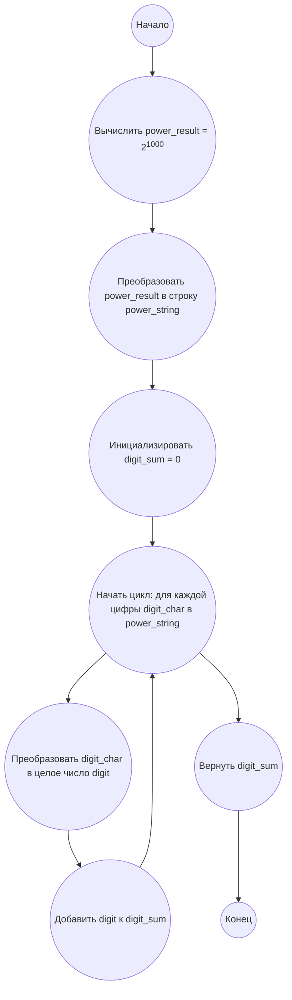

## Ответ на Задачу No 16: Сумма цифр степени

### 1. Анализ задачи и решение
**Понимание задачи:**
* Нам необходимо вычислить 2 в степени 1000 (2<sup>1000</sup>).
* Затем нужно просуммировать все цифры полученного числа.
* Число 2<sup>1000</sup> будет очень большим, поэтому нам понадобится способ работы с длинными целыми числами (в Python это делается автоматически).

**Решение:**
1. **Вычисление степени:** Вычисляем 2<sup>1000</sup>.
2. **Преобразование в строку:** Преобразуем полученное число в строку, чтобы получить доступ к каждой цифре.
3. **Суммирование цифр:** Проходим по каждой цифре строки, преобразуем её обратно в целое число и добавляем к общей сумме.
4. **Возврат результата:** Возвращаем итоговую сумму цифр.

### 2. Алгоритм решения
1. Начать
2. Вычислить `power_result` = 2<sup>1000</sup>
3. Преобразовать `power_result` в строку `power_string`
4. Инициализировать переменную `digit_sum` со значением 0
5. Для каждой цифры `digit_char` в строке `power_string`
    * Преобразовать `digit_char` в целое число `digit`
    * Прибавить `digit` к `digit_sum`
6. Вернуть `digit_sum`
7. Конец

### 3. Реализация на Python 3.12
```python
def sum_of_power_digits(base, exponent):
    """
    Calculates the sum of the digits of a base raised to an exponent.

    Args:
        base: The base number.
        exponent: The power to raise the base.

    Returns:
        The sum of the digits of the resulting number.
    """
    power_result = base ** exponent
    power_string = str(power_result)
    digit_sum = 0
    for digit_char in power_string:
        digit = int(digit_char)
        digit_sum += digit
    return digit_sum


# Пример использования:
result = sum_of_power_digits(2, 1000)
print(result)
```

### 4. Блок-схема в формате mermaid


**Legenda:**
*   **Начало, Конец:** Начало и конец алгоритма.
*   **Вычислить power_result = 2<sup>1000</sup>:** Вычисление результата возведения 2 в степень 1000.
*   **Преобразовать power_result в строку power_string:** Преобразование полученного числового результата в строку для обработки поциферно.
*   **Инициализировать digit_sum = 0:** Создание переменной для хранения суммы цифр и присвоение ей начального значения 0.
*   **Начать цикл: для каждой цифры digit_char в power_string:**  Начало цикла перебора символов (цифр) в строке.
*   **Преобразовать digit_char в целое число digit:** Преобразование текущего символа обратно в целое число.
*   **Добавить digit к digit_sum:** Добавление текущей цифры к общей сумме.
*   **Вернуть digit_sum:** Возвращение итоговой суммы цифр.
