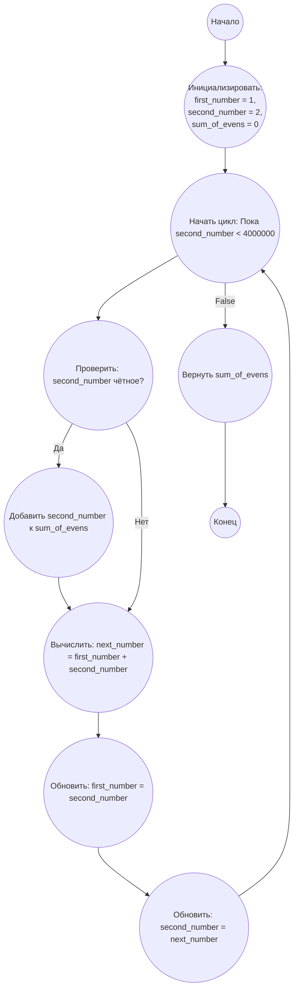

## Ответ на Задачу No 2: Чётные числа Фибоначчи

### 1. Анализ задачи и решение
**Понимание задачи:**
* Необходимо сгенерировать последовательность Фибоначчи до тех пор, пока значения членов не превысят 4 миллиона.
* Нужно просуммировать только чётные числа из этой последовательности.
* Последовательность Фибоначчи строится путем сложения двух предыдущих чисел.

**Решение:**
1. **Инициализация:** Создадим переменные `first_number` и `second_number` для хранения двух последних чисел последовательности Фибоначчи, а также переменную `sum_of_evens` для суммы чётных чисел.
2. **Генерация последовательности:**  В цикле генерируем новые числа Фибоначчи, складывая предыдущие два, и обновляем значения `first_number` и `second_number`.
3. **Проверка на чётность:** Каждое сгенерированное число проверяем на чётность. Если число чётное, добавляем его к `sum_of_evens`.
4. **Условие остановки:** Цикл продолжается до тех пор, пока сгенерированное число не превысит 4 миллиона.
5. **Возврат результата:** После окончания цикла возвращаем значение `sum_of_evens`.

### 2. Алгоритм решения
1. Начать
2. Инициализировать `first_number` = 1
3. Инициализировать `second_number` = 2
4. Инициализировать `sum_of_evens` = 0
5. Пока `second_number` < 4000000:
    *  Если `second_number` чётное:
         *  Прибавить `second_number` к `sum_of_evens`
    *  Вычислить `next_number` = `first_number` + `second_number`
    *  `first_number` = `second_number`
    *  `second_number` = `next_number`
6. Вернуть `sum_of_evens`
7. Конец

### 3. Реализация на Python 3.12
```python
def sum_even_fibonacci(limit):
    """
    Calculates the sum of even-valued terms in the Fibonacci sequence
    whose values do not exceed the given limit.

    Args:
      limit: The upper bound (exclusive).

    Returns:
      The sum of even-valued Fibonacci numbers.
    """
    first_number = 1
    second_number = 2
    sum_of_evens = 0

    while second_number < limit:
        if second_number % 2 == 0:
            sum_of_evens += second_number
        next_number = first_number + second_number
        first_number = second_number
        second_number = next_number
    return sum_of_evens

# Пример использования:
result = sum_even_fibonacci(4000000)
print(result)
```

### 4. Блок-схема в формате mermaid


**Легенда:**
*   **Начало, Конец:** Начало и конец алгоритма.
*   **Инициализировать переменные:** Инициализируем переменные `first_number`, `second_number`, и `sum_of_evens` начальными значениями.
*   **Начать цикл: Пока second_number < 4000000:**  Начало цикла, который выполняется, пока текущее число Фибоначчи `second_number` меньше 4 миллионов.
*   **Проверить: second_number чётное?:** Проверяем, является ли `second_number` чётным.
*   **Добавить second_number к sum_of_evens:** Если `second_number` чётное, то добавляем его к `sum_of_evens`.
*   **Вычислить: next_number = first_number + second_number:**  Вычисляем следующее число Фибоначчи.
*    **Обновить: first_number = second_number:** Обновляем `first_number` значением `second_number`.
*   **Обновить: second_number = next_number:** Обновляем `second_number` значением `next_number`.
*   **Вернуть sum_of_evens:** Возвращаем накопленную сумму четных чисел Фибоначчи.
