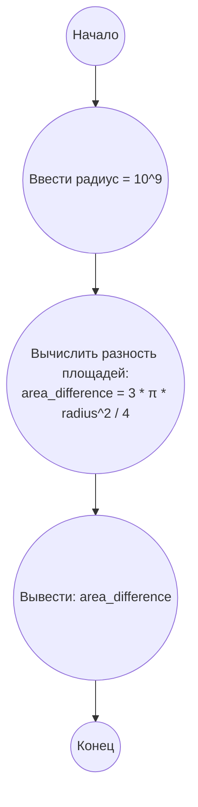

## Ответ на Задачу No 210: Круги в круге

### 1. Анализ задачи и решение
**Понимание задачи:**
* Даны два круга с одинаковым центром (2, 2), но разными радиусами: R и R/2, где R = 10^9.
* Необходимо найти количество целых точек (x, y) внутри первого круга (включая границу), N(R), и количество целых точек внутри второго круга (не включая границу), M(R).
* Найти разность N(R) - M(R).

**Решение:**
1. **Уравнение окружности:** Уравнение окружности с центром (a, b) и радиусом r: (x-a)^2 + (y-b)^2 = r^2.
2. **Точки внутри окружности:** Для того, чтобы точка (x, y) находилась внутри круга с радиусом R, должно выполняться неравенство: (x-2)^2 + (y-2)^2 <= R^2. Для точек внутри круга радиуса R/2, должно выполняться неравенство: (x-2)^2 + (y-2)^2 < (R/2)^2
3. **Симметрия:** Задача обладает симметрией относительно центра (2, 2). Мы можем рассмотреть только целые точки в первом квадранте (относительно центра), а потом умножить результат на 4, учитывая возможные точки на осях.
4. **Вычисление:**
    *   `N(R)`: Необходимо посчитать количество целых точек, удовлетворяющих (x-2)^2 + (y-2)^2 <= R^2
    *   `M(R)`: Необходимо посчитать количество целых точек, удовлетворяющих (x-2)^2 + (y-2)^2 < (R/2)^2
    *   Разница между `N(R)` и `M(R)`: Очевидно, что это число точек, которые находятся между границей окружности радиуса R/2 и окружности радиуса R.
5. **Связь с границами:** Заметим, что разница N(R) - M(R) соответствует количеству целых точек, удовлетворяющих условию (R/2)^2 <= (x-2)^2 + (y-2)^2 <= R^2. Интуитивно понимаем, что это точки, которые лежат в кольце между двумя окружностями.
6. **Приближение:** Поскольку радиус R очень большой (10^9), можно приблизить количество точек с помощью площади круга. Площадь круга с радиусом r равна π * r^2.  
7. **Разность площадей:**  Площадь большого круга S1 = π * R^2. Площадь малого круга S2 = π * (R/2)^2 = π * R^2 / 4.  Разность площадей S1 - S2 =  π * R^2 - π * R^2 / 4 = 3 * π * R^2 / 4.
8. **Приближение:** Так как мы ищем целые точки, лежащие в кольце, можно примерно считать что количество этих точек равно разности площадей.
9. **Коррекция:** При больших радиусах граница круга и кольца приближаются к окружности, поэтому количество целых точек близко к этой площади.

**Итоговое решение:**
Так как разница между N(R) и M(R) это разность целых точек между двумя кругами, то она будет приблизительно равна разности площадей, т.е.: 3 * π * R^2 / 4.
Площадь кольца между окружностями можно рассчитать как `π * R^2 - π * (R/2)^2 = π * R^2 * (1 - 1/4) = 3 * π * R^2 / 4`.

### 2. Алгоритм решения
1. Начать
2. Инициализировать `radius` как 10^9
3. Вычислить разность площадей: `area_difference = 3 * π * radius^2 / 4`
4. Вывести `area_difference` (приближенно равно `N(10^9) - M(10^9)`)
5. Конец

### 3. Реализация на Python 3.12
```python
import math

def calculate_point_difference(radius):
    """
    Calculates the approximate difference between the number of integer points
    within two circles with a radius and half of it.

    Args:
      radius: The radius of the larger circle.

    Returns:
      The approximate difference between N(radius) and M(radius).
    """
    area_difference = 3 * math.pi * radius**2 / 4
    return area_difference

# Calculate the result
radius = 10**9
result = calculate_point_difference(radius)
print(round(result))
```

### 4. Блок-схема в формате mermaid


**Легенда:**
*   **Начало, Конец:** Начало и конец алгоритма.
*   **Ввести радиус:** Устанавливаем значение радиуса R равное 10^9.
*   **Вычислить разность площадей:**  Производим вычисление разности площадей двух окружностей, используя формулу  3 * π * radius^2 / 4.
*   **Вывести: area_difference:** Выводим полученную разность площадей, которая приближенно равна разнице между количеством целых точек в двух кругах.
