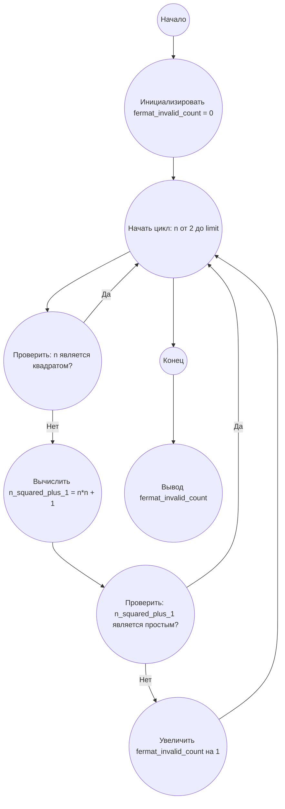

## Ответ на Задачу No 216: Инвалиды Ферма

### 1. Анализ задачи и решение
**Понимание задачи:**
*   Нам нужно найти количество целых чисел `n`, которые не являются квадратами, и при этом `n^2 + 1` не является простым числом. Такие числа `n` называются инвалидами Ферма.
*   Необходимо посчитать количество таких инвалидов Ферма в диапазоне от 1 до 5 * 10^8.

**Решение:**
1.  **Определение квадрата:** Создадим функцию, которая проверяет, является ли число квадратом целого числа.
2.  **Определение простого числа:** Создадим функцию, которая проверяет, является ли число простым.
3.  **Проверка инвалида Ферма:** Функция, которая принимает число n, проверяет, является ли оно инвалидом Ферма.
4.  **Перебор чисел:** Перебираем все числа от 1 до 5 * 10^8.
5.  **Подсчет:** Для каждого числа проверяем, является ли оно инвалидом Ферма, и если да, то увеличиваем счетчик.

### 2. Алгоритм решения
1.  Начать.
2.  Инициализировать `fermat_invalid_count` = 0.
3.  Для каждого числа `n` от 2 до 5 * 10^8:
    *   Если `n` не является квадратом:
        *   Вычислить `n_squared_plus_1 = n*n + 1`.
        *   Если `n_squared_plus_1` не является простым числом:
            *   Увеличить `fermat_invalid_count` на 1.
4.  Вернуть `fermat_invalid_count`.
5.  Конец.

### 3. Реализация на Python 3.12
```python
import math

def is_perfect_square(n):
    """Проверяет, является ли число n полным квадратом."""
    if n < 0:
        return False
    root = int(math.sqrt(n))
    return root * root == n


def is_prime(n):
    """Проверяет, является ли число n простым."""
    if n <= 1:
        return False
    if n <= 3:
        return True
    if n % 2 == 0 or n % 3 == 0:
        return False
    i = 5
    while i * i <= n:
        if n % i == 0 or n % (i + 2) == 0:
            return False
        i += 6
    return True

def is_fermat_invalid(n):
    """Проверяет, является ли число n инвалидом Ферма."""
    if is_perfect_square(n):
        return False
    n_squared_plus_1 = n * n + 1
    return not is_prime(n_squared_plus_1)


def count_fermat_invalids(limit):
    """Подсчитывает количество инвалидов Ферма до заданного предела."""
    fermat_invalid_count = 0
    for n in range(2, limit + 1):
        if is_fermat_invalid(n):
            fermat_invalid_count += 1
    return fermat_invalid_count


# Пример использования:
limit = 5 * 10**8
result = count_fermat_invalids(limit)
print(result)
```

### 4. Блок-схема в формате mermaid


**Legenda:**
*   **Начало, Конец:** Начало и конец алгоритма.
*   **Инициализировать fermat\_invalid\_count = 0:** Инициализация переменной для подсчета количества инвалидов Ферма.
*   **Начать цикл: n от 2 до limit:** Начало цикла перебора чисел.
*   **Проверить: n является квадратом?:** Проверка, является ли текущее число полным квадратом.
*   **Вычислить n\_squared\_plus\_1 = n*n + 1:** Вычисление значения `n^2 + 1`.
*   **Проверить: n\_squared\_plus\_1 является простым?:** Проверка, является ли результат простым числом.
*   **Увеличить fermat\_invalid\_count на 1:** Увеличение счетчика инвалидов Ферма.
* **Вывод fermat_invalid_count:** Вывод количества инвалидов Ферма.
