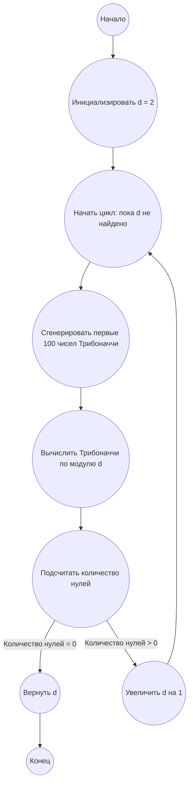

## Ответ на Задачу No 225: Коллапс нити

### 1. Анализ задачи и решение
**Понимание задачи:**
* Необходимо найти наименьшее целое число `d`, при котором в первых 100 членах последовательности трибоначчи, вычисленных по модулю `d`, не будет ни одного нуля.
* Последовательность трибоначчи определяется рекуррентно: T(1)=1, T(2)=1, T(3)=1 и T(n+3) = T(n) + T(n+1) + T(n+2).
* C(d) — это количество нулей в первых 100 членах последовательности по модулю d. Нам нужно найти такое `d`, что C(d) = 0.

**Решение:**
1. **Генерация последовательности трибоначчи:** Необходимо реализовать функцию для генерации первых n членов последовательности трибоначчи.
2. **Вычисление по модулю:**  Нужно вычислить каждый член последовательности трибоначчи по модулю `d`.
3. **Подсчет нулей:** Для заданного `d`, подсчитать количество нулей среди первых 100 членов последовательности трибоначчи по модулю `d`.
4. **Поиск наименьшего d:** Начиная с `d = 2`, проверять условие `C(d) = 0`. Если условие выполняется, то `d` является ответом.

### 2. Алгоритм решения
1. Начать
2. Инициализировать `d` = 2
3. Пока не найдено `d`, при котором `C(d) == 0`:
    * Вычислить первые 100 чисел последовательности трибоначчи
    * Вычислить последовательность трибоначчи по модулю `d`
    * Подсчитать количество нулей `zeros_count` в полученной последовательности по модулю `d`
    * Если `zeros_count == 0`:
        *  Вернуть `d`
    * Иначе:
       * Увеличить `d` на 1
4. Конец

### 3. Реализация на Python 3.12
```python
def tribonacci(n):
  """
  Generates the first n Tribonacci numbers.

  Args:
    n: The number of Tribonacci numbers to generate.

  Returns:
    A list containing the first n Tribonacci numbers.
  """
  if n <= 0:
    return []
  if n <= 3:
    return [1] * n
  
  sequence = [1, 1, 1]
  for i in range(3, n):
    sequence.append(sequence[i - 1] + sequence[i - 2] + sequence[i - 3])
  return sequence

def count_zeros_mod(sequence, d):
  """
  Counts the number of zeros in a sequence modulo d.

  Args:
      sequence: A list of numbers.
      d: The modulus.

  Returns:
      The count of zeros in the sequence modulo d.
  """
  zeros_count = 0
  for num in sequence:
    if num % d == 0:
      zeros_count += 1
  return zeros_count

def find_smallest_d():
  """
  Finds the smallest integer d such that C(d) = 0.
  C(d) is the count of zeros in the first 100 Tribonacci numbers modulo d.

  Returns:
    The smallest integer d that satisfies the condition.
  """
  d = 2
  while True:
    trib_seq = tribonacci(100)
    zeros = count_zeros_mod(trib_seq, d)
    if zeros == 0:
      return d
    d += 1


# Пример использования:
result = find_smallest_d()
print(result)
```

### 4. Блок-схема в формате mermaid


**Легенда:**
* **Начало, Конец:** Начало и конец алгоритма.
* **Инициализировать d = 2:** Устанавливаем начальное значение `d` равным 2.
* **Начать цикл: пока d не найдено:** Начало цикла поиска подходящего значения `d`.
* **Сгенерировать первые 100 чисел Трибоначчи:** Генерируем первые 100 чисел последовательности трибоначчи.
* **Вычислить Трибоначчи по модулю d:** Вычисляем каждый член последовательности трибоначчи по модулю `d`.
* **Подсчитать количество нулей:** Подсчитываем количество нулей в полученной последовательности по модулю `d`.
* **Количество нулей = 0:** Проверяем, равно ли количество нулей нулю.
* **Вернуть d:** Если количество нулей равно нулю, то возвращаем текущее значение `d`.
* **Увеличить d на 1:** Если количество нулей больше нуля, то увеличиваем `d` на 1.
