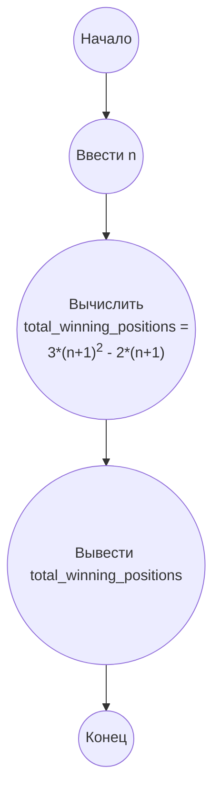

## Ответ на Задачу No 260: Каменный треугольник

### 1. Анализ задачи и решение
**Понимание задачи:**
*   Задача заключается в подсчете количества выигрышных позиций (a, b, c) в игре с тремя кучами камней.
*   Выигрышной считается позиция, когда одна из куч становится пустой. Это означает, что количество камней в двух кучах должно быть равно, то есть `a=b, a=c, b=c`.
*   Необходимо найти количество таких позиций, где 0 ≤ a, b, c ≤ n.
*   S(n) – количество выигрышных позиций для заданного `n`.

**Решение:**
1.  **Анализ выигрышных позиций:** Выигрышная позиция возникает, когда две из трех куч имеют одинаковое количество камней, и третья куча может содержать любое количество камней. Это означает, что выигрышные позиции имеют вид (x, x, y), (x, y, x) или (y, x, x), где `0 <= x, y <= n`.
2.  **Подсчет позиций:**  Для каждой пары `x` из диапазона от 0 до `n`, мы получаем 3 варианта:
    *   (x, x, y), где `y` варьируется от 0 до `n`
    *   (x, y, x), где `y` варьируется от 0 до `n`
    *   (y, x, x), где `y` варьируется от 0 до `n`
    При этом необходимо исключить повторы. Повторы возникают, когда `x=y`. В таком случае все три кучи равны, и такая позиция считается один раз.
3.  **Учет повторов:**
    *   Позиций вида (x, x, x) будет `n+1` (по одному на каждое x).
    *   Каждая из остальных позиций (x, x, y), (x, y, x), и (y, x, x) дает `n+1` вариаций для каждого x, то есть `3*(n+1)`
    *   Но для каждого x=y мы посчитали позицию трижды (x, x, x) вместо одного.
    *   Для корректного подсчета количества уникальных выигрышных позиций необходимо исключить двойной подсчет позиций (x, x, x) в общем числе выигрышных позиций (x,x,y), (x,y,x) и (y,x,x), а их ровно (n+1).
4. **Формула:**  Сумма уникальных выигрышных позиций будет: `3 * (n + 1) * (n + 1) - 2 * (n + 1)`
   *  Первая часть: `3 * (n + 1) * (n + 1)` - общее кол-во выигрышных позиций.
   *  Вторая часть `-2 * (n + 1)` - компенсация за тройной подсчет позиций (x,x,x).
   *   Упростив, получим: `3*(n+1)^2 - 2*(n+1)`

### 2. Алгоритм решения
1.  Начать.
2.  Ввести `n`.
3.  Вычислить `total_winning_positions` по формуле: `3*(n+1)^2 - 2*(n+1)`
4.  Вывести `total_winning_positions`.
5.  Закончить.

### 3. Реализация на Python 3.12
```python
def count_winning_positions(limit):
    """
    Calculates the number of winning positions (a, b, c) such that 0 <= a, b, c <= limit.

    Args:
        limit: The upper bound for a, b, and c.

    Returns:
        The number of winning positions.
    """
    return 3 * (limit + 1)**2 - 2 * (limit + 1)

# Example usage:
n = 1000000
result = count_winning_positions(n)
print(result)
```

### 4. Блок-схема в формате mermaid


**Легенда:**
*   **Начало, Конец:** Начало и конец алгоритма.
*   **Ввести n:** Ввод значения n, до которого нужно посчитать позиции.
*   **Вычислить total_winning_positions:** Вычисление количества выигрышных позиций по формуле `3*(n+1)^2 - 2*(n+1)`.
*   **Вывести total_winning_positions:** Вывод вычисленного значения.
