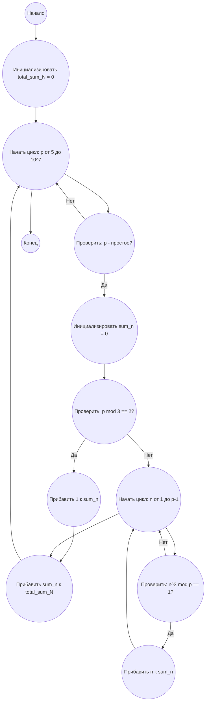

## Ответ на Задачу No 271: Суммы остатков

### 1. Анализ задачи и решение

**Понимание задачи:**
*   Нам дано сравнение $n^3 \equiv 1 \pmod{p}$, где $p$ - простое число.
*   $S(p)$ - множество решений $n$ в интервале $0 < n < p$.
*   $N(p)$ - сумма элементов в $S(p)$.
*   Необходимо найти сумму $N(p)$ для всех простых чисел $p$, где $5 \le p < 10^7$.

**Решение:**

1.  **Поиск решений $n$:** Для каждого простого числа $p$ нужно найти все $n$ в диапазоне $0 < n < p$, которые удовлетворяют условию $n^3 \equiv 1 \pmod{p}$. Это можно сделать путем перебора всех $n$ и проверки условия.
2.  **Вычисление $N(p)$:** После нахождения всех $n$, составляющих $S(p)$, вычисляем их сумму, которая является $N(p)$.
3.  **Суммирование $N(p)$:** Наконец, необходимо просуммировать все $N(p)$ для заданного диапазона простых чисел.

**Оптимизация:**

*   **Проверка простоты:** Для оптимизации, мы можем использовать известные алгоритмы проверки на простоту, например, тест Миллера-Рабина или решето Эратосфена для генерации простых чисел.
*   **Поиск решений:** Вместо перебора всех $n$, можно воспользоваться свойствами сравнений. Если $p \equiv 2 \pmod 3$, то $n \equiv 1 \pmod p$ является единственным решением. Если $p \equiv 1 \pmod 3$, то существует 3 решения.

### 2. Алгоритм решения

1.  Начать
2.  Инициализировать переменную `total_sum_N` со значением 0
3.  Найти все простые числа `p` в диапазоне $5 \le p < 10^7$ (можно использовать решето Эратосфена)
4.  Для каждого простого числа `p`
    *   Инициализировать переменную `sum_n` со значением 0
    *   Если $p \equiv 2 \pmod 3$
        *   Прибавить 1 к `sum_n`
    *   Иначе
        *   Для каждого `n` от 1 до `p`-1
            *   Если $(n^3 \mod p) == 1$
                *   Прибавить `n` к `sum_n`
    *   Прибавить `sum_n` к `total_sum_N`
5.  Вернуть `total_sum_N`
6.  Конец

### 3. Реализация на Python 3.12

```python
def is_prime(n):
    """Проверка числа на простоту"""
    if n <= 1:
        return False
    if n <= 3:
        return True
    if n % 2 == 0 or n % 3 == 0:
        return False
    i = 5
    while i * i <= n:
        if n % i == 0 or n % (i + 2) == 0:
            return False
        i += 6
    return True

def sum_of_residues(limit):
    """Вычисляет сумму N(p) для всех простых p в заданном диапазоне."""
    total_sum_N = 0
    for p in range(5, limit):
        if is_prime(p):
            sum_n = 0
            if p % 3 == 2:
                sum_n = 1
            else:
                for n in range(1, p):
                    if pow(n, 3, p) == 1:
                        sum_n += n
            total_sum_N += sum_n
    return total_sum_N


limit = 10**7
result = sum_of_residues(limit)
print(result)
```

### 4. Блок-схема в формате mermaid



**Legenda:**
*   **Начало, Конец:** Начало и конец алгоритма.
*   **Инициализировать total\_sum\_N:** Создаем переменную для хранения общей суммы и присваиваем ей значение 0.
*   **Начать цикл: p от 5 до 10^7:** Начало цикла по всем числам в диапазоне от 5 до $10^7$.
*   **Проверить: p - простое?:** Проверяем, является ли текущее число `p` простым.
*   **Инициализировать sum\_n:** Создаем переменную для хранения суммы решений для текущего `p` и присваиваем ей значение 0.
*   **Проверить: p mod 3 == 2?:** Проверяем, дает ли остаток 2 при делении на 3.
*   **Прибавить 1 к sum\_n:** Если `p mod 3 == 2`, то единственное решение n = 1, прибавляем 1 к sum_n.
*    **Начать цикл: n от 1 до p-1:** Начало цикла по всем возможным значениям n.
*   **Проверить: n^3 mod p == 1?:** Проверяем, удовлетворяет ли текущее n условию.
*   **Прибавить n к sum\_n:** Если условие выполняется, то добавляем n к sum_n.
*   **Прибавить sum\_n к total\_sum\_N:** Добавляем сумму решений sum_n для текущего p к общей сумме total_sum_N.
