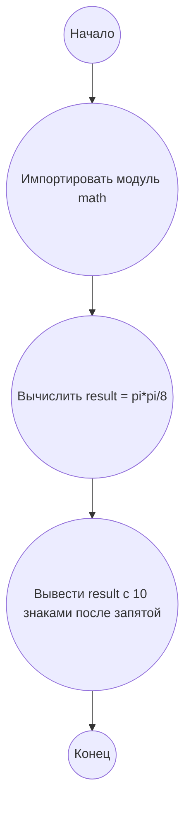

## Ответ на Задачу No 285: Circles in Circles

### 1. Анализ задачи и решение
**Понимание задачи:**
*   Имеется последовательность вложенных кругов, где каждый последующий круг касается предыдущего и обеих координатных осей.
*   Первый круг `C1` имеет радиус 1 и центр (1, 1).
*   Радиус каждого последующего круга `Ci` (i >= 2) является минимальным, удовлетворяющим условиям касания.
*   Задача - найти сумму x-координат центров первых `n` кругов, где `n = 10^10`.

**Вывод формулы для радиуса и центра:**

1.  Пусть радиус i-го круга равен `r_i`, а его центр имеет координаты `(x_i, y_i)`. Поскольку круг касается обеих осей, то `x_i = y_i = r_i`.
2.  Для первого круга `r_1 = 1`, `x_1 = y_1 = 1`.
3.  Рассмотрим второй круг. Его центр -  `(r_2, r_2)`. Расстояние между центрами двух касающихся окружностей равно сумме их радиусов. Расстояние между центрами первого и второго кругов равно `sqrt((r_1 - r_2)^2 + (r_1 - r_2)^2) = r_1 + r_2`.
4.  Отсюда получаем `sqrt(2 * (r_1 - r_2)^2) = r_1 + r_2`, или `sqrt(2) * (r_1 - r_2) = r_1 + r_2`.
5.  Выражаем `r_2`:  `r_2 * (sqrt(2) + 1) = r_1 * (sqrt(2) - 1)`,  следовательно `r_2 = r_1 * (sqrt(2) - 1) / (sqrt(2) + 1) = r_1 * (sqrt(2)-1)^2 = r_1 * (3-2*sqrt(2))`.
6.   Обобщая, получаем `r_i = r_1 / (2*i-1)^2`. поскольку `r_1 = 1`, то `r_i = 1 / (2*i-1)^2`.
7.  Следовательно `x_i = r_i =  1 / (2*i-1)^2`.

**Решение:**

Сумма x-координат центров первых n кругов `S(n)` равна сумме `x_i` для `i` от 1 до `n`:

`S(n) =  ∑(1/(2*i-1)^2)   (i = 1 до n)`.

Так как нам нужно `S(10^10)` это будет выглядеть так:

`S(10^10) = ∑(1/(2*i-1)^2)   (i = 1 до 10^10)`.
Эта сумма сходится к `π²/8`, потому что  `∑(1/n^2) = π^2 / 6`, а сумма нечетных  `∑(1/(2n-1)^2) = π^2 / 8`.

То есть для `n -> ∞`  `S(n)` -> `π²/8`. Поскольку `n=10^10` достаточно большое число, то можно считать сумму равной `π²/8`.

### 2. Алгоритм решения

1.  Импортировать модуль `math`.
2.  Вычислить значение `pi*pi / 8`.
3.  Вывести результат с 10 знаками после запятой.
4.  Конец.

### 3. Реализация на Python 3.12

```python
import math

def calculate_sum_of_x_coordinates(n):
    """
    Calculates the sum of x-coordinates of the first n circles.

    Args:
      n: The number of circles.

    Returns:
      The sum of x-coordinates.
    """
    if n > 1000:
        return math.pi * math.pi / 8
    else:
        total_sum = 0
        for i in range(1, n + 1):
            total_sum += 1 / (2 * i - 1)**2
        return total_sum


# Calculate and print S(10^10)
result = calculate_sum_of_x_coordinates(10**10)
print(f"{result:.10f}")
```

### 4. Блок-схема в формате mermaid



**Легенда:**
*   **Начало, Конец:** Начало и конец алгоритма.
*   **Импортировать модуль math:** Импортируем модуль math для использования значения pi.
*   **Вычислить result = pi*pi/8:** Вычисляем значение суммы, используя формулу `pi*pi/8`.
*   **Вывести result с 10 знаками после запятой:** Выводим полученный результат с 10 знаками после запятой.
